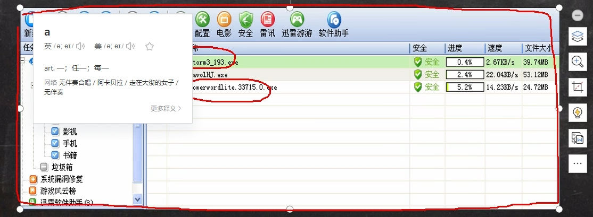

# 第1章 内容介绍

## 1.怎么学习

1. 先学习整体的框架
2. 会百度使用指令
3. fist konw how     last know why
4. 通过使用场景来认知某个知识点,而不是一直卡在某个知识点
5. 适当的囫囵吞枣
6. linux不是编程,是实操,多用 常用指令要非常6;玩到6,不行咱就背诵

## linux的各种配置


## linux搭建各种开发环境


## 能够写一些基本的脚本


## 能够进行安全设置.防止别人攻击


## 6.升入理解Linux的内核

# 第2章 Linux入门

# 第3章 VM和Linux安装

- 找视频看

# 第4章 目录结构

## Linux目录结构概览

在Linux系统中，目录结构是以根目录`/`作为起点的层级树状结构。以下是重要目录及其功能概述：

##  **根目录 `/`**

   - 这是整个文件系统的顶层，所有其他目录都是从此处展开。

### **核心系统目录**

   - **`/bin`**: 存储基本的用户命令，这些命令可供所有用户使用，通常包含像`ls`, `cat`, `mkdir`等日常工具。

   - **`/sbin`**: 存放系统级别的二进制文件，通常包括那些仅限超级用户（root）使用的系统管理命令，如系统启动或维护所需的工具。

   - **`/boot`**: 包含用于系统启动的文件，如Linux内核映像、GRUB引导加载器配置等。

   - **`/dev`**: 存储设备文件，这里的所有项代表系统的物理或虚拟设备，如磁盘、终端、网络接口等。

   - **`/etc`**: 配置文件目录，包含系统和服务的各种全局配置文件。

   - **`/lib`** 和 **`/lib64`**: 存放系统启动和系统命令运行所需要的共享库文件。

   - **`/proc`**: 虚拟文件系统，提供进程和系统状态信息。

   - **`/sys`**: 同样是虚拟文件系统，用于访问和控制内核参数和硬件设备信息。

   - **`/usr`**: 用户程序和数据的二级层次结构，其中：
     - `/usr/bin`: 大部分用户级别的可执行程序，非必须在系统启动时可用。
     - `/usr/local`: 本地安装的应用程序和数据，由系统管理员安装，区别于系统自带软件。
     - `/usr/sbin`: 类似于`sbin`，但包含了非必需在系统启动时就存在的系统管理命令。
     - `/usr/share`: 存放共享的文档和数据，如手册页、示例文件、图标等。

   - **`/var`**: 可变数据文件的存储位置，包括系统日志、临时邮件文件、数据库文件等，这里的文件会随着系统运行而不断变化。

#### 3. **用户相关目录**

   - **`/home`**: 用户的主目录所在位置，每个用户都有一个以其用户名命名的子目录。

   - **`/root`**: 系统管理员（root）用户的主目录。

   - **`/tmp`**: 临时文件目录，存放临时文件，系统可能会定期清理此目录下的内容。

   - **`/lost+found`**: 在文件系统检查过程中恢复的不正常链接文件会被移动至此目录。

#### 4. **其他值得注意的目录**

   - **`/mnt`** 和 **`/media`**: 用于临时挂载外部介质，如U盘、CD-ROM、硬盘分区等。

   - **`/opt`**: 第三方软件或额外的可选应用程序的安装位置。

请根据实际操作系统的版本和具体实现，可能还会有其他特定目录或者细微差别。在创建笔记时，可以根据上述结构来组织，并针对每个目录深入理解其在系统运行中的具体作用和典型内容。

# 第5章 远程登陆到Linux服务器

# 第六章 vi和vim编辑器

## 6.1vi和vim的快捷键

1. 拷贝当前行[yy],拷贝当前向下5行[5yy],并粘贴[p]
2. 删除当前行[dd]
3. 在文件中查找某个单词[/word],查找下一个[n]
4. 设置文件的行号[set nu],取消文件的行号[set nonu]
5. 使用快捷键到该文档的最后一行[G]和最首行[gg]
6. 撤销上一个动作[u]
7. 将光标移动到指定行[line shift+g]

# 第7章 开机重启和用户登陆注销

# 第8章 用户管理

# 第9章 实用指令

## 9.3帮助指令

- man[命令或配置文件] (功能描述:获得帮助信息)
- help [命令] (功能描述:获得shell内置命令的帮助信息)

## 9.4文件目录类

- pwd (功能描述:显示当前工作目录的绝对路径)
- ls [选项] [目录或是文件] 

1. -a:显示当前目录所有的文件和目录,包括隐藏的
2. -l:以列表的方式显示信息

- cd [参数] (功能描述:切换到指定目录)
- mkdir [选项] 要创建的目录

1. -p 创建多级目录

- rmdir [选项]  要删除的空目录
- touch 文件名称
- cp [选项] 要拷贝的文件 拷贝到的地方

1. -r:递归复制整个文件夹
2. 强制覆盖不提示的方法 \cp

## 系统命令

### date

`date` 命令是Linux和类Unix操作系统中用于显示或设置系统日期和时间的工具。该命令格式化输出当前时间，或者可以用来设置系统时钟。`date` 命令的输出可以按照用户的需求定制，它支持多种格式化选项。

**基本用法**

不带任何参数时，`date` 命令会输出当前的日期和时间，默认格式通常是：
```
Mon Jun 3 14:18:48 CST 2019
```
这里的各个部分分别代表：星期几、月份、日期、时间、时区、年份。

**设置日期和时间**

超级用户（root）可以使用 `date` 命令设置系统的日期和时间。例如：
```bash
sudo date -s "2024-05-01 12:00:00"
```
这将设置日期为2024年5月1日，时间为中午12点。

**格式化输出**

`date` 命令可以使用 `+%` 格式来定制输出。例如：
- `date +%Y`：显示年份（4位数）。
- `date +%m`：显示月份（01-12）。
- `date +%d`：显示日期（01-31）。
- `date +%H`：显示小时（00-23）。
- `date +%M`：显示分钟（00-59）。
- `date +%S`：显示秒（00-60）。
这些格式可以组合使用，例如：
- `date +%Y-%m-%d`：显示年-月-日。
- `date +%H:%M:%S`：显示时分秒。

**时间戳**

`date` 命令还可以用来将日期和时间转换为时间戳，或者从时间戳转换回可读的日期格式。
- 获取当前时间的时间戳：`date +%s`
- 将时间戳转换为日期：`date -d @<timestamp>`
例如：
```bash
date -d @1635714400
```
这将会显示时间戳 `1635714400` 对应的日期和时间。

**时区**

`date` 命令默认使用系统的本地时区。你可以使用 `-u` 参数来获取UTC时间，或者使用 `-R` 参数来按照RFC 2822的格式输出日期和时间。
```bash
date -u
date -R
```
**实例**

```bash
# 获取当前年份
date +%Y
# 获取上个月的年份和月份
date -d 'last month' +%Y-%m
# 设置系统时间为2024年1月1日
sudo date 0101012024
# 获取昨天这个时间的时间戳
date -d 'yesterday' +%s
```
`date` 命令是Linux中非常有用的一个工具，通过不同的参数和格式化选项，可以满足各种日期和时间相关的需求。

### who

`who` 命令是Linux和类Unix操作系统中用于显示当前登录系统的用户信息的工具。它会列出所有登录的用户，以及他们登录的终端、登录时间、登录IP等信息。

**基本用法**

不带任何参数时，`who` 命令会输出当前登录系统的所有用户的基本信息，默认输出格式通常是：
```
username    tty        login-time    ip-address
```
例如：
```
user1       tty1       2023-01-01 10:00   (192.168.1.100)
user2       pts/0      2023-01-01 10:30   (192.168.1.101)
```
这里的各个部分分别代表：用户名、登录的终端、登录时间和登录IP。

**常用选项**

- `-a` 或 `--all`：显示所有信息，包括死进程和启动时间。
- `-H` 或 `--heading`：显示列标题。
- `-q` 或 `--count`：只显示登录用户的数量和用户名列表。
- `-u` 或 `--users`：显示登录用户和它们的状态。
- `-r` 或 `--runlevel`：显示当前的运行级别。

**实例**

```bash
# 显示当前登录系统的所有用户
who
# 显示当前登录系统的所有用户，包括列标题
who -H
# 只显示登录用户的数量
who -q
# 显示登录用户和它们的状态
who -u
# 显示当前的运行级别
who -r
```
`who` 命令是Linux中用于查看当前系统登录用户的一个简单但实用的工具。通过不同的参数，可以获取更多关于登录用户的信息。

### whoami

### uname

### free

### ps

### top

### kill

### reboot

### halt

### ipcs

`ipcs` 命令是Linux和类Unix操作系统中用于报告进程间通信设施（Inter-Process Communication, IPC）的状态的工具。这些设施包括消息队列（Message Queues）、信号量（Semaphores）和共享内存段（Shared Memory Segments）。

**基本用法**

不带任何参数时，`ipcs` 命令会输出当前系统的消息队列、信号量和共享内存的概要信息。
```
IPC status for message queues      = ON
IPC status for semaphores          = ON
IPC status for shared memory       = ON
------ Message Queues --------
key        msqid      owner      perms      used-bytes   messages
------ Semaphore Arrays --------
key        semid      owner      perms      nsems
------ Shared Memory Segments --------
key        shmid      owner      perms      bytes      nattch     status
```
**常用选项**

- `-m`：只显示共享内存段的信息。
- `-q`：只显示消息队列的信息。
- `-s`：只显示信号量的信息。
- `-a`：显示所有IPC设施的信息。
- `-l`：显示IPC设施的详细信息。
- `-t`：显示IPC设施的创建时间。

**实例**

```bash
# 显示所有IPC设施的信息
ipcs
# 只显示共享内存段的信息
ipcs -m
# 只显示消息队列的信息
ipcs -q
# 只显示信号量的信息
ipcs -s
# 显示所有IPC设施的详细信息
ipcs -al
# 显示共享内存段的详细信息
ipcs -ml
# 显示消息队列的详细信息
ipcs -ql
# 显示信号量的详细信息
ipcs -sl
```
`ipcs` 命令对于调试和监控进程间通信非常有用。它可以帮助开发者和管理员了解系统上IPC资源的使用情况，以及哪些进程正在使用这些资源。

# 第10章 组管理和权限管理

# 第11章 定时任务调度

## cront任务调度没学明白

在Linux系统中，`crond`是一个系统服务，用于执行周期性或定时任务。它是`cron`守护进程的缩写，常用于安排那些需要自动运行的任务，比如日志轮换、数据备份、系统更新等。
### 基本命令
1. 启动`crond`服务：
   ```bash
   sudo systemctl start cron
   ```
2. 停止`crond`服务：
   ```bash
   sudo systemctl stop cron
   ```
3. 重启`crond`服务：
   ```bash
   sudo systemctl restart cron
   ```
4. 检查`crond`服务的状态：
   ```bash
   sudo systemctl status cron
   ```
### 配置定时任务
Linux系统中，每个用户都有自己的`crontab`文件，用于配置定时任务。可以通过`crontab`命令来编辑这些任务。
1. 编辑当前用户的`crontab`文件：
   ```bash
   crontab -e
   ```
2. 查看当前用户的`crontab`文件：
   ```bash
   crontab -l
   ```
3. 删除当前用户的`crontab`文件：
   ```bash
   crontab -r
   ```
### `crontab`文件格式
`crontab`文件包含6个字段，分别表示分钟、小时、日期、月份、星期几和要执行的命令。
```
* * * * * command to execute
```
- 分钟：0-59
- 小时：0-23
- 日期：1-31
- 月份：1-12
- 星期几：0-7（0和7都代表周日）
- 命令：要执行的shell命令
例如，每天凌晨1点执行备份脚本：
```bash
0 1 * * * /path/to/backup_script.sh
```
### 注意事项
- 确保脚本有执行权限。
- 使用绝对路径来指定脚本和命令。
- `crontab`中的环境变量与用户登录时的环境变量可能不同，可以在`crontab`文件中设置环境变量。
- 为了确保日志和输出能够被找到，可以指定输出重定向到特定文件。
### 示例
每天早上6点30分发送一封邮件：
```bash
30 6 * * * echo "Good morning!" | mail -s "Morning Greeting" [email protected]
```
这些是`crond`在Linux下的基本使用方法。通过配置`crontab`，你可以灵活地设置各种定时任务，以帮助自动化日常管理和维护工作。

## 守护进程

### daemon()

```c
#include <unistd.h>

int daemon(int nochdir, int noclose);

函数参数：

nochdir：为0时表示将当前目录更改至“/”

noclose：为0时表示将标准输入、标准输出、标准错误重定向至“/dev/null”

返回值：

成功则返回0，失败返回-1
```

在Linux系统中，守护进程（Daemon）是一种在后台运行并提供服务的进程，它独立于控制终端并且通常在系统引导时启动，在系统关闭时终止。守护进程的概念是Unix和类Unix操作系统中非常重要的一部分。
守护进程通常不与任何终端关联，也就是说，它们不会通过终端接收输入或向终端输出结果。它们常常在系统启动时自动运行，并在后台持续运行，等待请求或执行任务。
要编写一个守护进程，通常会遵循以下步骤：

1. **执行父进程**：首先，守护进程从其父进程（通常是执行程序）中脱离。这通常是通过执行`fork()`系统调用实现的。父进程退出，而子进程继续执行。
2. **创建新的会话**：脱离父进程后，守护进程需要创建一个新的会话，这可以通过`setsid()`系统调用实现。这会使守护进程成为新会话的首进程，同时也是新进程组的组长，并且没有控制终端。
3. **改变工作目录**：由于守护进程可能会在文件系统的一个挂载点上长时间运行，它通常会改变工作目录到根目录（`/`），或者某个特定的、不会卸载的目录，以避免阻止文件系统卸载。
4. **关闭文件描述符**：守护进程会关闭所有不需要的文件描述符，因为它们可能会继承父进程的打开文件，这可能会导致资源泄漏或意外的行为。
5. **忽略信号**：守护进程通常会忽略某些信号，特别是那些与终端相关的信号，因为它们不再与任何终端关联。
6. **执行核心逻辑**：完成上述步骤后，守护进程将执行其核心功能，比如监听网络请求、处理任务队列等。
7. **处理优雅终止**：守护进程通常需要处理终止信号，以便能够优雅地关闭，释放资源，并可能进行一些清理工作。
    创建守护进程的具体实现可能会根据其所需服务的性质而有所不同。在设计守护进程时，重要的是要确保其稳定性和安全性，因为它们通常需要长时间运行，并可能对系统资源有较高的权限。

**使用 sudo vim /etc/rc.local 开机自启动,绝对路径加程序名字**


# 第12章-Linux分区

## linux的分区

### 图解


### **查看所有设备挂载情况**

- lsblk | lsblk -f 		`lsblk` 的名称是由“list”和“block”两个词组合而成的缩写，意为“列出块设备”。

### 经典案例-挂载硬盘

在Linux虚拟机中挂载一块硬盘，可以按照以下步骤进行：

1. **添加硬盘**：
   - 如果虚拟机尚未启动，可以直接在虚拟机管理软件（如VirtualBox、VMware等）中添加新的硬盘。
   - 如果虚拟机正在运行，通常可以在虚拟机的设置中添加新的硬盘。
2. **启动虚拟机**：
   - 添加硬盘后，启动Linux虚拟机。
3. **检查新硬盘**：
   - 登录到虚拟机中。
   - 打开终端。
   - 输入 `lsblk` 或 `fdisk -l` 命令来查看新添加的硬盘。新硬盘通常会被识别为 `/dev/sdb`、`/dev/sdc` 等设备文件。
4. **分区硬盘**：
   - 使用 `fdisk` 或 `parted` 工具对新硬盘进行分区。例如，使用 `fdisk /dev/sdb` 命令来对 `/dev/sdb` 进行分区。
   - 根据提示创建新的分区，保存并退出。
5. **格式化分区**：
   - 使用 `mkfs` 命令对新分区进行格式化。例如，如果你想创建一个EXT4文件系统，可以使用 `mkfs.ext4 /dev/sdb1` 命令。
   - 不格式化不可以,因为格式化会给新分区分配一个uuid,不格式化没有,
6. **创建挂载点**：
   - 使用 `mkdir` 命令创建一个目录作为挂载点。例如，`mkdir /mnt/data`。
7. **挂载分区**：
   - 使用 `mount` 命令挂载分区。例如，`mount /dev/sdb1 /mnt/data`。
8. **自动挂载**：
   - 如果希望在系统启动时自动挂载这个分区，需要将分区信息添加到 `/etc/fstab` 文件中。
   - 使用 `nano` 或 `vi` 编辑器打开 `/etc/fstab` 文件。
   - 在文件中添加一行，例如：`/dev/sdb1 /mnt/data ext4 defaults 0 0`。
   - 保存并关闭文件。
9. **验证挂载**：
   - 使用 `df -h` 命令或 `lsblk` 命令来验证分区是否已经正确挂载。
   以上步骤是在一般情况下挂载新硬盘的流程。根据不同的Linux发行版和虚拟机管理软件，具体的步骤可能会有所不同。如果在操作过程中遇到问题，可以查阅相关的文档或寻求社区的帮助。
10. 卸载
  - 使用`umount`卸载 `umount /dev/sdb3`
  - 在Linux系统中安全地退出U盘，可以按照以下步骤进行：
    1. **查找U盘设备文件**：
       - 使用 `lsblk` 或 `df -h` 命令来查找U盘的设备文件名。通常U盘会被识别为 `/dev/sdX`，其中 `X` 是一个字母，例如 `/dev/sdb`。
    2. **卸载挂载点**：
       - 如果U盘已经挂载，你需要先卸载挂载点。使用 `umount` 命令，后面跟上挂载点的路径。例如，如果U盘挂载在 `/media/user/USB`，则使用命令 `sudo umount /media/user/USB`。
       - 如果不确定挂载点，可以使用 `umount` 命令加上U盘的设备文件名。例如，`sudo umount /dev/sdb1`，其中 `sdb1` 是U盘的分区号。
    3. **安全移除U盘**：
       - 使用 `eject` 命令来安全地移除U盘。例如，`sudo eject /dev/sdb`。
       - 这会确保所有对U盘的读写操作都已经完成，并且通知系统可以安全地拔出U盘。
    4. **检查U盘是否已卸载**：
       - 再次使用 `lsblk` 或 `df -h` 命令来检查U盘是否已经从挂载列表中移除。
    5. **拔出U盘**：
       - 确认U盘已经安全卸载后，你可以物理地拔出U盘。
       请注意，如果系统中有任何程序还在使用U盘，`umount` 命令可能会失败。在这种情况下，你需要先结束那些使用U盘的程序，然后再次尝试卸载。如果U盘上有打开的文件或文件夹，也可能会导致卸载失败。确保所有的文件操作都已经完成，并且关闭了所有相关的应用程序后再尝试卸载。
       在拔出U盘之前，始终确保已经通过上述步骤安全地卸载了U盘，以避免数据丢失或损坏。

## 磁盘情况查询


## 磁盘情况-工作实用指令


## udev自动挂载u盘没学明白


# 第13章-网络配置

## 网络连接的三种模式

1. 桥接模式:虚拟系统可以和外部系统通讯,但是容易造成IP冲突
2. NAT模式:网络地址转换模式,虚拟系统可以和外部系统通讯,不造成IP冲突
3. 主机模式:独立的系统

# 第14章-进程管理(重点)

## 基本介绍

1. 在Linux中,每个**执行的程序**都称为一个进程,每一个进程都分配一个id号(pid,进程号)
2. 每个进程都可以以俩种方式存在的.**前台**与**后台**,所谓前台进程就是用户目前屏幕上可以进行操作的.后台进程则是实际在操作,但由于屏幕上无法看到的进程,通常使用后台方式执行.
3. 一般系统的服务都是以**后台进程**的方式存在,而且会常驻在系统中,知道关机才结束

## 显示系统执行的进程

### 基本介绍

1.  ps :	ps命令是用来查看模具前系统中,有哪些正在执行,以及他们的执行状态,可以不加任何参数.
	- ps	-a	显示当前中断所有的进程信息
	- ps	-u	以用户的格式显示进程信息
	- ps	-x	显示后台进程运行的参数
	- ps	-e	显示所有进程
	- ps	-f	全格式
	- ps    -l     长格式显示当前登录用户（即执行`ps`命令的用户）的进程列表


- 上图参数介绍:

|      UESR      |   PID    |      %CPU       |         %MEN          |                      VSZ                      |                  RSS                  |
| :------------: | :------: | :-------------: | :-------------------: | :-------------------------------------------: | :-----------------------------------: |
|  进程执行用户  |  进程号  | 占用cpu的百分比 | 占用物理内存的百分比  |            进程在虚拟内存中的大小             | 该进程当前占用的物理内存（RAM）的大小 |
|      TTY       |   STAT   |      START      |         TIME          |                    COMMAND                    |                                       |
| 终端名称(缩写) | 进程状态 | 进程的启动时间  | 该进程占用cpu的总时间 | 启动进程所用的命令和参数,如果过长会被截断显示 |                                       |


上图参数介绍

|  PPID  | C                             | STIME            | TTY                       | TIME           | CMD              |
| :----: | ----------------------------- | ---------------- | ------------------------- | -------------- | ---------------- |
| 父进程 | 进程的CPU使用率，以百分比表示 | 进程的启动时间。 | 进程所运行的终端（tty）。 | 进程运行的时间 | 启动进程的命令。 |

2. kill 和 kill all
	- 基本语法
		- kill	[选项]	进程号	(功能描述:通过进程号杀死/终止进程)
		- killall 	进程名称	(功能描述:通过进程名称杀死进程,也支持通配符,这在系统因负载过而变得很慢的时候很有用)(杀死所有子进程)
	- 常用选项
		- -9	表示强迫进程立即停止
3. pstree:    
	1. 基本语法
		- pstree	[选项]	可以更加直观的来看信息
	2. 常用选项
		- -p	显示进程的PID
		- -u    显示进程的所属用户

## 服务(service)管理

### 介绍:

在Linux操作系统中，服务（service）是指后台运行的守护进程（daemon），它通常在系统启动时自动启动，并在系统关闭时自动停止。服务可以提供各种功能，如网络服务、文件共享、数据库服务等。

### 管理指令

- systemctl start <service_name>.service：启动服务。
- systemctl stop <service_name>.service：停止服务。
- systemctl restart <service_name>.service：重启服务。
- systemctl status <service_name>.service：查看服务状态。
- systemctl enable <service_name>.service：设置服务开机自启。
- systemctl disable <service_name>.service：禁止服务开机自启。
- systemctl reload <service_name>.service：重新加载服务的配置文件。

- 你可以使用以下命令来查看系统中所有的服务，包括激活的和未激活的：

	```bash
	systemctl list-units --all --type=service
	```


- 上述指令默认在运行级别3和5生效

### 服务的运行级别

- 在Ubuntu和其他基于Linux的操作系统中，服务的运行级别（runlevels）是一个系统状态的概念，它决定了系统启动时启动哪些服务。运行级别在不同的Linux系统和服务管理器中可能有所不同，但通常包括以下几个主要级别：
	1. **运行级别0（halt）**：系统停止，关闭电源。
	2. **运行级别1（single）**：单用户模式，通常用于系统维护。
	3. **运行级别2（multi-user）**：多用户模式，没有图形界面。
	4. **运行级别3（multi-user text）**：多用户文本模式，通常用于服务器。
	5. **运行级别4（not used）**：在某些系统中未使用。
	6. **运行级别5（graphical）**：多用户图形模式，通常包括图形界面。
	7. **运行级别6（reboot）**：重新启动系统。
	在较新的Ubuntu版本中，默认使用`systemd`作为初始化系统和服务管理器，它引入了不同的运行级别概念，称为“目标”（targets）。这些目标更灵活，可以被认为是运行级别的现代版本。`systemd`的目标与传统的运行级别大致对应，但提供了更多的控制和灵活性。
	以下是一些主要的`systemd`目标和它们对应的传统运行级别：
	- **multi-user.target**（对应运行级别3）：多用户文本模式。
	- **graphical.target**（对应运行级别5）：多用户图形模式。
	- **reboot.target**（对应运行级别6）：重新启动系统。
	- **poweroff.target**（对应运行级别0）：关闭系统。
	在`systemd`中，你可以使用以下命令来查看和管理当前的目标：
	- 查看当前目标：
	  ```bash
	  systemctl get-default
	  ```
	- 设置默认目标（例如，设置为多用户文本模式）：
	  ```bash
	  sudo systemctl set-default multi-user.target
	  ```
	- 切换到不同的目标（例如，切换到图形模式）：
	  ```bash
	  sudo systemctl isolate graphical.target
	  ```

### Ubuntu开机流程说明

1. **BIOS/UEFI启动**：
   - 当计算机电源被打开时，首先启动的是BIOS（基本输入输出系统）或UEFI（统一可扩展固件接口）。
   - BIOS/UEFI会执行硬件自检，加载固件，并检查硬件配置。
   - 随后，它会搜索可引导设备，如硬盘、USB驱动器等，以找到启动加载器。
2. **引导加载器启动**：
   - 在Ubuntu中，引导加载器通常是GRUB（GRand Unified Bootloader）。
   - GRUB会加载内核，并传递控制权给内核。
3. **内核启动**：
   - 内核开始加载，它负责管理计算机的硬件资源。
   - 内核会读取启动配置文件（如`/boot/grub/grub.cfg`），以确定应该启动哪个操作系统。
4. **运行级别（或目标）选择**：
   - 内核启动后，它会读取`/etc/inittab`（对于老式的`init`系统）或`/etc/systemd/system/default.target`（对于`systemd`系统）来确定系统的运行级别。
   - 在`systemd`系统中，系统会根据配置文件（如`/etc/systemd/system/default.target`）选择一个目标。
5. **系统初始化**：
   - 系统启动服务管理器，如`init`（在老式系统）或`systemd`（在较新系统）。
   - `systemd`会根据目标启动服务，如`multi-user.target`或`graphical.target`。
   - 服务管理器会启动和配置各种服务，如网络服务、登录服务、系统守护进程等。
6. **用户登录**：
   - 如果运行级别或目标配置为图形界面，系统会启动图形登录界面。
   - 用户输入用户名和密码后，登录到系统。
7. **桌面环境启动**：
   - 登录后，用户选择的桌面环境（如GNOME、KDE、Xfce等）开始启动。
   - 桌面环境会加载桌面组件，如面板、窗口管理器、文件浏览器等。
8. **用户交互**：
   - 用户可以开始使用桌面环境进行各种操作，如打开应用程序、访问文件、网络等。
   在整个启动过程中，`systemd`扮演了非常重要的角色，它负责管理服务的启动和停止，确保系统稳定运行。在较新的Ubuntu版本中，`systemd`是默认的服务管理器，它提供了比传统的`init`系统更高效和可靠的服务管理方式。

### 防火墙与其指令

- 该内容韩顺平老师说的版本与我所用版本不同,导致很多指令已经改变,不在适合当前的学习,等以后学到再来补充此处内容

## 动态监控系统

### 动态监控进程

在Ubuntu中，您可以使用多种工具来动态监控进程。以下是一些常用的命令行工具：
#### **top**

   `top`是一个非常有用的命令行工具，用于实时显示系统的运行状态，包括当前的进程、系统的负载、CPU使用情况、内存使用情况等。`top`提供了一个动态更新的视图，可以让你实时监控系统的性能。
   以下是一些常用的`top`命令操作：

   1. **启动`top`**：
      在终端中输入`top`命令，然后按回车键，即可启动`top`。
      
      ```bash
      top
      ```
   2. **交互式命令**：
      `top`启动后，你可以使用以下键来执行交互式命令：
      - `h` 或 `?`：显示帮助屏幕。
      - `k`：杀死一个进程。你会被提示输入要杀死进程的PID和信号编号。
      - `r`：重新设置进程的优先级（nice值）。
      - `d`：改变更新时间间隔。输入`d`后，再输入你希望的时间间隔（以秒为单位）。
      - `s`：改变显示的更新次数。输入`s`后，再输入你希望`top`运行多少次。
      - `m`：切换内存显示模式。
      - `t`：切换CPU状态显示模式。
      - `c`：切换命令行/程序名称的显示。
      - `1`：如果有多核CPU，显示每个CPU的状态。
      - `q`：退出`top`。
   3. **排序**：
      `top`默认按照CPU使用率对进程进行排序，但你也可以按其他列排序：
      - `M`：按内存使用量排序。
      - `P`：按CPU使用率排序。
      - `T`：按运行时间排序。
      - `N`：按PID排序。
   4. **查看特定用户的进程**：
      使用`-u`选项可以只显示特定用户的进程：
      
      ```bash
      top -u username
      ```
   5. **查看特定进程**：
      使用`-p`选项可以只显示特定的进程ID：
      
      ```bash
      top -p PID
      ```
   
   6. **不查看僵死进程**：
      使用`-i`选项可以使得`top`不显示任何闲置或者僵死的进程

      ```bash
      top -i PID
      ```

#### netstat

`netstat`是一个用于显示网络连接、路由表、接口统计信息、伪装连接和组播成员的工具。它是一个功能强大的命令行工具，可以帮助你监控网络状态和排查网络问题。
以下是一些常用的`netstat`命令选项：

1. **显示所有连接**：
   ```bash
   netstat -a
   ```
   这个命令会显示所有监听的和未监听的套接字。
2. **显示所有连接和进程ID（PID）**：
   ```bash
   netstat -ap
   ```
   这个命令会显示每个连接对应的进程ID。
3. **显示所有连接和进程名称**：
   ```bash
   netstat -apn
   ```
   使用`-n`选项可以避免域名解析，显示数字形式的地址和端口。
4. **显示TCP连接**：
   ```bash
   netstat -at
   ```
   这个命令只显示TCP连接。
5. **显示UDP连接**：
   ```bash
   netstat -au
   ```
   这个命令只显示UDP连接。
6. **显示网络接口统计信息**：
   ```bash
   netstat -s
   ```
   这个命令会显示每个网络接口的发送和接收数据包的统计信息。
7. **显示路由表**：
   ```bash
   netstat -r
   ```
   这个命令显示系统的路由表。
8. **显示正在监听的端口**：
   ```bash
   netstat -l
   ```
   这个命令只显示正在监听的套接字。
9. **显示所有TCP连接及其状态**：
   ```bash
   netstat -atn
   ```
   这个命令结合了`-a`（所有），`-t`（TCP），和`-n`（不解析数字地址）选项，用于显示所有TCP连接及其状态。
10. **持续输出网络状态**：
    ```bash
    watch -n 1 netstat -atn
    ```
    使用`watch`命令可以每隔一段时间执行`netstat`，以持续监控网络状态。
    请注意，从Linux内核4.2版本开始，`netstat`已经被`ss`命令取代，因为`ss`命令提供了更多的信息并且性能更好。如果你使用的是较新的Ubuntu版本，可以考虑使用`ss`命令来代替`netstat`。

#### Socket Statistics

`ss`（Socket Statistics）是一个在Linux系统中用于获取套接字信息的工具，它可以显示类似`netstat`命令所提供的详细信息，但`ss`提供了更多的统计数据和更好的性能。`ss`可以显示TCP连接、sockets、路由表、端口等网络接口信息。
以下是一些常用的`ss`命令选项和用法：

1. **列出所有TCP连接**：
   ```bash
   ss -t
   ```
   这个命令会列出所有TCP套接字。
2. **列出所有UDP连接**：
   ```bash
   ss -u
   ```
   这个命令会列出所有UDP套接字。
3. **列出所有套接字**：
   ```bash
   ss -a
   ```
   这个命令会列出所有套接字，包括监听和非监听的。
4. **显示套接字的详细信息**：
   ```bash
   ss -s
   ```
   这个命令会显示套接字的汇总信息。
5. **显示进程相关的套接字信息**：
   ```bash
   ss -p
   ```
   这个命令会显示套接字对应的进程ID和进程名称。
6. **显示套接字的摘要信息**：
   ```bash
   ss -s
   ```
   这个命令会显示TCP和UDP套接字的摘要信息。
7. **显示特定端口的连接**：
   ```bash
   ss -t src :port
   ```
   这个命令会显示源端口为`port`的TCP连接。
8. **显示特定状态的连接**：
   ```bash
   ss -t state established
   ```
   这个命令会显示所有已建立的TCP连接。
9. **显示网络接口统计信息**：
   ```bash
   ss -m
   ```
   这个命令会显示内存使用信息。
10. **持续监控套接字信息**：
    ```bash
    watch -n 1 ss -tup
    ```
    使用`watch`命令可以每隔一段时间执行`ss`，以持续监控网络状态。
    `ss`命令的输出通常包括本地地址、远程地址、状态（对于TCP套接字）、接收和发送的队列大小等信息。与`netstat`相比，`ss`的优势在于它能够更快地获取信息，并且能够提供更详细的关于网络套接字的统计数据。

#### 补充:套接字

在网络编程中，套接字（Socket）是一个抽象层，它允许应用程序在不同的网络主机间进行通信。套接字为应用程序提供了一种发送和接收数据的机制，而无需关心底层网络协议（如TCP、UDP等）的细节。
套接字的概念可以类比于电话系统中的电话插座。电话插座（套接字）是电话和电话线之间的接口，它允许你在不关心电话线内部工作原理的情况下进行通话。类似地，网络套接字是软件应用程序和网络之间的接口，它允许数据传输，而无需关心数据如何在网络中传输。
在技术细节上，套接字由以下几个主要部分组成：
1. **IP地址**：标识网络中的设备。
2. **端口号**：标识设备上的特定服务或应用程序。
3. **协议**：定义数据传输的规则和格式（如TCP、UDP等）。
套接字可以根据通信方式分为几种类型：
1. **流套接字（Stream Sockets）**：使用TCP协议，提供可靠、面向连接的服务，保证数据顺序传输和数据的完整性。
2. **数据报套接字（Datagram Sockets）**：使用UDP协议，提供不可靠、无连接的服务，数据可能会丢失或重复，但不保证顺序传输。
3. **原始套接字（Raw Sockets）**：允许程序直接访问网络层协议，如IP协议，通常用于特殊用途，如编写网络诊断工具或实现新的协议。
在Linux和Unix系统中，套接字是以文件的形式存在的，可以通过文件系统中的特殊文件（通常是位于`/proc/net/tcp`、`/proc/net/udp`等目录下的文件）来访问和操作。这意味着可以使用标准的文件I/O系统调用来读写套接字，从而实现网络通信。

第15章

第16章

# 第17章 shell编程

# 嵌入式Linux

## gcc编译过程

1. 将.c文件预处理(找到.c文件 把宏展开 编译开关使用起来),生成.i文件
2. 将.i文件编译(转换为汇编码)成.S文件 在这一步会检查代码的正确性
3. 将.s文件汇编(转换为二进制)为.o文件
4. 将众多.o文件以及.so文件等等链接为.elf文件(应用程序)

## makefile

### 规则

- ​	目标文件:依赖文件

	​	TAB 命令 [当“依赖”比“目标”新,执行命令]

### 语法

- 通配符: %.o

	1. $@ 表示目标
	2. $< 表示第一个依赖文件
	3. $^ 表示所有的依赖文件

- 假想目标: .PHONY

- 即时变量,延时变量,export

	- A = xxx // 延时变量    A的值在使用时才确定

	- B ?= xxx // 延时变量，只有第一次定义时赋值才成功；如果曾定义过，此赋值无效

	- C := xxx // 立即变量    C的值即刻确定,在定义时就确定

	- D += yyy // 如果 D 在前面是延时变量，那么现在它还是延时变量；

### 函数


### 实例

## 文件io

### 如何学习此章节

- 我认为通过对源码的阅读更有利于对于各个函数的理解.
- 关于API的中文解释
	- API（应用程序编程接口）是一套预定义的规则和协议，用于构建和交互软件应用程序之间的接口。它允许不同的软件应用程序之间进行交互和数据共享，无需用户干预。
		在中文中，API可以被解释为“应用程序接口”。它定义了请求的制作方式，如何发送请求，预期的响应格式等。API使得开发者能够方便地使用某个软件或服务的功能，而无需了解其内部的具体实现细节。
		例如，当你在手机应用上查看天气预报时，该应用可能会使用一个天气API来获取最新的天气信息。在这种情况下，API充当了应用和天气信息提供者之间的桥梁，使得应用能够获取到最新的天气数据。

### 文件io函数分类

- 标准io-系统io
  - 区别:标准io有一个用户缓冲区,不需要一直调用系统io
- 标准io示例

```C
# include <stdio.h>
# include <string.h>

int main (void)
{
        FILE *fp;
        fp = fopen("./name.txt","w+");

    char* name = "furongyu!";
	//第二个参数是输入的大小,第三个参数是输入的次数
    fwrite(name,sizeof(char),strlen(name),fp);

    char readbuf[128] = {0};

    fseek(fp,0,SEEK_SET);
    //第二个参数是输入的大小,第三个参数是输入的次数
    fread(readbuf,sizeof(char),strlen(name),fp);

    return 0;

}
```

1. fgetc
2. fputc
3. feof

### 文件打开及创建:

```c
NAME
       open, openat, creat - open and possibly create a file
     
SYNOPSIS
       #include <sys/types.h>
       #include <sys/stat.h>
       #include <fcntl.h>

   int open(const char *pathname, int flags);
   int open(const char *pathname, int flags, mode_t mode);
   
RETURN VALUE
       open(), openat(), and creat() return the new file descriptor (a nonnegative integer), or -1 if an error occurred (in which case, errno is set appropriately).
```

### 文件写入操作编程:

```c
NAME
       write - write to a file descriptor

SYNOPSIS
       #include <unistd.h>

   ssize_t write(int fd, const void *buf, size_t count);

RETURN VALUE
   On  success,  the number of bytes written is returned.  On error, -1 is returned, and errno is
   set to indicate the cause of the error.

   Note that a successful write() may transfer fewer than count bytes.  Such partial  writes  can
   occur  for  various reasons; for example, because there was insufficient space on the disk de‐
   vice to write all of the requested bytes, or because a blocked write() to a socket,  pipe,  or
   similar  was  interrupted by a signal handler after it had transferred some, but before it had
   transferred all of the requested bytes.  In the event of a partial write, the caller can  make
   another  write() call to transfer the remaining bytes.  The subsequent call will either trans‐
   fer further bytes or may result in an error (e.g., if the disk is now full).

   If count is zero and fd refers to a regular file, then write() may return a failure status  if
   one  of  the  errors  below is detected.  If no errors are detected, or error detection is not
   performed, 0 will be returned without causing any other effect.   If  count  is  zero  and  fd
   refers to a file other than a regular file, the results are not specified.
```

### 文件读取操作:read

```c
NAME
       read - read from a file descriptor

SYNOPSIS
       #include <unistd.h>

   ssize_t read(int fd, void *buf, size_t count);

RETURN VALUE
       On  success,  the  number of bytes read is returned (zero indicates end of file), and the file
       position is advanced by this number.  It is not an error if this number is  smaller  than  the
       number of bytes requested; this may happen for example because fewer bytes are actually avail‐
       able right now (maybe because we were close to end-of-file, or because we are reading  from  a
       pipe, or from a terminal), or because read() was interrupted by a signal.  See also NOTES.

   On  error,  -1 is returned, and errno is set appropriately.  In this case, it is left unspeci‐
   fied whether the file position (if any) changes.
```

- 注意:文件读取时,分配的buf要分配空间,不然就访问了非法的内存.

### 文件光标移动操作

```c++
NAME
       lseek - reposition read/write file offset

SYNOPSIS
       #include <sys/types.h>
       #include <unistd.h>
       off_t lseek(int fd, off_t offset, int whence);
description:
    lseek() repositions the file offset of the open file description associated with the file descrip tor fd to the argument offset according to the directive whence as follows:
       //whence的三种选择
       SEEK_SET
              The file offset is set to offset bytes.

       SEEK_CUR
              The file offset is set to its current location plus offset bytes.

       SEEK_END
              The file offset is set to the size of the file plus offset bytes.
           
RETURN VALUE
       Upon successful completion, lseek() returns the resulting offset location as measured in bytes from the beginning of the file.  On error, the value (off_t) -1 is returned and errno is set to indicate
the error.
```

### 文件的创建

```c
NAME
       open, openat, creat - open and possibly create a file

SYNOPSIS
       #include <sys/types.h>
       #include <sys/stat.h>
       #include <fcntl.h>

   int open(const char *pathname, int flags);
   int open(const char *pathname, int flags, mode_t mode);

   int creat(const char *pathname, mode_t mode);

   int openat(int dirfd, const char *pathname, int flags);
   int openat(int dirfd, const char *pathname, int flags, mode_t mode);

   /* Documented separately, in openat2(2): */
   int openat2(int dirfd, const char *pathname,
               const struct open_how *how, size_t size);

   Feature Test Macro Requirements for glibc (see feature_test_macros(7)):

   openat():
       Since glibc 2.10:
           _POSIX_C_SOURCE >= 200809L
       Before glibc 2.10:
           _ATFILE_SOURCE

DESCRIPTION
       The  open()  system  call opens the file specified by pathname.  If the
       specified file does not exist, it may optionally (if O_CREAT is  speci‐
       fied in flags) be created by open().
               
RETURN VALUE
       open(), openat(), and creat() return the new file descriptor (a nonneg‐
       ative integer), or -1 if an error occurred (in which case, errno is set
       appropriately).
```

### 文件操作原理简述

### 文件描述符

- Linux文件描述符是一个非负整数，它是Linux内核对打开的文件或I/O资源（如套接字、管道等）的引用。每当进程打开一个文件或创建一个新的I/O资源时，内核会分配一个文件描述符来标识这个资源。进程可以通过文件描述符来进行读、写、定位等操作，而无需关心资源的具体物理位置或实现细节。在Linux系统中，标准输入（stdin）、标准输出（stdout）和标准错误（stderr）分别对应文件描述符0、1和2。文件描述符的管理对于系统的资源使用和进程间通信都至关重要。

## 进程

### 常见函数的使用

#### fork

在类UNIX操作系统中，`fork()` 函数是一个系统调用，它在当前进程的上下文中创建一个新的进程。这个新创建的进程被称为子进程，而调用 `fork()` 的进程被称为父进程。子进程是父进程的一个副本，它继承了父进程的内存空间、环境变量、文件描述符等资源。但是，子进程有自己的唯一的进程ID（PID）和父进程ID（PPID），并且有自己的独立的执行流程。
在Ubuntu中，`fork()` 函数的原型定义在 `unistd.h` 头文件中，其函数原型如下：
```c
pid_t fork(void);
```
参数说明：
- `void`：`fork()` 函数没有参数。
返回值：
- `pid_t`：`fork()` 的返回值对于父进程和子进程是不同的：
  - 在父进程中，`fork()` 返回子进程的PID。
  - 在子进程中，`fork()` 返回0。
  - 如果出错，`fork()` 返回-1，并设置 `errno` 来指示错误。
  `fork()` 函数的典型用法是创建一个新的进程来执行特定的任务，而父进程继续执行其自己的任务。例如，一个父进程可能使用 `fork()` 来创建一个子进程来处理一个网络请求，而父进程继续监听其他请求。
  示例代码：
```c
#include <stdio.h>
#include <stdlib.h>
#include <unistd.h>
#include <sys/types.h>
int main() {
    pid_t pid = fork();
    if (pid < 0) {
        // 出错
        perror("fork");
        exit(EXIT_FAILURE);
    } else if (pid == 0) {
        // 子进程
        printf("Hello from the child process!\n");
        // 子进程执行一些操作
        exit(EXIT_SUCCESS);
    } else {
        // 父进程
        printf("Hello from the parent process! Child PID: %d\n", pid);
        // 父进程执行一些操作
        wait(NULL); // 等待子进程结束
        printf("Child process has finished.\n");
    }
    return 0;
}
```
在这个例子中，程序首先调用了 `fork()`。如果 `fork()` 成功，那么程序将会有两个副本在执行：一个父进程和一个子进程。子进程会打印一条消息，然后退出。父进程会打印一条消息，表明它已经创建了子进程，然后调用 `wait()` 等待子进程结束，最后再打印一条消息表明子进程已经结束。

#### vfork

在类UNIX操作系统中，`vfork()` 函数是一个系统调用，用于创建一个新的进程。与 `fork()` 函数类似，`vfork()` 也会创建一个子进程，但是它有不同的语义和用途。
在早期的UNIX系统中，`vfork()` 用于创建一个新进程，而不会复制父进程的地址空间。相反，子进程会共享父进程的地址空间，这意味着子进程对内存的任何修改都会直接影响父进程。这种设计是为了减少内存占用，因为子进程通常会立即调用 `exec()` 或 `_exit()`，从而不会长时间与父进程共享地址空间。
在Ubuntu中，`vfork()` 函数的原型定义在 `unistd.h` 头文件中，其函数原型如下：
```c
pid_t vfork(void);
```
参数说明：
- `void`：`vfork()` 函数没有参数。
返回值：
- `pid_t`：`vfork()` 的返回值对于父进程和子进程是不同的：
  - 在父进程中，`vfork()` 返回子进程的PID。
  - 在子进程中，`vfork()` 返回0。
  - 如果出错，`vfork()` 返回-1，并设置 `errno` 来指示错误。
  由于 `vfork()` 的特殊行为，使用它时必须非常小心。子进程不应该从 `vfork()` 返回，也不应该调用 `exit()` 来终止，因为它会破坏父进程的地址空间。相反，子进程应该立即调用 `exec()` 系列函数（如 `execve()`）来加载新的程序映像，或者调用 `_exit()` 来终止而不执行清理处理。
  示例代码：
```c
#include <stdio.h>
#include <stdlib.h>
#include <unistd.h>
#include <sys/types.h>
int main() {
    pid_t pid = vfork();
    if (pid < 0) {
        // 出错
        perror("vfork");
        exit(EXIT_FAILURE);
    } else if (pid == 0) {
        // 子进程
        printf("Hello from the child process!\n");
        // 子进程执行一些操作，然后立即调用 _exit()
        _exit(EXIT_SUCCESS);
    } else {
        // 父进程
        printf("Hello from the parent process! Child PID: %d\n", pid);
        // 父进程执行一些操作
    }
    return 0;
}
```
在这个例子中，程序首先调用了 `vfork()`。如果 `vfork()` 成功，那么程序将会有两个副本在执行：一个父进程和一个子进程。子进程会打印一条消息，然后调用 `_exit()` 终止。父进程会打印一条消息，表明它已经创建了子进程。注意，子进程没有从 `vfork()` 返回，也没有调用 `exit()`。
在现代UNIX系统中，`vfork()` 已经被 `fork()` 函数的优化实现所取代，因此在大多数情况下，应该使用 `fork()` 而不是 `vfork()`。`fork()` 会在必要时使用写时复制（copy-on-write）技术来优化内存使用，这使得 `vfork()` 的特殊用途变得不那么必要。

#### getpid

在类UNIX操作系统中，`getpid()` 函数是一个系统调用，用于获取调用进程的进程ID（PID）。PID是一个唯一的正整数，由操作系统分配给每个进程，用于标识进程。
在Ubuntu中，`getpid()` 函数的原型定义在 `unistd.h` 头文件中，其函数原型如下：
```c
pid_t getpid(void);
```
参数说明：
- `void`：`getpid()` 函数没有参数。
返回值：
- `pid_t`：`getpid()` 返回调用进程的PID。
`getpid()` 函数是进程间识别和通信的基础。例如，一个进程可能需要知道自己的PID来创建唯一的临时文件名，或者在一个进程间通信的上下文中标识自己。
示例代码：
```c
#include <stdio.h>
#include <unistd.h>
int main() {
    pid_t pid = getpid();
    printf("The process ID is: %d\n", pid);
    return 0;
}
```
在这个例子中，程序调用了 `getpid()` 来获取当前进程的PID，并将其打印到标准输出。这个程序简单展示了如何使用 `getpid()` 函数来获取进程ID。

#### exit

在类UNIX操作系统中，`exit()` 函数是一个用于终止当前进程的库函数。当一个进程调用 `exit()` 时，它会立即停止执行，并且操作系统会开始进行清理工作，包括关闭进程的所有文件描述符、释放进程使用的内存和其他资源，以及将进程的退出状态通知父进程。
在Ubuntu中，`exit()` 函数的原型定义在 `stdlib.h` 头文件中，其函数原型如下：
```c
void exit(int status);
```
参数说明：
- `status`：一个整数，表示进程的退出状态。通常，退出状态 `0` 表示进程成功完成，而非零值表示进程以错误或异常情况结束。退出状态可以被父进程通过 `wait()` 或 `waitpid()` 系统调用获取，以检查子进程的退出原因。
`exit()` 函数在执行时会自动调用所有通过 `atexit()` 注册的函数，并执行标准库的清理操作。此外，`exit()` 也会刷新所有输出流，确保所有缓冲的数据被写入文件。
示例代码：
```c
#include <stdio.h>
#include <stdlib.h>
int main() {
    printf("Hello, World!\n");
    // 以退出状态 0 正常终止进程
    exit(0);
    // 代码不会执行到这里，因为 exit() 会立即终止进程
    return 0;
}
```
在这个例子中，程序打印了一条消息，然后调用 `exit()` 以退出状态 `0` 终止。由于 `exit()` 会立即终止进程，所以注释中的代码不会被执行。
需要注意的是，`exit()` 函数是库函数，它最终会调用 `exit` 系统调用。在C语言中，还有一个 `_exit()` 系统调用，它直接终止进程而不执行任何清理操作，不调用 `atexit()` 注册的函数，也不刷新输出流。通常，`_exit()` 不会直接在应用程序中使用，而是通过 `exit()` 来安全地终止进程。

#### wait

在类UNIX操作系统中，`wait()` 函数是一个系统调用，用于等待一个子进程终止，并获取其终止状态。当一个进程创建了子进程时，它可以使用 `wait()` 来等待子进程结束，并收集子进程的退出状态信息。
在Ubuntu中，`wait()` 函数的原型定义在 `sys/wait.h` 头文件中，其函数原型如下：
```c
pid_t wait(int *status);
```
参数说明：
- `status`：指向一个整数的指针，用于存储子进程的终止状态。如果对子进程的具体终止状态不感兴趣，可以设为 `NULL`。
返回值：
- `pid_t`：如果 `wait()` 成功，返回终止子进程的进程ID；如果没有子进程终止，返回 `-1` 并设置 `errno` 来指示错误。
`wait()` 函数会阻塞调用进程，直到一个子进程终止。如果多个子进程都处于可等待状态，`wait()` 将等待第一个终止的子进程。
子进程的终止状态可以通过 `status` 参数获取，可以使用以下宏来检查终止状态：
- `WIFEXITED(status)`：如果子进程正常退出，返回非零值。
- `WEXITSTATUS(status)`：获取子进程的退出状态（只有当 `WIFEXITED(status)` 为非零时有效）。
- `WIFSIGNALED(status)`：如果子进程因为信号而终止，返回非零值。
- `WTERMSIG(status)`：获取导致子进程终止的信号（只有当 `WIFSIGNALED(status)` 为非零时有效）。
- `WIFSTOPPED(status)`：如果子进程当前是被停止的，返回非零值（通常用于 `waitpid()` 且指定了 `WUNTRACED` 选项时）。
- `WSTOPSIG(status)`：获取导致子进程停止的信号（只有当 `WIFSTOPPED(status)` 为非零时有效）。
示例代码：
```c
#include <stdio.h>
#include <stdlib.h>
#include <unistd.h>
#include <sys/types.h>
#include <sys/wait.h>
int main() {
    pid_t child_pid, wait_pid;
    int status;
    child_pid = fork();
    if (child_pid == 0) {
        // 子进程
        printf("Child process is running\n");
        sleep(5); // 子进程执行一些操作
        exit(0); // 子进程结束
    } else if (child_pid > 0) {
        // 父进程
        wait_pid = wait(&status);
        if (wait_pid == -1) {
            perror("wait");
            exit(EXIT_FAILURE);
        }
        if (WIFEXITED(status)) {
            printf("Child exited, status=%d\n", WEXITSTATUS(status));
        } else if (WIFSIGNALED(status)) {
            printf("Child killed by signal %d\n", WTERMSIG(status));
        }
    } else {
        // 出错
        perror("fork");
        exit(EXIT_FAILURE);
    }
    return 0;
}
```
在这个例子中，父进程创建了一个子进程，并使用 `wait()` 来等待子进程结束。父进程会根据子进程的退出状态打印不同的消息。如果子进程正常退出，它会打印退出状态；如果子进程因为信号而终止，它会打印信号编号。

#### waitpid

`waitpid` 函数是 UNIX 和类 UNIX 系统（包括 Linux 的 Ubuntu）中的一个系统调用，用于等待一个或多个子进程结束，并获取其终止状态。它是 `wait` 函数的更灵活的变种。
在 Ubuntu 中，`waitpid` 函数的原型定义在 `unistd.h` 头文件中，其函数原型如下：

```c
pid_t waitpid(pid_t pid, int *status, int options);
```
参数说明：
- `pid`：指定等待的子进程的进程 ID。这个参数有几种特殊值：
  - `pid > 0`：等待进程 ID 为 `pid` 的子进程。
  - `pid = -1`：等待任一子进程，与 `wait` 函数行为相同。
  - `pid = 0`：等待进程组 ID 与当前进程相同的任一子进程。
  - `pid < -1`：等待进程组 ID 等于 `pid` 的绝对值的任一子进程。
  
- `status`：指向一个整数的指针，用于存储子进程的终止状态。如果对子进程的具体终止状态不感兴趣，可以设为 `NULL`。
- `options`：提供对 `waitpid` 行为的额外控制。常用的选项有：
  - `WNOHANG`：如果等待的子进程没有立即结束，`waitpid` 调用将不会阻塞，而是立即返回 0。
  - `WUNTRACED`：不仅等待已结束的子进程，还会等待已暂停的子进程。
  - `WCONTINUED`：等待已暂停后又被继续执行的子进程。
  返回值：
- `> 0`：返回等待的子进程的进程 ID。
- `0`：如果设置了 `WNOHANG` 且没有子进程立即结束，返回 0。
- `-1`：出错，并设置 `errno` 来指示错误。
`waitpid` 函数在处理子进程时非常有用，因为它允许进程精确控制等待哪些子进程以及如何等待它们。这对于进程同步和资源管理来说是非常重要的。
示例代码：
```c
#include <stdio.h>
#include <stdlib.h>
#include <unistd.h>
#include <sys/types.h>
#include <sys/wait.h>
int main() {
    pid_t child_pid, wait_pid;
    int status;
    child_pid = fork();
    if (child_pid == 0) {
        // 子进程
        printf("Child process is running\n");
        sleep(5); // 子进程执行一些操作
        exit(0); // 子进程结束
    } else if (child_pid > 0) {
        // 父进程
        do {
            wait_pid = waitpid(child_pid, &status, WUNTRACED | WCONTINUED);
            if (wait_pid == -1) {
                perror("waitpid");
                exit(EXIT_FAILURE);
            }
            if (WIFEXITED(status)) {
                printf("Child exited, status=%d\n", WEXITSTATUS(status));
            } else if (WIFSIGNALED(status)) {
                printf("Child killed by signal %d\n", WTERMSIG(status));
            } else if (WIFSTOPPED(status)) {
                printf("Child stopped by signal %d\n", WSTOPSIG(status));
            } else if (WIFCONTINUED(status)) {
                printf("Child continued\n");
            }
        } while (!WIFEXITED(status) && !WIFSIGNALED(status));
    } else {
        // 出错
        perror("fork");
        exit(EXIT_FAILURE);
    }
    return 0;
}
```
在这个例子中，父进程创建了一个子进程，并使用 `waitpid` 来等待子进程结束。父进程会根据子进程的退出状态打印不同的消息。

#### exec族函数

在Linux操作系统中，`exec`族函数是一组用于执行程序的系统调用。这些函数允许一个正在运行的进程加载一个新的程序映像并从新程序的入口点开始执行，同时保持原有的进程ID和其他属性。这意味着调用`exec`函数的进程会被新的程序替换，而不会创建新的进程。
`exec`族函数包括多个变体，它们之间的主要区别在于如何指定要运行的程序和如何传递参数。以下是`exec`族函数的一些常见成员：

1. `int execl(const char *path, const char *arg, ..., NULL);`
   - `path`: 要执行的程序的路径。
   - `arg`: 第一个参数，通常为程序名。
   - `...`: 程序的参数列表，以`NULL`结尾。
2. `int execv(const char *path, char *const argv[]);`
   - `path`: 要执行的程序的路径。
   - `argv`: 指向字符串数组的指针，数组包含参数列表，以`NULL`结尾。
3. `int execle(const char *path, const char *arg, ..., NULL, char *const envp[]);`
   - `path`: 要执行的程序的路径。
   - `arg`: 第一个参数，通常为程序名。
   - `...`: 程序的参数列表，以`NULL`结尾。
   - `envp`: 指向字符串数组的指针，数组包含环境变量，以`NULL`结尾。
4. `int execve(const char *path, char *const argv[], char *const envp[]);`
   - `path`: 要执行的程序的路径。
   - `argv`: 指向字符串数组的指针，数组包含参数列表，以`NULL`结尾。
   - `envp`: 指向字符串数组的指针，数组包含环境变量，以`NULL`结尾。
5. `int execvp(const char *file, char *const argv[]);`
   - `file`: 要执行的程序的文件名。
   - `argv`: 指向字符串数组的指针，数组包含参数列表，以`NULL`结尾。
   - 如果`file`中没有`/`，则会在`PATH`环境变量指定的目录中搜索该程序。
6. `int execvpe(const char *file, char *const argv[], char *const envp[]);`
   - `file`: 要执行的程序的文件名。
   - `argv`: 指向字符串数组的指针，数组包含参数列表，以`NULL`结尾。
   - `envp`: 指向字符串数组的指针，数组包含环境变量，以`NULL`结尾。
   - 如果`file`中没有`/`，则会在`PATH`环境变量指定的目录中搜索该程序。
   `exec`族函数在执行时，会替换当前进程的内存映像，包括代码段、数据段、堆栈等，但是进程ID、打开的文件描述符、信号处理函数等会保持不变。如果新的程序映像执行成功，那么原来的进程将不复存在，它的资源会被新的程序映像接手。
   示例代码：
```c
#include <unistd.h>
#include <stdio.h>
#include <stdlib.h>
int main() {
    printf("Before exec\n");
    // 尝试执行"/bin/ls"程序，参数为"-l"和"/"，环境变量为当前环境
    execve("/bin/ls", (char *[]){"ls", "-l", "/", NULL}, NULL);
    // 如果execve成功，下面的代码将不会执行
    perror("execve failed");
    exit(EXIT_FAILURE);
}
```
在这个例子中，程序尝试执行`/bin/ls`程序，传递参数`-l`和`/`，并且使用当前的环境变量。如果`execve`调用成功，程序将打印出当前目录的详细列表，然后结束。如果调用失败，将打印错误信息并退出。

当然可以。`execlp` 和 `execv` 是 `exec` 族函数中的两个成员，它们在 Linux 系统中用于执行新的程序。下面是这两个函数的详细信息：
7. `execlp` 函数：
   - 原型：`int execlp(const char *file, const char *arg, ..., NULL);`
   - 功能：`execlp` 执行由 `file` 参数指定的程序，后面跟着一系列的参数，最后以 `NULL` 结尾。如果 `file` 中不包含路径分隔符（`/`），则 `execlp` 会根据 `PATH` 环境变量搜索可执行文件。
   - 返回值：如果执行成功，`execlp` 不会返回；如果执行失败，返回 -1，并设置 `errno`。
8. `execv` 函数：
   - 原型：`int execv(const char *path, char *const argv[]);`
   - 功能：`execv` 执行由 `path` 参数指定的程序，`argv` 是一个指向字符串数组的指针，该数组包含传递给程序的参数，最后以 `NULL` 结尾的数组。
   - 返回值：如果执行成功，`execv` 不会返回；如果执行失败，返回 -1，并设置 `errno`。
   示例代码：
```c
#include <unistd.h>
#include <stdio.h>
#include <stdlib.h>
#include <errno.h>
int main() {
    // 使用execlp执行ls命令
    if (execlp("ls", "ls", "-l", "/", NULL) == -1) {
        perror("execlp failed");
        exit(EXIT_FAILURE);
    }
    // 使用execv执行ls命令
    char *args[] = {"ls", "-l", "/", NULL};
    if (execv("/bin/ls", args) == -1) {
        perror("execv failed");
        exit(EXIT_FAILURE);
    }
    // 以下代码不会被执行，因为exec函数成功时不会返回
    printf("This line will not be executed\n");
    return 0;
}
```
在这个示例中，`execlp` 被用来执行 `ls -l /` 命令，而 `execv` 被用来执行相同的命令。如果 `execlp` 或 `execv` 调用失败，程序将打印错误消息并退出。成功的 `exec` 调用会替换当前进程的映像，因此 `printf` 语句不会被执行。

**返回值**

`exec`族函数的返回值是相同的：如果执行成功，函数不会返回；如果执行失败，返回 -1，并设置全局变量 `errno` 来表示错误原因。
由于 `exec` 函数在成功时不会返回到调用进程，因此通常不需要检查返回值。相反，错误处理通常是通过检查 `errno` 来完成的。如果 `exec` 函数返回，那么通常意味着执行失败，此时可以检查 `errno` 来确定为什么执行失败。
示例代码，用于错误处理：

```c
#include <unistd.h>
#include <stdio.h>
#include <stdlib.h>
#include <errno.h>
int main() {
    printf("Before exec\n");
    // 尝试执行一个可能不存在的程序
    if (execve("/bin/nonexistent_program", (char *[]){NULL}, NULL) == -1) {
        perror("execve failed");
        exit(EXIT_FAILURE);
    }
    // 这段代码不会被执行，因为如果execve成功，它会替换当前进程
    printf("After exec\n");
    return 0;
}
```
在这个例子中，`execve` 尝试执行一个不存在的程序。由于该程序不存在，`execve` 将失败，并返回 -1。然后，程序使用 `perror` 函数打印出错误消息，并退出。如果 `execve` 成功，`perror` 和 `exit` 调用都不会执行。\

#### system

在Linux中，`system` 函数是一个库函数，用于在当前进程中执行一个命令。这个函数会创建一个子进程来执行指定的命令，并且等待该命令执行完毕。`system` 函数的原型定义在 `stdlib.h` 头文件中，其函数原型如下：
```c
int system(const char *command);
```
参数说明：
- `command`: 一个指向字符串的指针，该字符串包含了要执行的命令。
返回值：
- 如果 `command` 为 `NULL`，`system` 会返回非零值，表示命令解释器（通常是 `/bin/sh`）可用。
- 如果 `command` 不为 `NULL`，`system` 执行指定的命令，并返回命令的退出状态。如果命令执行过程中出现错误，或者命令解释器不可用，`system` 返回 `-1`。
`system` 函数实际上是通过 `fork`、`exec` 和 `waitpid` 系统调用来实现的。它首先 `fork` 一个子进程，然后在该子进程中 `exec` 命令解释器（通常是 `/bin/sh`），并传递 `command` 作为参数。最后，父进程使用 `waitpid` 等待子进程结束，并返回子进程的退出状态。
示例代码：
```c
#include <stdio.h>
#include <stdlib.h>
int main() {
    // 执行一个简单的ls命令
    int status = system("ls -l /");
    if (status == -1) {
        perror("system failed");
        exit(EXIT_FAILURE);
    } else {
        printf("The command exited with status %d\n", status);
    }
    return 0;
}
```
在这个例子中，`system` 函数执行了 `ls -l /` 命令，并打印了命令的退出状态。如果 `system` 调用失败，程序将打印错误消息并退出。如果调用成功，它将打印命令的退出状态，这通常是命令解释器执行 `exit` 或 `_exit` 的状态码。

#### sprintf

在Linux中，`sprintf` 函数是一个标准C库函数，用于将格式化的字符串写入一个字符串缓冲区。这个函数是 `printf` 函数的更加强大的版本，因为它允许你将格式化的输出写入一个字符串而不是标准输出。

**函数原型**

```c
#include <stdio.h>
int sprintf(char *str, const char *format, ...);
```
**参数说明**

- `str`：指向目标字符串缓冲区的指针，这个缓冲区应该足够大以容纳所有的输出。
- `format`：一个格式化字符串，与 `printf` 函数使用的格式化字符串相同，包含格式化指令和数据。
- `...`：可选参数列表，根据 `format` 字符串中的格式化指令进行填充。

**返回值**

成功时，返回写入缓冲区的字符数（不包括终止的 `\0`）。如果发生错误（例如，缓冲区太小），返回一个负值。

**示例**

```c
#include <stdio.h>
#include <stdlib.h>
int main() {
    char buffer[20]; // 定义一个足够大的缓冲区
    int value = 42;
    // 使用sprintf函数将值写入缓冲区
    sprintf(buffer, "The answer is %d", value);
    printf("The formatted string is: %s\n", buffer);
    return 0;
}
```
在这个示例中，我们定义了一个字符串缓冲区 `buffer`，然后使用 `sprintf` 函数将整数值 `42` 格式化为字符串，并写入 `buffer`。最后，我们使用 `printf` 函数打印出格式化的字符串。

**注意事项**

- `sprintf` 函数可能会导致缓冲区溢出，因为它不检查缓冲区的大小是否足够容纳输出。为了防止这种情况，你应该确保 `str` 指向的缓冲区足够大。
- 由于 `sprintf` 函数不总是安全，特别是在处理用户输入时，因为它可能被用来执行缓冲区溢出攻击，因此在生产环境中应该谨慎使用。
`sprintf` 函数是一个非常有用的工具，但它的使用需要小心，特别是在处理用户输入时。

#### popen

在Linux中，`popen` 函数是一个用于与子进程进行交互的库函数。它允许你在当前进程中打开一个与子进程的输入或输出或输入输出关联的文件描述符。`popen` 函数的原型定义在 `stdio.h` 头文件中，其函数原型如下：
```c
FILE *popen(const char *command, const char *type);
```
参数说明：
- `command`: 一个指向字符串的指针，该字符串包含了要执行的命令。
- `type`: 指定与子进程关联的文件描述符类型。这个参数可以取以下值：
  - `"r"`: 表示子进程的输出将与父进程的输入关联，即从子进程读取。
  - `"w"`: 表示子进程的输入将与父进程的输出关联，即向子进程写入。
  - `"r+"`: 表示子进程的输入输出将与父进程的输入输出关联，即双向通信。
  返回值：
- 如果调用成功，`popen` 返回一个指向 `FILE` 结构的指针。
- 如果调用失败，`popen` 返回 `NULL`，并设置 `errno` 来指示错误。
`popen` 函数首先 `fork` 一个子进程，然后在该子进程中执行 `command` 指定的命令。根据 `type` 参数的值，`popen` 函数将子进程的输入输出与父进程的输入输出关联起来。
使用 `popen` 函数时，需要注意以下几点：
1. 子进程的输入输出与父进程的输入输出关联，这意味着父进程的输入输出操作会影响子进程的输入输出。
2. 子进程的退出状态可以通过调用 `waitpid` 函数来获取。
3. 子进程的输入输出关闭后，父进程的输入输出文件描述符也将关闭。
4. `popen` 函数不会自动关闭子进程，需要手动调用 `pclose` 函数来关闭子进程和文件描述符。
示例代码：
```c
#include <stdio.h>
#include <stdlib.h>
#include <string.h>
#include <unistd.h>
int main() {
    FILE *fp;
    char buffer[1024];
    // 打开一个与子进程的输出关联的文件描述符
    fp = popen("ls -l /", "r");
    if (fp == NULL) {
        perror("popen failed");
        exit(EXIT_FAILURE);
    }
    // 从子进程读取数据
    while (fgets(buffer, sizeof(buffer), fp) != NULL) {
        printf("%s", buffer);
    }
    // 关闭子进程和文件描述符
    pclose(fp);
    return 0;
}
```
在这个例子中，`popen` 函数打开了一个与子进程的输出关联的文件描述符，然后从子进程读取数据并打印到标准输出。最后，调用 `pclose` 函数来关闭子进程和文件描述符。

#### perror

在Linux系统中，`perror`函数用于将错误消息输出到标准错误流（通常是终端或控制台），这些错误消息与当前的错误码（`errno`）相对应。`perror`函数的定义在`<stdio.h>`头文件中，其原型如下：

```c
void perror(const char *s);
```

参数说明：

- `s`：一个字符串，用于指定错误消息的前缀。这个字符串会先于错误消息本身被打印出来，通常用于提供上下文信息，比如导致错误的操作或函数名。
	`perror`函数的工作原理是先打印出传入的前缀字符串，然后是一个冒号和空格，接着是根据当前`errno`值转换的错误消息，最后是一个换行符。`errno`是一个全局变量，它在`<errno.h>`头文件中定义，用于在系统调用或某些库函数发生错误时存储错误码。
	`perror`函数的使用场景通常是在程序中捕捉到错误后，需要向用户报告错误原因时。例如，如果一个系统调用（如`open`或`read`）失败了，它会设置`errno`变量，然后程序可以使用`perror`来打印出相应的错误消息。
	示例代码：

```c
#include <stdio.h>
#include <stdlib.h>
#include <fcntl.h>
int main() {
    int fd = open("nonexistent.txt", O_RDONLY);
    if (fd == -1) {
        perror("open");
        exit(EXIT_FAILURE);
    }
    // 其他操作...
    close(fd);
    return 0;
}
```

在这个示例中，我们尝试以只读模式打开一个不存在的文件。如果`open`函数失败，它会返回-1并设置`errno`。我们使用`perror`函数来打印出与`errno`相对应的错误消息，并提供了一个前缀字符串"open"来指示错误的来源。这将输出类似于以下内容到标准错误流：

```
open: No such file or directory
```

需要注意的是，`perror`输出的错误消息是依赖于系统的，因为它们通常是由操作系统提供的本地化字符串。此外，由于`perror`会打印换行符，所以在调用`perror`之后不需要再手动打印换行符。

### 孤儿进程

在Linux操作系统中，孤儿进程是指一个父进程已经结束，但其子进程仍在运行的进程。当父进程终止时，它的子进程的父进程ID（PPID）会变成1，即init进程（在较新的Linux系统中是systemd）的进程ID。init进程会自动接管这些孤儿进程，成为它们的新的父进程，负责清理它们退出时留下的资源。
孤儿进程通常不是问题，因为它们会被init进程或者systemd进程接管，确保它们在退出时能够正确地释放资源。这种机制避免了僵尸进程的产生，僵尸进程是指已经结束但仍然在进程表中占据一个位置的进程，它们需要父进程来收集其退出状态。
孤儿进程的一个常见场景是在shell脚本中执行后台进程时。例如，当在shell中执行一个命令后面加上`&`时，该命令会在后台运行，如果此时shell退出，那么该后台进程就会成为孤儿进程。
孤儿进程的例子：

```bash
#!/bin/bash
# 一个会产生孤儿进程的shell脚本
echo "Parent process ID: $$"
# 创建一个子进程，并将其放入后台运行
child_pid=$(fork)
if [ $child_pid -eq 0 ]; then
    # 子进程
    echo "Child process ID: $$"
    sleep 10
    echo "Child process has finished"
else
    # 父进程
    echo "Parent is exiting"
    exit 0
fi
```
在上面的脚本中，父进程会创建一个子进程，然后将子进程放入后台运行。接着父进程会立即退出，留下子进程成为孤儿进程。子进程在睡眠10秒后结束。在这个过程中，init进程或systemd会接管孤儿进程，并在它结束时清理资源。

## 进程间通信

### 管道

#### pipe (无名管道)

在Linux中，`pipe` 函数是一个用于创建一个管道（PIPE）的系统调用。管道是一种特殊类型的文件描述符，用于在进程之间传输数据。它通常用于实现进程间的通信（IPC）。`pipe` 函数的原型定义在 `unistd.h` 头文件中，其函数原型如下：
```c
int pipe(int filedes[2]);
```
参数说明：
- `filedes`: 是一个指向 `int` 类型的指针数组，其中 `filedes[0]` 和 `filedes[1]` 将分别被设置为管道读端和写端的文件描述符。
返回值：
- 如果调用成功，`pipe` 返回 `0`。
- 如果调用失败，`pipe` 返回 `-1`，并设置 `errno` 来指示错误。
`pipe` 函数创建一个匿名管道，即不与文件名关联的管道。调用 `pipe` 函数会创建一个管道，并将两个文件描述符返回给调用者。其中，`filedes[0]` 是管道的读端，而 `filedes[1]` 是管道的写端。
使用管道时，通常会创建一个子进程来处理管道的写端，而父进程则处理管道的读端。子进程通过 `filedes[1]` 向管道写入数据，而父进程通过 `filedes[0]` 从管道读取数据。
示例代码：
```c
#include <stdio.h>
#include <stdlib.h>
#include <unistd.h>
#include <string.h>
int main() {
    int pipefds[2];
    pid_t pid;
    char buffer[1024];
    // 创建管道
    if (pipe(pipefds) == -1) {
        perror("pipe failed");
        exit(EXIT_FAILURE);
    }
    // 创建子进程
    pid = fork();
    if (pid == -1) {
        perror("fork failed");
        exit(EXIT_FAILURE);
    }
    if (pid == 0) {
        // 子进程关闭不需要的管道端
        close(pipefds[0]);
        // 子进程向管道写入数据
        strcpy(buffer, "Hello, world!");
        write(pipefds[1], buffer, strlen(buffer) + 1);
        // 子进程关闭写端
        close(pipefds[1]);
        // 子进程退出
        exit(EXIT_SUCCESS);
    } else {
        // 父进程关闭不需要的管道端
        close(pipefds[1]);
        // 父进程从管道读取数据
        read(pipefds[0], buffer, sizeof(buffer));
        printf("Read from pipe: %s\n", buffer);
        // 父进程关闭读端
        close(pipefds[0]);
        // 父进程等待子进程结束
        wait(NULL);
    }
    return 0;
}
```
在这个例子中，父进程创建了一个管道，并调用 `fork` 创建了一个子进程。子进程向管道写入数据，而父进程从管道读取数据。最后，父进程等待子进程结束。

#### mkfifo	(有名管道|命名管道)

1. 在Linux系统中，`mkfifo`函数用于创建一个命名管道（FIFO），它是一种特殊类型的文件，可以在进程间提供单向通信。命名管道在文件系统中有一个名称，**可以被不同的进程用作通信的通道。**这些进程可以是相关进程（例如，一个进程的子进程），也可以是无关进程（例如，属于不同用户的进程）。
    `mkfifo`函数的原型定义在`<sys/types.h>`和`<sys/stat.h>`头文件中，如下所示：

  ```c
  int mkfifo(const char *pathname, mode_t mode);
  ```
  参数说明：
  - `pathname`：指向要创建的管道文件的路径名。
  - `mode`：指定新创建管道的权限位。这与`open`函数中的模式标志类似，通常包括读、写权限和设置用户、组和其他用户的权限。
    返回值：
  - 成功时，返回0。
  - 出错时，返回-1，并设置`errno`来指示错误原因。
    `mkfifo`函数创建的命名管道有以下特点：
  1. 它在文件系统中有一个可见的名称，就像普通文件一样。
  2. 写入管道的数据会按照先进先出的顺序读取，即第一个写入的数据会被第一个读取。
  3. 当没有进程读取管道时，写操作会阻塞，直到有读进程打开管道。
  4. 当没有进程写入管道时，读操作会阻塞，直到有写进程打开管道。
  5. 管道可以通过`open`系统调用以读写模式打开，或者通过`read`和`write`系统调用进行操作。

    使用`mkfifo`创建命名管道的步骤通常包括：
    - 调用`mkfifo`函数创建管道。
    - 至少有一个进程以写模式打开管道，另一个进程以读模式打开管道。
    - 进程间通过管道进行数据传输。
    - 完成通信后，关闭管道的文件描述符。
    - 如果需要，可以使用`unlink`系统调用删除管道文件。
      命名管道是实现进程间通信（IPC）的一种简单方式，但它仅支持单向通信。如果需要双向通信，通常需要创建两个管道。
      示例代码：
  ```c
  #include <sys/types.h>
  #include <sys/stat.h>
  #include <fcntl.h>
  #include <unistd.h>
  #include <stdio.h>
  int main() {
      // 创建命名管道
      if (mkfifo("/path/to/fifo", 0666) == -1) {
          perror("mkfifo");
          return 1;
      }
      // 打开管道
      int fd = open("/path/to/fifo", O_WRONLY);
      if (fd == -1) {
          perror("open");
          return 1;
      }
      // 写入数据
      const char *data = "Hello, FIFO!";
      if (write(fd, data, strlen(data)) == -1) {
          perror("write");
          return 1;
      }
      // 关闭管道
      close(fd);
      return 0;
  }
  ```
  在这个示例中，我们创建了一个名为`/path/to/fifo`的命名管道，并以写模式打开它。然后，我们写入了一些数据，最后关闭了管道。在实际应用中，可能会有一个单独的进程以读模式打开同一个管道，以接收写入的数据。

### 消息队列

在Linux系统中，`msgget`, `msgsnd`, `msgrcv`, 和 `msgctl` 是用于进程间通信（IPC）的消息队列函数。这些函数允许进程通过一个消息队列来发送和接收消息。消息队列是一种在内核中维护的消息链表，它允许一个或多个进程写入或读取数据。
以下是这些函数的详细说明：

#### msgget

在Linux系统中，`msgget`函数用于创建一个新的消息队列或获取一个已经存在的消息队列的标识符。消息队列是一种进程间通信（IPC）机制，允许一个或多个进程写入或读取数据。
`msgget`函数的原型定义在`<sys/msg.h>`头文件中，如下所示：

```c
int msgget(key_t key, int msgflg);
```
参数说明：
- `key`：一个键值，用于标识特定的消息队列。可以通过`ftok`函数生成，或者直接指定为`IPC_PRIVATE`。`IPC_PRIVATE`创建一个私有的消息队列，通常用于父子进程之间的通信。
- `msgflg`：一个位掩码，指定创建消息队列时的权限和标志。如果包含了`IPC_CREAT`标志，且指定的消息队列不存在，则创建一个新的消息队列。`msgflg`还可以包含访问权限位，类似于文件权限位，用于控制谁可以访问消息队列。
返回值：
- 成功时，返回消息队列标识符。
- 出错时，返回-1，并设置`errno`来指示错误原因。
`msgget`函数的常见用法是首先尝试获取一个已经存在的消息队列的标识符，如果不存在，则创建一个新的消息队列。例如：
```c
#include <stdio.h>
#include <stdlib.h>
#include <sys/msg.h>
int main() {
    key_t key;
    int msgid;
    // 生成一个键值
    key = ftok("pathname", 'a');
    // 尝试获取消息队列标识符，如果不存在，则创建
    if ((msgid = msgget(key, IPC_CREAT | 0666)) == -1) {
        perror("msgget");
        exit(EXIT_FAILURE);
    }
    printf("Message queue created/opened with ID: %d\n", msgid);
    // 其他操作...
    return 0;
}
```
在这个示例中，我们使用`ftok`函数基于一个路径名和一个字符生成一个键值。然后，我们调用`msgget`函数尝试获取与该键值关联的消息队列标识符。如果消息队列不存在，`IPC_CREAT`标志将导致创建一个新的消息队列，并设置访问权限为`0666`（所有用户可读写）。如果`msgget`调用成功，它将返回消息队列的标识符，否则将打印错误消息并退出程序。

#### msgsnd

在Linux系统中，`msgsnd`函数用于将消息发送到消息队列。消息队列是一种进程间通信（IPC）机制，允许一个或多个进程写入或读取数据。`msgsnd`函数将消息添加到消息队列的末尾，如果队列已满，则根据指定的标志进行阻塞或返回错误。
`msgsnd`函数的原型定义在`<sys/msg.h>`头文件中，如下所示：

```c
int msgsnd(int msqid, const void *msgp, size_t msgsz, int msgflg);
```
参数说明：
- `msqid`：消息队列的标识符，由`msgget`函数返回。
- `msgp`：指向要发送的消息的指针。消息必须是一个结构体，其第一个字段是一个长整型，用于指定消息类型，通常称为`mtype`。消息的实际数据跟在`mtype`字段后面。
- `msgsz`：消息的大小，不包括消息类型字段。必须是小于系统定义的最大消息大小的值。
- `msgflg`：控制发送操作的标志。如果设置了`IPC_NOWAIT`标志，且消息队列已满，`msgsnd`将不会阻塞，而是返回错误。
返回值：
- 成功时，返回0。
- 出错时，返回-1，并设置`errno`来指示错误原因。
`msgsnd`函数的常见用法是向一个已经创建的消息队列发送消息。例如：
```c
#include <stdio.h>
#include <stdlib.h>
#include <sys/msg.h>
// 定义消息结构
struct msgbuf {
    long mtype;       // 消息类型
    char mtext[256];  // 消息内容
};
int main() {
    key_t key;
    int msgid;
    struct msgbuf msg;
    // 生成键值并获取消息队列标识符
    key = ftok("pathname", 'a');
    msgid = msgget(key, 0666);
    if (msgid == -1) {
        perror("msgget");
        exit(EXIT_FAILURE);
    }
    // 设置消息类型和内容
    msg.mtype = 1;  // 消息类型
    strncpy(msg.mtext, "Hello, message queue!", sizeof(msg.mtext));
    // 发送消息
    if (msgsnd(msgid, &msg, sizeof(msg.mtext), 0) == -1) {
        perror("msgsnd");
        exit(EXIT_FAILURE);
    }
    printf("Message sent successfully.\n");
    // 其他操作...
    return 0;
}
```
在这个示例中，我们首先使用`ftok`和`msgget`函数获取消息队列的标识符。然后，我们定义了一个消息结构`msgbuf`，设置消息类型和内容。接着，我们调用`msgsnd`函数将消息发送到消息队列。如果发送成功，`msgsnd`将返回0；如果失败，将打印错误消息并退出程序。

#### msgrcv

在Linux系统中，`msgrcv`函数用于从消息队列中接收消息。消息队列是一种进程间通信（IPC）机制，允许一个或多个进程写入或读取数据。`msgrcv`函数从消息队列中提取消息，并将其存储到指定的缓冲区中。
`msgrcv`函数的原型定义在`<sys/msg.h>`头文件中，如下所示：

```c
ssize_t msgrcv(int msqid, void *msgp, size_t msgsz, long msgtyp, int msgflg);
```
参数说明：
- `msqid`：消息队列的标识符，由`msgget`函数返回。
- `msgp`：指向接收消息的缓冲区的指针。这个缓冲区应该是一个结构体，其第一个字段是一个长整型，用于指定消息类型，通常称为`mtype`。消息的实际数据跟在`mtype`字段后面。
- `msgsz`：接收消息的最大大小，不包括消息类型字段。必须是小于系统定义的最大消息大小的值。
- `msgtyp`：指定要接收的消息类型。可以是0，表示接收队列中的第一个消息；也可以是大于0的值，表示接收特定类型的第一个消息；或者是小于0的值，表示接收类型小于或等于其绝对值的消息。
- `msgflg`：控制接收操作的标志。如果设置了`IPC_NOWAIT`标志，且消息队列中没有消息，`msgrcv`将不会阻塞，而是返回错误。如果设置了`MSG_NOERROR`，如果消息长度大于`msgsz`，消息将被截断。
返回值：
- 成功时，返回实际读取的消息字节数。
- 出错时，返回-1，并设置`errno`来指示错误原因。
`msgrcv`函数的常见用法是从一个已经创建的消息队列中接收消息。例如：
```c
#include <stdio.h>
#include <stdlib.h>
#include <sys/msg.h>
// 定义消息结构
struct msgbuf {
    long mtype;       // 消息类型
    char mtext[256];  // 消息内容
};
int main() {
    key_t key;
    int msgid;
    struct msgbuf msg;
    size_t msgsz = sizeof(msg.mtext);
    // 生成键值并获取消息队列标识符
    key = ftok("pathname", 'a');
    msgid = msgget(key, 0666);
    if (msgid == -1) {
        perror("msgget");
        exit(EXIT_FAILURE);
    }
    // 接收消息
    if (msgrcv(msgid, &msg, msgsz, 0, 0) == -1) {
        perror("msgrcv");
        exit(EXIT_FAILURE);
    }
    printf("Received message: %s\n", msg.mtext);
    // 其他操作...
    return 0;
}
```
在这个示例中，我们首先使用`ftok`和`msgget`函数获取消息队列的标识符。然后，我们定义了一个消息结构`msgbuf`，并指定了接收消息的最大大小。接着，我们调用`msgrcv`函数从消息队列中接收消息。如果接收成功，`msgrcv`将返回实际读取的消息字节数；如果失败，将打印错误消息并退出程序。

#### msgctl

`msgctl` - 控制消息队列的信息和状态。

```c
int msgctl(int msqid, int cmd, struct msqid_ds *buf);
```
- `msqid`：消息队列的标识符。
- `cmd`：要执行的命令，例如IPC_RMID删除消息队列，IPC_STAT获取消息队列的状态，IPC_SET设置消息队列的状态。
- `buf`：指向`msqid_ds`结构的指针，用于保存消息队列的当前状态或设置新状态。
- 返回值：成功时返回0，出错时返回-1。
这些函数是Linux系统提供的消息队列API的一部分，用于在进程间进行数据交换。使用这些函数时，需要包含`<sys/msg.h>`头文件。

5. 在Linux系统中，`ftok`函数用于将一个文件路径名转换为一个键值，这个键值通常用于消息队列、共享内存和信号量等进程间通信（IPC）机制中。`ftok`函数通过文件的inode信息和项目ID生成一个唯一的键值，这样不同的进程可以使用这个键值来访问同一个IPC对象。
    `ftok`函数的原型定义在`<sys/ipc.h>`头文件中，如下所示：

  ```c
  key_t ftok(const char *pathname, int proj_id);
  ```
  参数说明：
  - `pathname`：指向一个存在的文件路径名的指针。这个文件必须存在，并且对调用`ftok`的进程可访问。
  - `proj_id`：一个整数，通常是一个字符，作为项目的标识符。这个值与文件的inode号组合起来生成键值。
    返回值：
  - 成功时，返回一个键值（`key_t`类型）。
  - 出错时，返回-1，并设置`errno`来指示错误原因。
    `ftok`函数的工作原理是取`pathname`指定的文件的inode号，并与`proj_id`的低8位组合，生成一个`key_t`类型的键值。这个键值可以用来创建或访问IPC对象。
    使用`ftok`函数时，需要注意的是，如果指定的文件被删除或替换，那么生成的键值可能会发生变化，这可能会导致无法再访问到原有的IPC对象。因此，在使用`ftok`时，应该确保指定的文件是稳定的，不会被意外删除或修改。
    示例代码：
  ```c
  #include <stdio.h>
  #include <sys/ipc.h>
  int main() {
      key_t key;
      // 使用一个存在的文件路径和一个项目ID生成键值
      key = ftok("/path/to/file", 'a');
      if (key == -1) {
          perror("ftok");
          exit(EXIT_FAILURE);
      }
      printf("Key value: %d\n", key);
      return 0;
  }
  ```
  在这个示例中，我们使用`/path/to/file`文件和项目ID `'a'`来生成一个键值。如果`ftok`调用成功，它会打印出生成的键值；如果失败，将打印错误消息并退出程序。

### 共享内存

#### shmget

在Linux系统中，`shmget` 是一个系统调用，用于创建或获取一个共享内存段（Shared Memory Segment）。共享内存是允许不同进程访问同一块内存区域的机制，常用于进程间通信（IPC）。

**函数原型**

```c
#include <sys/ipc.h>
#include <sys/shm.h>
int shmget(key_t key, size_t size, int shmflg);
```
**参数说明**

- `key`：一个键值，用于标识共享内存段。可以通过 `ftok` 函数生成，或者直接指定为 IPC_PRIVATE。如果多个进程使用相同的键值，它们将访问相同的共享内存段。
- `size`：共享内存段的大小（以字节为单位）。如果创建新的共享内存段，这个值指定了内存段的大小。如果访问已经存在的共享内存段，这个值可以设置为0。
- `shmflg`：一组标志，用于控制共享内存段的创建和访问权限。这些标志可以是 `IPC_CREAT`、`IPC_EXCL` 以及传统的文件权限位（如 `0644`）。

**返回值**

成功时，返回共享内存标识符（shm_id），用于后续的 `shmat`、`shmdt`、`shmctl` 等操作。失败时，返回 `-1` 并设置 `errno` 来指示错误。

**错误码**

- `EACCES`：请求的共享内存段存在，但调用进程没有足够的权限访问它。
- `EEXIST`：`shmget` 被指定了 `IPC_CREAT | IPC_EXCL` 标志，但键值 `key` 对应的共享内存段已经存在。
- `EINVAL`：`size` 小于系统允许的最小共享内存大小，或者 `shmflg` 包含了无效的标志。
- `ENOENT`：`shmget` 被指定了 `IPC_CREAT` 标志，但键值 `key` 对应的共享内存段不存在，并且没有指定 `IPC_EXCL` 标志。
- `ENOMEM`：没有足够的内存来创建新的共享内存段。

**使用示例**

以下是一个简单的 `shmget` 使用示例，它创建一个新的共享内存段：
```c
#include <stdio.h>
#include <sys/ipc.h>
#include <sys/shm.h>
int main() {
    key_t key;
    int shm_id;
    const size_t size = 1024; // 1KB shared memory size
    // Generate a unique key
    key = ftok("somefile", 'R');
    // Create a shared memory segment
    shm_id = shmget(key, size, IPC_CREAT | 0666);
    if (shm_id == -1) {
        perror("shmget failed");
        return 1;
    }
    printf("Shared memory created with ID: %d\n", shm_id);
    return 0;
}
```
在这个示例中，我们使用 `ftok` 函数基于一个文件和一个字符生成一个键值。然后，我们调用 `shmget` 创建一个新的共享内存段，如果它不存在的话。我们设置了 `IPC_CREAT` 标志来创建共享内存段，并设置了权限 `0666`，使得所有用户都有读写的权限。如果创建成功，`shmget` 会返回共享内存段的标识符。

#### shmat

在Linux系统中，`shmat` 是一个系统调用，用于将共享内存段（Shared Memory Segment）附加到进程的地址空间。一旦附加，进程就可以像访问自己的内存一样访问共享内存，从而实现进程间通信（IPC）。

**函数原型**

```c
#include <sys/types.h>
#include <sys/shm.h>
void *shmat(int shmid, const void *shmaddr, int shmflg);
```
**参数说明**

- `shmid`：共享内存段的标识符，通常由 `shmget` 系统调用返回。
- `shmaddr`：指定共享内存段附加到进程地址空间的地址。如果设置为 `NULL`，则由内核选择一个合适的地址。如果 `shmflg` 参数中包含了 `SHM_RND` 标志，那么共享内存会附加到 `(shmaddr - (shmaddr % SHMLBA))` 地址上，其中 `SHMLBA` 是系统页大小的倍数。
- `shmflg`：一组标志，用于控制共享内存段的附加行为。常用的标志有：
  - `SHM_RDONLY`：以只读方式附加共享内存段。如果没有这个标志，共享内存段将以读写方式附加。
  - `SHM_RND`：如果设置了 `shmaddr` 参数，那么共享内存会附加到 `(shmaddr - (shmaddr % SHMLBA))` 地址上。

**返回值**

成功时，返回共享内存段在进程地址空间中的起始地址。失败时，返回 `(void *) -1` 并设置 `errno` 来指示错误。

**错误码**

- `EACCES`：共享内存段存在，但调用进程没有足够的权限以请求的方式附加它。
- `EINVAL`：`shmid` 无效，或者 `shmaddr` 和 `shmflg` 参数无效。
- `ENOMEM`：没有足够的内存来将共享内存段附加到进程的地址空间。

**使用示例**

以下是一个简单的 `shmat` 使用示例，它将一个共享内存段附加到进程的地址空间：
```c
#include <stdio.h>
#include <sys/ipc.h>
#include <sys/shm.h>
int main() {
    key_t key;
    int shm_id;
    void *shm_addr;
    const size_t size = 1024; // 1KB shared memory size
    // Generate a unique key
    key = ftok("somefile", 'R');
    // Create a shared memory segment
    shm_id = shmget(key, size, IPC_CREAT | 0666);
    if (shm_id == -1) {
        perror("shmget failed");
        return 1;
    }
    // Attach the shared memory segment to the process address space
    shm_addr = shmat(shm_id, NULL, 0);
    if (shm_addr == (void *) -1) {
        perror("shmat failed");
        return 1;
    }
    printf("Shared memory attached at address: %p\n", shm_addr);
    return 0;
}
```
在这个示例中，我们首先使用 `shmget` 创建一个新的共享内存段，然后使用 `shmat` 将这个共享内存段附加到进程的地址空间。如果附加成功，`shmat` 会返回共享内存段在进程地址空间中的起始地址。

#### shmdt

在Linux系统中，`shmdt` 是一个系统调用，用于将共享内存段（Shared Memory Segment）从调用进程的地址空间分离。这与 `shmat` 系统调用相反，后者用于将共享内存段附加到进程的地址空间。当进程完成对共享内存段的使用后，应该使用 `shmdt` 来分离它。

**函数原型**

```c
#include <sys/types.h>
#include <sys/shm.h>
int shmdt(const void *shmaddr);
```
**参数说明**

- `shmaddr`：共享内存段在进程地址空间中的起始地址，通常是由之前的 `shmat` 调用返回的。

**返回值**

成功时，返回 `0`。失败时，返回 `-1` 并设置 `errno` 来指示错误。

**错误码**

- `EINVAL`：`shmaddr` 不是共享内存段的起始地址。

**使用示例**

以下是一个简单的 `shmdt` 使用示例，它将一个共享内存段从进程的地址空间分离：
```c
#include <stdio.h>
#include <sys/ipc.h>
#include <sys/shm.h>
int main() {
    key_t key;
    int shm_id;
    void *shm_addr;
    const size_t size = 1024; // 1KB shared memory size
    // Generate a unique key
    key = ftok("somefile", 'R');
    // Create a shared memory segment
    shm_id = shmget(key, size, IPC_CREAT | 0666);
    if (shm_id == -1) {
        perror("shmget failed");
        return 1;
    }
    // Attach the shared memory segment to the process address space
    shm_addr = shmat(shm_id, NULL, 0);
    if (shm_addr == (void *) -1) {
        perror("shmat failed");
        return 1;
    }
    // ... use the shared memory segment ...
    // Detach the shared memory segment from the process address space
    if (shmdt(shm_addr) == -1) {
        perror("shmdt failed");
        return 1;
    }
    printf("Shared memory detached successfully.\n");
    return 0;
}
```
在这个示例中，我们首先使用 `shmget` 创建一个新的共享内存段，然后使用 `shmat` 将这个共享内存段附加到进程的地址空间。在完成对共享内存段的使用后，我们使用 `shmdt` 将其从进程的地址空间分离。如果分离成功，`shmdt` 会返回 `0`。

#### shmctl

在Linux系统中，`shmctl` 是一个系统调用，用于控制共享内存段（Shared Memory Segment）的各种属性，包括删除共享内存段、设置或获取共享内存段的权限和所有权等信息。

**函数原型**

```c
#include <sys/ipc.h>
#include <sys/shm.h>
int shmctl(int shmid, int cmd, struct shmid_ds *buf);
```
**参数说明**

- `shmid`：共享内存段的标识符，通常由 `shmget` 系统调用返回。
- `cmd`：要执行的命令，可以是以下之一：
  - `IPC_STAT`：获取共享内存段的当前状态，并将其存储在 `buf` 指向的 `shmid_ds` 结构中。
  - `IPC_SET`：设置共享内存段的属性，使用 `buf` 指向的 `shmid_ds` 结构中的信息。
  - `IPC_RMID`：删除共享内存段。当最后一个附加的进程分离共享内存段后，共享内存段将被实际删除。
  - 其他命令，如 `SHM_LOCK` 和 `SHM_UNLOCK`，用于锁定或解锁共享内存段，以防止其被交换到磁盘上。
- `buf`：指向 `shmid_ds` 结构的指针，该结构用于存储共享内存段的属性信息。对于 `IPC_STAT` 和 `IPC_SET` 命令，这个参数是必需的。对于 `IPC_RMID` 命令，这个参数可以是 `NULL`。

**返回值**

成功时，返回 `0`。失败时，返回 `-1` 并设置 `errno` 来指示错误。

**错误码**

- `EINVAL`：`shmid` 无效，或者 `cmd` 无效。
- `EACCES`：调用进程没有足够的权限执行请求的命令。
- `EFAULT`：`buf` 指向的地址无效。

**使用示例**

以下是一个简单的 `shmctl` 使用示例，它获取一个共享内存段的当前状态：
```c
#include <stdio.h>
#include <sys/ipc.h>
#include <sys/shm.h>
int main() {
    key_t key;
    int shm_id;
    struct shmid_ds shm_info;
    // Generate a unique key
    key = ftok("somefile", 'R');
    // Create a shared memory segment
    shm_id = shmget(key, 1024, IPC_CREAT | 0666);
    if (shm_id == -1) {
        perror("shmget failed");
        return 1;
    }
    // Get the current status of the shared memory segment
    if (shmctl(shm_id, IPC_STAT, &shm_info) == -1) {
        perror("shmctl failed");
        return 1;
    }
    printf("Shared memory segment status:\n");
    printf(" - Permissions: %o\n", shm_info.shm_perm.mode);
    printf(" - Size: %zu bytes\n", shm_info.shm_segsz);
    printf(" - Attached processes: %d\n", shm_info.shm_nattch);
    return 0;
}
```
在这个示例中，我们首先使用 `shmget` 创建一个新的共享内存段，然后使用 `shmctl` 获取这个共享内存段的当前状态，并将其存储在 `shm_info` 结构中。最后，我们打印出一些关于共享内存段的详细信息。

### ftok和内存标识符

`ftok` 函数和共享内存标识符（由 `shmget` 函数返回）之间的区别在于它们各自的用途和产生方式。

**ftok 函数**

`ftok` 函数用于生成一个键值（key），这个键值通常用于进程间通信（IPC）的设施，如消息队列、信号量和共享内存。`ftok` 函数接受一个文件名和一个字符作为参数，基于这两个参数生成一个键值。这个键值是唯一的，只要文件名和字符不变，每次调用 `ftok` 函数生成的键值都会相同。

```c
key_t key = ftok("somefile", 'R');
```
在这个例子中，`ftok` 函数使用文件 "somefile" 和字符 'R' 来生成一个键值。这个键值可以用来创建一个新的 IPC 对象，或者获取一个已经存在的 IPC 对象的标识符。

**共享内存标识符**

共享内存标识符是由 `shmget` 函数返回的一个整数，它唯一地标识了一个共享内存段。当你想要创建一个新的共享内存段或者获取一个已经存在的共享内存段时，你会调用 `shmget` 函数，并传递一个键值（通常是由 `ftok` 生成的）和其他参数。
```c
int shm_id = shmget(key, size, IPC_CREAT | 0666);
```
在这个例子中，`shmget` 函数使用 `ftok` 函数生成的键值 `key` 来创建一个新的共享内存段，或者获取一个已经存在的共享内存段的标识符。`size` 参数指定了共享内存段的大小，而 `IPC_CREAT | 0666` 是一个标志，用于控制共享内存段的创建和访问权限。

**区别**

- `ftok` 生成的键值是一个 `key_t` 类型的值，它用于创建或获取 IPC 对象。这个键值是IPC对象的唯一标识符，用于在多个进程之间进行通信。
- 共享内存标识符是一个整数，它是由 `shmget` 函数返回的，用于在单个进程中标识一个特定的共享内存段。这个标识符用于后续的 `shmat`、`shmdt` 和 `shmctl` 等操作。
简而言之，`ftok` 生成的键值是用来创建或获取 IPC 对象的，而共享内存标识符是用来在单个进程中操作特定共享内存段的。

### 信号

#### signal

在Linux系统中，`signal` 函数用于设置一个信号的处理函数。它允许用户定义当进程接收到特定信号时应该执行的操作。这个函数是用来设置信号的默认处理方式或捕获信号。

**函数原型**

```c
#include <signal.h>
//我怎么看这里都很奇怪 我的建议是改成 signal(int sig, void (*func)(int))然后看下面就正常一点了
void (*signal(int sig, void (*func)(int)))(int);
```
**参数说明**

- `sig`：要设置的信号编号。
- `func`：新的信号处理函数，它将作为信号处理程序。如果 `func` 是 `SIG_IGN`，表示忽略该信号；如果 `func` 是 `SIG_DFL`，表示恢复该信号的默认处理方式。

**返回值**

返回之前设置的信号处理函数的指针。如果返回 `SIG_ERR`，则表示调用失败。

**示例**

```c
#include <stdio.h>
#include <signal.h>
void sig_handler(int sig) {
    printf("Received signal: %d\n", sig);
}
int main() {
    signal(SIGINT, sig_handler); // 设置SIGINT信号的处理函数
    // ... 程序的其他部分 ...
    return 0;
}
```
在这个示例中，我们使用 `signal` 函数将 `SIGINT` 信号设置为 `sig_handler` 函数，这样当进程接收到 `SIGINT` 信号时，就会调用 `sig_handler` 函数。

**注意事项**

- `signal` 函数不能用于实时信号（`SIGRTMIN` 到 `SIGRTMAX`），因为它们有特殊的处理机制。
- 在多线程环境中，信号处理函数可能会受到线程信号屏蔽的影响。
- 在信号处理函数中，不能调用 `signal` 函数来改变信号的处理方式，因为这将导致信号处理函数被调用两次。
`signal` 函数是Linux中用于设置信号处理的一个简单接口，但它有一些限制，例如不能处理实时信号，也不能在信号处理函数中改变信号的处理方式。在需要更复杂信号处理或实时信号支持的情况下，可以使用 `sigaction` 函数。

#### typedef的特殊用法

在C语言中，`typedef` 关键字通常用于为已存在的数据类型定义一个新的名称，但它不能用于定义函数。函数在C语言中是按照它们的名字和参数来识别的，而不是通过一个类型名。函数的定义和声明都是通过函数的名字和参数列表来进行的。
然而，有一种特殊情况，即你可以使用 `typedef` 来为函数指针定义一个新的类型名。这通常用于创建函数指针数组，或者在编写需要操作函数指针的代码时提高代码的可读性。

**示例**

```c
#include <stdio.h>
// 定义一个函数指针类型
typedef void (*func_ptr_t)(int);
// 定义一个函数
void func(int n) {
    printf("Function called with %d\n", n);
}
// 定义另一个函数
void another_func(int n) {
    printf("Another function called with %d\n", n);
}
int main() {
    // 创建一个函数指针数组
    func_ptr_t functions[] = {func, another_func};
    // 调用数组中的函数
    functions[0](10); // 调用func函数
    functions[1](20); // 调用another_func函数
    return 0;
}
```
在这个例子中，我们使用 `typedef` 为函数指针定义了一个新的类型名 `func_ptr_t`。然后，我们定义了两个函数 `func` 和 `another_func`，它们都被存储在一个函数指针数组中。最后，我们通过索引来调用数组中的函数。
请注意，这种用法是特殊的，它不创建一个新的函数类型，而是创建了一个新的函数指针类型。函数本身仍然是按照它们的名字和参数来识别的。

#### kill

在Linux系统中，`kill` 函数是用于向进程发送信号的标准C库函数。它允许用户向一个或多个进程发送信号，从而影响这些进程的行为。

**函数原型**

```c
#include <sys/types.h>
#include <unistd.h>
int kill(pid_t pid, int sig);
```
**参数说明**

- `pid`：进程ID，可以是一个特定的进程ID，也可以是 `-1`，表示向所有进程发送信号；也可以是 `0`，表示向当前进程组中的所有进程发送信号；还可以是一个正数，表示向该进程组ID的所有进程发送信号。
- `sig`：信号编号，可以是标准信号（如 `SIGINT`、`SIGTERM` 等）或实时信号（如 `SIGRTMIN`、`SIGRTMAX` 等）。

**返回值**

成功时，返回 `0`。失败时，返回 `-1` 并设置 `errno` 来指示错误。

**示例**

```c
#include <stdio.h>
#include <sys/types.h>
#include <unistd.h>
int main() {
    // 向进程ID为123的进程发送SIGINT信号
    if (kill(123, SIGINT) == -1) {
        perror("kill failed");
        return 1;
    }
    // 向所有进程发送SIGTERM信号
    if (kill(-1, SIGTERM) == -1) {
        perror("kill failed");
        return 1;
    }
    return 0;
}
```
在这个示例中，我们首先尝试向进程ID为123的进程发送 `SIGINT` 信号，然后尝试向所有进程发送 `SIGTERM` 信号。如果发送信号失败，我们使用 `perror` 函数打印错误消息。

**注意事项**

- `kill` 函数不能用于实时信号（`SIGRTMIN` 到 `SIGRTMAX`），因为它们有特殊的处理机制。
- 发送信号可能受到信号屏蔽的影响。
- 在多线程环境中，发送信号可能需要特别注意，以避免竞态条件。
  `kill` 函数是Linux中用于向进程发送信号的一个简单接口，但它有一些限制，例如不能处理实时信号，也不能在信号处理函数中改变信号的处理方式。在需要更复杂信号处理或实时信号支持的情况下，可以使用 `sigqueue` 函数。

#### sigaction

在Linux系统中，`sigaction` 函数是一个用于设置或更改信号处理函数的系统调用。与 `signal` 函数相比，`sigaction` 提供了更多的灵活性，特别是在处理实时信号时。

**函数原型**

```c
#include <signal.h>
int sigaction(int sig, const struct sigaction *act, struct sigaction *oldact);
```
**参数说明**

- `sig`：要设置的信号编号。
- `act`：指向 `struct sigaction` 结构的指针，其中包含新的信号处理函数和信号处理选项。
- `oldact`：指向 `struct sigaction` 结构的指针，用于获取旧的信号处理函数和信号处理选项。这个参数可以是 `NULL`，如果不需要获取旧的信号处理信息。

**返回值**

成功时，返回 `0`。失败时，返回 `-1` 并设置 `errno` 来指示错误。

`struct sigaction` **结构**

```c
struct sigaction {
    void (*sa_handler)(int); // 信号处理函数 用于非实时信号。
    void (*sa_sigaction)(int, siginfo_t *, void *); // 信号处理函数，用于实时信号
    sigset_t sa_mask; // 信号屏蔽字，用于阻止信号的发送和接收
    int sa_flags; // 信号处理选项
};
```
- `sa_handler`：信号处理函数，用于非实时信号。
- `sa_sigaction`：信号处理函数，用于实时信号。
- `sa_mask`：信号屏蔽字，用于阻止信号的发送和接收。
- `sa_flags`：信号处理选项，可以包含以下标志：
  - `SA_RESETHAND`：设置后，信号处理函数在每次信号到达时都会被调用。
  - `SA_NODEFER`：设置后，信号处理函数在处理信号时不会被阻塞。
  - `SA_SIGINFO`：设置后，信号处理函数是 `sa_sigaction` 而不是 `sa_handler`。
  - `SA_ONSTACK`：设置后，信号处理函数将在栈上执行。
  - `SA_RESTART`：设置后，信号处理函数将重启系统调用。
  - `SA_NOCLDSTOP`：设置后，子进程停止信号（`SIGSTOP`、`SIGTSTP`、`SIGTTIN`、`SIGTTOU`）不会被传递给子进程。

**补充:非实时信号（也称为标准信号）和实时信号。**

在Linux操作系统中，信号是用于进程间通信（IPC）的一种机制，它们可以用来通知进程某些事件已经发生。Linux信号分为两类：非实时信号（也称为标准信号）和实时信号。
非实时信号（标准信号）：

- 非实时信号是早期的UNIX系统中的信号，它们的行为是简单的“触发-通知”模型。
- 非实时信号的最大特点是，如果同一个信号多次发送给一个进程，而进程还没有处理该信号，那么除了最后一次发送的信号外，其他信号都会被忽略。
- 非实时信号的编号通常是从1到31（在Linux上，信号编号1即SIGHUP是实时信号，但从2到31的信号是非实时信号）。

- 非实时信号的处理是异步的，也就是说，信号可以在任何时候发生，打断正在执行的代码。
	实时信号：

- 实时信号是后来为了满足更复杂的IPC需求而引入的，它们提供了更高级的信号处理机制。
- 实时信号的最大特点是，如果同一个信号多次发送给一个进程，这些信号会排队，进程会按照信号发送的顺序逐个处理它们。
- 实时信号的编号通常是从32到64（信号编号34即SIGRTMIN是第一个实时信号，信号编号64即SIGRTMAX是最后一个实时信号）。
- 实时信号可以携带附加信息，如整数值或指针，这些信息可以通过`sigqueue`系统调用传递给信号处理函数。
- 实时信号的处理可以是异步的，也可以是同步的。在同步模式下，信号会在信号处理函数执行完毕后返回到原来的执行点。
  总结一下，非实时信号和实时信号的主要区别在于信号的处理方式和信号的排队机制。非实时信号可能会丢失，而实时信号则可以保证按顺序处理。此外，实时信号提供了携带附加信息的能力，使得它们在进程间通信中更加灵活和强大。

**示例**

```c
#include <stdio.h>
#include <signal.h>
void sig_handler(int sig) {//(函数名是地址)
    printf("Received signal: %d\n", sig);
}
int main() {
    struct sigaction act;
    memset(&act, 0, sizeof(act)); // 初始化结构体
    act.sa_handler = sig_handler; // 设置信号处理函数 
    act.sa_flags = 0; // 设置信号处理选项
    // 设置SIGINT信号的处理函数
    if (sigaction(SIGINT, &act, NULL) == -1) {
        perror("sigaction failed");
        return 1;
    }
    // 程序的其他部分
    return 0;
}
```
在这个示例中，我们首先定义了一个 `struct sigaction` 结构，并初始化它。然后，我们设置 `sa_handler` 字段为 `sig_handler` 函数，并设置 `sa_flags` 字段为 `0`。最后，我们使用 `sigaction` 函数将 `SIGINT` 信号设置为 `sig_handler` 函数，这样当进程接收到 `SIGINT` 信号时，就会调用 `sig_handler` 函数。

**注意事项**

- `sigaction` 函数可以用于实时信号（`SIGRTMIN` 到 `SIGRTMAX`），而 `signal` 函数不能。
- 在多线程环境中，信号处理函数可能会受到线程信号屏蔽的影响。
- 在信号处理函数中，不能调用 `sigaction` 函数来改变信号的处理方式，因为这将导致信号处理函数被调用两次。
  `sigaction` 函数是Linux中用于设置信号处理的一个更加强大的接口，它提供了更多的选项和灵活性。

#### sigqueue

在Linux系统中，`sigqueue` 函数是一个用于向进程发送信号的标准C库函数。它允许你向一个特定的进程发送一个信号，并且可以附带一个数据参数。
**函数原型**

```c
#include <sys/types.h>
#include <unistd.h>
#include <signal.h>
int sigqueue(pid_t pid, int sig, const union sigval value);
```
**参数说明**

- `pid`：目标进程的进程ID。
- `sig`：要发送的信号编号。
- `value`：可选的数据参数，用于向信号发送附加信息。

**返回值**

成功时，返回 `0`。失败时，返回 `-1` 并设置 `errno` 来指示错误。

**示例**

```c
#include <stdio.h>
#include <sys/types.h>
#include <unistd.h>
#include <signal.h>
int main() {
    // 向进程ID为123的进程发送SIGINT信号，并附带一个整数参数
    if (sigqueue(123, SIGINT, (union sigval){.sival_int = 42}) == -1) {
        perror("sigqueue failed");
        return 1;
    }
    // 向所有进程发送SIGKILL信号
    if (sigqueue(-1, SIGKILL, (union sigval){.sival_int = 0}) == -1) {
        perror("sigqueue failed");
        return 1;
    }
    return 0;
}
```
在这个示例中，我们首先尝试向进程ID为123的进程发送 `SIGINT` 信号，并附带一个整数参数 `42`。然后，我们尝试向所有进程发送 `SIGKILL` 信号。如果发送信号失败，我们使用 `perror` 函数打印错误消息。

**注意事项**

- `sigqueue` 函数不能用于实时信号（`SIGRTMIN` 到 `SIGRTMAX`），因为它们有特殊的处理机制。
- 在多线程环境中，发送信号可能需要特别注意，以避免竞态条件。
- `sigqueue` 函数在某些情况下可能不会被默认安装在系统上，因此在使用之前需要确认它是否可用。
  `sigqueue` 函数是一个有用的工具，用于向特定进程发送信号，并且可以附带数据参数。然而，它的使用需要小心，特别是在多线程环境和实时信号处理方面。

### 信号量

#### 临界资源

在Linux操作系统中，临界资源指的是一次只允许一个进程访问的资源，例如硬件设备、共享内存区域或者文件等。由于多个进程同时访问这类资源可能会导致数据不一致或者硬件冲突，因此需要操作系统提供一种机制来确保临界资源的正确使用。
Linux内核提供了一系列的同步机制来处理临界资源，包括：

1. **互斥锁（Mutexes）**：互斥锁是一种保证多个线程不会同时访问共享资源的同步机制。在Linux中，互斥锁可以通过`pthread_mutex_lock`和`pthread_mutex_unlock`函数来加锁和解锁。
2. **自旋锁（Spinlocks）**：自旋锁是一种忙等待锁，当线程尝试获取一个已被其他线程持有的自旋锁时，该线程将在一个循环中不断地检查锁是否已经可用。这适用于锁定时间非常短的场景。
3. **读写锁（Read-Write Locks）**：读写锁允许多个读者同时访问资源，但在写者访问时，其他读者或写者都必须等待。这种锁适用于读操作远多于写操作的场景。
4. **信号量（Semaphores）**：信号量是一个整数变量，可以用来控制对共享资源的访问。它通常用于实现更复杂的同步模式，如生产者-消费者问题。
5. **条件变量（Condition Variables）**：条件变量通常与互斥锁一起使用，允许线程在某条件不满足时挂起，当条件满足时被唤醒。
6. **顺序控制**：在某些情况下，可以通过控制进程的执行顺序来避免临界资源冲突。
    为了正确地使用这些同步机制，开发者需要遵循以下原则：

  - **互斥**：确保当一个进程正在访问临界资源时，其他进程不能同时访问。

  - **死锁避免**：合理地设计同步机制，避免因为资源竞争导致进程永久挂起。

  - **饥饿避免**：确保所有进程最终都能访问到临界资源，避免某些进程长时间得不到服务。

  - **高效性**：同步机制应尽量减少系统开销，提高资源利用率和系统性能。
    在Linux系统中，正确管理临界资源对于保证系统的稳定性和性能至关重要。开发者需要根据具体的应用场景选择合适的同步机制，并遵循最佳实践来设计和实现同步代码。
#### semget

在Linux系统中，`semget`是System V IPC（进程间通信）的一部分，用于创建或获取一个信号量集合的标识符。信号量是一种用于同步进程间操作的机制，它可以用来控制对共享资源的访问，确保多个进程或线程按照一定的顺序执行。
`semget`函数的原型定义在`<sys/sem.h>`头文件中，其函数原型如下：

```c
int semget(key_t key, int nsems, int semflg);
```
参数说明：
- `key`：这是一个整数键值，用于标识一个唯一的信号量集合。可以通过`ftok`函数生成，或者直接指定为一个特定的整数值。如果`key`为IPC_PRIVATE，则创建一个只属于当前进程的私有信号量集合。
- `nsems`：指定信号量集合中信号量的数量。这个值表示你想要创建的信号量集合中包含多少个独立的信号量。
- `semflg`：这是一个位掩码，用于指定创建信号量集合时的权限和标志。它通常包含九个权限位（与文件的权限位相同），以及以下可选标志：
  - `IPC_CREAT`：如果信号量集合不存在，则创建一个新的信号量集合。
  - `IPC_EXCL`：与`IPC_CREAT`一起使用，如果信号量集合已经存在，则返回错误。
  返回值：
- 成功时，返回一个非负的信号量集合标识符（semaphore identifier）。
- 失败时，返回-1，并设置`errno`来指示错误原因。
使用`semget`时，通常需要结合其他信号量操作函数，如`semop`（用于对信号量进行P（等待）和V（信号）操作）和`semctl`（用于控制信号量的状态）。
示例代码：
```c
#include <sys/sem.h>
#include <stdio.h>
#include <stdlib.h>
int main() {
    key_t key;
    int semid;
    // 生成一个键值
    key = ftok("somepath", 'J');
    // 创建或获取信号量集合
    semid = semget(key, 1, 0666 | IPC_CREAT);
    if (semid == -1) {
        perror("semget failed");
        exit(EXIT_FAILURE);
    }
    printf("Semaphore created with ID: %d\n", semid);
    // ... 其他信号量操作 ...
    return 0;
}
```
在这个示例中，我们使用`ftok`函数生成一个键值，然后调用`semget`创建一个新的信号量集合，如果该集合已经存在，则获取它的标识符。我们指定集合中只有一个信号量，并设置了相应的权限。

#### semop

在Linux系统中，`semop`函数是System V IPC（进程间通信）的一部分，用于对信号量集合执行操作。信号量是一种用于同步进程间操作的机制，它可以用来控制对共享资源的访问，确保多个进程或线程按照一定的顺序执行。
`semop`函数的原型定义在`<sys/sem.h>`头文件中，其函数原型如下：

```c
int semop(int semid, struct sembuf *sops, size_t nsops);
```
参数说明：
- `semid`：信号量集合的标识符，由`semget`函数返回。
- `sops`：指向一个`sembuf`结构数组的指针，每个结构指定了对一个信号量的操作。
- `nsops`：指定`sops`数组中`sembuf`结构的数量，即要执行的操作的数量。
`sembuf`结构的定义如下：
```c
struct sembuf {
    unsigned short sem_num;  // 信号量在集合中的编号（从0开始）
    short          sem_op;   // 要执行的操作（正数、零或负数）
    short          sem_flg;  // 操作标志，可以是0或IPC_NOWAIT
};
```
`sem_op`的值决定了操作类型：
- 如果`sem_op`是正数，表示执行V操作（信号），信号量的值增加`sem_op`的值。
- 如果`sem_op`是负数，表示执行P操作（等待），信号量的值减少`sem_op`的绝对值。如果信号量的值小于`sem_op`的绝对值，则调用进程会阻塞，直到信号量的值足够减去`sem_op`的绝对值。
- 如果`sem_op`是零，表示执行一个等待操作，只有当信号量的值为零时，调用进程才不会阻塞。
`sem_flg`的值可以是0或者以下两个标志之一：
- `IPC_NOWAIT`：如果操作不能立即执行（例如，信号量的值不足以减去`sem_op`的绝对值），则`semop`调用不会阻塞，而是返回错误。
- `SEM_UNDO`：当进程终止时，系统会自动撤销该进程对信号量所做的所有操作。这有助于避免因进程异常终止而导致的资源永久锁定。
返回值：
- 成功时，返回0。
- 失败时，返回-1，并设置`errno`来指示错误原因。
示例代码：
```c
#include <sys/sem.h>
#include <stdio.h>
#include <stdlib.h>
int main() {
    key_t key;
    int semid;
    struct sembuf sb = {0, -1, 0};  // 对信号量集合中第一个信号量执行P操作
    // 生成一个键值
    key = ftok("somepath", 'J');
    // 获取信号量集合标识符
    semid = semget(key, 1, 0666);
    if (semid == -1) {
        perror("semget failed");
        exit(EXIT_FAILURE);
    }
    // 执行信号量操作
    if (semop(semid, &sb, 1) == -1) {
        perror("semop failed");
        exit(EXIT_FAILURE);
    }
    printf("Semaphore operation successful\n");
    // ... 其他信号量操作 ...
    return 0;
}
```
在这个示例中，我们使用`sembuf`结构定义了一个P操作，即对信号量集合中第一个信号量减1。然后调用`semop`执行这个操作。如果信号量的值已经为0，那么这个操作会导致调用进程阻塞，直到信号量的值变为足够减1。如果设置了`IPC_NOWAIT`标志，那么操作不会阻塞，而是会返回错误。

#### semctl

在Linux系统中，`semctl`函数是System V IPC（进程间通信）的一部分，用于控制信号量集合的各个方面，包括创建、删除、获取和设置信号量的值，以及获取和设置信号量集合的权限等信息。
`semctl`函数的原型定义在`<sys/sem.h>`头文件中，其函数原型如下：

```c
int semctl(int semid, int semnum, int cmd, ...);
```
参数说明：
- `semid`：信号量集合的标识符，由`semget`函数返回。
- `semnum`：信号量集合中特定信号量的编号，从0开始。
- `cmd`：指定要执行的操作命令。这个参数可以是以下之一：
  - `IPC_STAT`：将信号量集合的信息复制到由第四个参数指定的`semid_ds`结构中。
  - `IPC_SET`：根据第四个参数指定的`semid_ds`结构中的值更新信号量集合的信息。
  - `IPC_RMID`：立即删除信号量集合。
  - `GETVAL`：返回信号量集合中指定信号量的值。
  - `SETVAL`：设置信号量集合中指定信号量的值，需要第四个参数指定新值。
  - `GETPID`：返回最后一个执行`semop`操作的进程ID。
  - `GETNCNT`：返回正在等待信号量增加的进程数。
  - `GETZCNT`：返回正在等待信号量变为0的进程数。
- 第四个参数（可变参数）：根据`cmd`的不同，这个参数可以是`semid_ds`结构指针、整数等。例如，当`cmd`为`SETVAL`时，需要一个整数作为新值。
返回值：
- 成功时，返回值取决于`cmd`。例如，`GETVAL`返回信号量的值，其他命令通常返回0。
- 失败时，返回-1，并设置`errno`来指示错误原因。
示例代码：
```c
#include <sys/sem.h>
#include <stdio.h>
#include <stdlib.h>
int main() {
    key_t key;
    int semid, semval;
    // 生成一个键值
    key = ftok("somepath", 'J');
    // 获取信号量集合标识符
    semid = semget(key, 1, 0666);
    if (semid == -1) {
        perror("semget failed");
        exit(EXIT_FAILURE);
    }
    // 获取信号量集合中第一个信号量的值
    semval = semctl(semid, 0, GETVAL, 0);
    if (semval == -1) {
        perror("semctl GETVAL failed");
        exit(EXIT_FAILURE);
    }
    printf("Semaphore value is: %d\n", semval);
    // 设置信号量集合中第一个信号量的值
    if (semctl(semid, 0, SETVAL, 1) == -1) {
        perror("semctl SETVAL failed");
        exit(EXIT_FAILURE);
    }
    printf("Semaphore value set to 1\n");
    // ... 其他信号量操作 ...
    return 0;
}
```
在这个示例中，我们首先使用`semctl`的`GETVAL`命令获取信号量集合中第一个信号量的值，并将其打印出来。然后，我们使用`SETVAL`命令将信号量的值设置为1。这些操作允许我们查询和更新信号量的状态，从而控制对共享资源的访问。


## 线程

### 进程和线程

在Linux操作系统中，进程和线程是执行代码的基本单位，它们在操作系统中有着不同的含义和用途。

**进程（Process）**

进程是操作系统进行资源分配和调度的一个独立单位。它是一个正在执行的程序的实例，拥有自己的虚拟地址空间、执行堆栈、打开的文件描述符、信号处理程序、进程状态等信息。进程是重量级的，创建和上下文切换都需要较大的系统开销。
- **特性**
  - 进程间相互独立，拥有独立的内存空间。
  - 进程间的通信（IPC）需要特定的机制，如管道、消息队列、共享内存等。
  - 进程的创建、终止和切换开销较大。
  - 每个进程都有自己的PID（进程ID）。
- **用途**
  - 进程可以运行不同的程序。
  - 进程提供了良好的隔离性，一个进程的崩溃不会影响到其他进程。
  - 进程可以分布在不同的物理和虚拟机上，进行分布式计算。

**线程（Thread）**

线程是进程内部的一个执行流，是CPU调度的最小单位。线程共享进程的内存空间和资源，如打开的文件描述符、信号处理程序等。线程是轻量级的，创建和上下文切换的开销较小。
- **特性**
  - 线程间共享内存空间，可以方便地共享数据。
  - 线程间的通信相对简单，可以直接读写共享内存。
  - 线程的创建、终止和切换开销较小。
  - 每个线程都有自己的TID（线程ID），但在同一进程中的线程共享PID。
- **用途**
  - 线程可以用于实现并发执行，提高程序性能。
  - 线程可以用于处理I/O操作，而不会阻塞整个程序的执行。
  - 线程可以用于分解任务，实现并行计算。

**进程与线程的关系**

- 一个进程可以包含多个线程，它们共享进程的资源，但有自己的执行堆栈和程序计数器。
- 进程是线程的容器，一个进程的终止会导致其所有线程的终止。
- 线程的创建、同步和销毁通常由线程库管理，如POSIX线程（pthread）。

**Linux中的进程和线程实现**

Linux内核本身并不区分进程和线程，它将线程实现为轻量级进程（Lightweight Processes, LWP），也称为线程。在Linux中，线程被视为一个特殊的进程，它们与其他进程共享一些资源，如地址空间和文件描述符表。
Linux中的进程和线程都使用`task_struct`结构来表示，这是内核中用于管理进程和线程的主要数据结构。线程在内核中看起来就像是具有一些共享资源的进程，例如，它们共享相同的地址空间和文件描述符表。
总结来说，Linux中的进程和线程是执行代码的基本单位，它们在资源分配、执行环境和上下文切换等方面有所不同。进程提供隔离性和稳定性，而线程提供并发性和效率。在实际应用中，根据需要选择合适的并发模型，可以是多进程、多线程，或者是两者的结合。

### 对象

#### pthread_create

在Linux操作系统中，`pthread_create`函数是POSIX线程（pthread）库的一部分，用于创建一个新的线程。线程是轻量级的执行流，它们共享进程的内存空间和资源，但有自己的执行堆栈和程序计数器。
`pthread_create`函数的原型定义在`<pthread.h>`头文件中，其函数原型如下：

```c
int pthread_create(pthread_t *thread, const pthread_attr_t *attr, void *(*start_routine)(void*), void *arg);
```
参数说明：
- `thread`：指向`pthread_t`类型变量的指针，用于存储新创建线程的线程ID。
- `attr`：指向`pthread_attr_t`类型变量的指针，用于设置线程的属性。如果传递`NULL`，则使用默认属性。
- `start_routine`：指向线程执行函数的指针。这个函数接收一个`void*`类型的参数，并返回一个`void*`类型的值。
- `arg`：传递给`start_routine`函数的参数。
返回值：
- 成功时，返回0。
- 失败时，返回错误编号，可以通过`pthread_strerror`函数获取错误消息。
示例代码：
```c
#include <pthread.h>
#include <stdio.h>
#include <stdlib.h>
#include <unistd.h>
// 线程执行函数
void* thread_function(void* arg) {
    printf("Hello from the new thread!\n");
    sleep(2);  // 模拟线程执行一些工作
    printf("Thread is done\n");
    return NULL;
}
int main() {
    pthread_t thread;
    // 创建新线程
    int ret = pthread_create(&thread, NULL, thread_function, NULL);
    if (ret != 0) {
        printf("Error: pthread_create() failed\n");
        return 1;
    }
    printf("Main thread is waiting for the new thread to finish...\n");
    // 等待新线程结束w'w
    pthread_join(thread, NULL);
    printf("New thread has finished\n");
    return 0;
}
```
在这个示例中，我们定义了一个名为`thread_function`的函数，它将作为新线程的执行入口。然后，在`main`函数中，我们调用`pthread_create`创建一个新的线程，并传递`thread_function`作为线程的执行函数。我们使用`NULL`作为线程属性和函数参数。在创建线程后，`main`线程使用`pthread_join`等待新创建的线程结束。
需要注意的是，`pthread_create`成功创建线程后，新线程和调用线程（通常是`main`线程）并发执行。因此，在`main`函数中，我们使用`pthread_join`来等待新线程结束，以避免`main`线程过早退出导致程序终止。

#### pthread_exit

在Linux操作系统中，`pthread_exit`函数是POSIX线程（pthread）库的一部分，用于终止调用它的线程。当一个线程完成了它的任务后，它可以通过调用`pthread_exit`来终止自己的执行。
`pthread_exit`函数的原型定义在`<pthread.h>`头文件中，其函数原型如下：

```c
void pthread_exit(void *retval); 会释放占用资源,但是要等到进程结束
```
参数说明：
- `retval`：指向一个`void`类型的指针，用于存储线程的退出状态。这个值可以通过其他线程使用`pthread_join`函数获取。
当一个线程调用`pthread_exit`时，它会立即终止执行，并且不会返回到调用点。与`return`语句不同，`pthread_exit`可以用于任何函数中，而`return`语句只能用于返回到调用它的函数。
`pthread_exit`执行以下操作：
1. 清理线程的栈和线程特定的数据。
2. 终止线程的执行。
3. 如果其他线程正在等待这个线程，那么`retval`的值会被传递给`pthread_join`的第二个参数。
示例代码：
```c
#include <pthread.h>
#include <stdio.h>
#include <stdlib.h>
// 线程执行函数
void* thread_function(void* arg) {
    printf("Hello from the new thread!\n");
    sleep(2);  // 模拟线程执行一些工作
    printf("Thread is done and will now exit\n");
    pthread_exit(NULL);  // 终止线程
    // 注意：下面的代码不会被执行
    printf("This will not be printed\n");
}
int main() {
    pthread_t thread;
    void* thread_return;
    // 创建新线程
    int ret = pthread_create(&thread, NULL, thread_function, NULL);
    if (ret != 0) {
        printf("Error: pthread_create() failed\n");
        return 1;
    }
    printf("Main thread is waiting for the new thread to finish...\n");
    // 等待新线程结束并获取退出状态
    pthread_join(thread, &thread_return);
    printf("New thread has finished with return value: %p\n", thread_return);
    return 0;
}
```
在这个示例中，我们定义了一个名为`thread_function`的函数，它将作为新线程的执行入口。在函数的末尾，我们调用`pthread_exit`来终止线程。在`main`函数中，我们使用`pthread_join`等待新创建的线程结束，并检查其退出状态。由于我们传递了`NULL`给`pthread_exit`，所以`thread_return`将接收到的值也是`NULL`。
需要注意的是，每个线程都可以调用`pthread_exit`来终止自己，但是`pthread_exit`不会终止整个进程。只有在所有线程都终止后，进程才会结束。如果需要终止整个进程，可以在任意线程中使用`exit`或`_exit`函数，或者在`main`线程中使用`return`语句。

#### pthread_join

在Linux操作系统中，`pthread_join`函数是POSIX线程（pthread）库的一部分，用于等待一个线程的终止，并获取其退出状态。当一个线程创建了另一个线程时，它通常需要知道这个线程何时结束以及如何结束，这时候就可以使用`pthread_join`。
`pthread_join`函数的原型定义在`<pthread.h>`头文件中，其函数原型如下：

```c
int pthread_join(pthread_t thread, void **retval);
```
参数说明：
- `thread`：指定要等待的线程的线程ID。
- `retval`：指向一个`void*`类型指针的指针，用于存储线程的退出状态。如果不需要获取退出状态，可以传递`NULL`。
返回值：
- 成功时，返回0。
- 失败时，返回错误编号，可以通过`pthread_strerror`函数获取错误消息。
示例代码：
```c
#include <pthread.h>
#include <stdio.h>
#include <stdlib.h>
#include <unistd.h>
// 线程执行函数
void* thread_function(void* arg) {
    printf("Hello from the new thread!\n");
    sleep(2);  // 模拟线程执行一些工作
    printf("Thread is done and will now exit\n");
    pthread_exit((void*)42);  // 终止线程，并返回退出状态42
}
int main() {
    pthread_t thread;
    void* thread_return;
    // 创建新线程
    int ret = pthread_create(&thread, NULL, thread_function, NULL);
    if (ret != 0) {
        printf("Error: pthread_create() failed\n");
        return 1;
    }
    printf("Main thread is waiting for the new thread to finish...\n");
    // 等待新线程结束并获取退出状态
    ret = pthread_join(thread, &thread_return);
    if (ret != 0) {
        printf("Error: pthread_join() failed\n");
        return 1;
    }
    printf("New thread has finished with return value: %ld\n", (long)thread_return);
    return 0;
}
```
在这个示例中，我们定义了一个名为`thread_function`的函数，它将作为新线程的执行入口。在函数的末尾，我们调用`pthread_exit`来终止线程，并返回一个退出状态42。在`main`函数中，我们使用`pthread_create`创建了一个新线程，并使用`pthread_join`等待这个线程结束。`pthread_join`的第二个参数是一个指向`void*`类型指针的指针，用于存储线程的退出状态。在这个例子中，我们传递了一个有效的指针，以便在`pthread_join`返回后打印出线程的退出状态。
需要注意的是，`pthread_join`是一个阻塞调用，它会一直等待直到指定的线程终止。如果不需要获取线程的退出状态，可以将`retval`参数设置为`NULL`。此外，如果一个线程已经终止，`pthread_join`会立即返回，而不会阻塞。

#### pthread_deatch

在 Linux 中，`pthread_detach` 函数用于将一个线程设置为“分离”状态。当一个线程被设置为分离状态后，它将在结束时自动释放所有资源，而不需要其他线程调用 `pthread_join` 来获取其退出状态。这适用于那些不需要关心其退出状态的线程。
以下是 `pthread_detach` 函数的详细信息：
**函数原型**:

```c
int pthread_detach(pthread_t thread); //在主函数中调用
```
**参数**:
- `thread`: 需要设置为分离状态的线程的线程 ID。
**返回值**:
- 成功时返回 0。
- 失败时返回一个非零的错误码，表示出错原因。
**错误码**:
- `EINVAL`: 指定的线程 ID 无效。
- `ESRCH`: 无法找到指定的线程 ID。
**注意事项**:
- 一旦线程被分离，就不能再通过 `pthread_join` 来等待其结束。尝试这样做会导致错误。
- 调用 `pthread_detach` 后，线程的状态可能会变为 `PTHREAD_CREATE_DETACHED`。
- 如果线程已经处于分离状态，再次调用 `pthread_detach` 将会失败，返回 `ESRCH` 错误。
- 如果线程已经结束，调用 `pthread_detach` 也会失败，返回 `ESRCH` 错误。
- 在线程内部调用 `pthread_detach(pthread_self())` 是合法的，这样线程可以自己将自己设置为分离状态。
**示例代码**:
```c
#include <pthread.h>
#include <stdio.h>
#include <stdlib.h>
void* threadFunction(void* arg) {
    // 执行一些任务
    printf("Thread is running.\n");
    sleep(2); // 模拟工作
    printf("Thread is done.\n");
    return NULL;
}
int main() {
    pthread_t thread;
    int ret;
    // 创建线程
    ret = pthread_create(&thread, NULL, threadFunction, NULL);
    if (ret != 0) {
        printf("Error creating thread.\n");
        return 1;
    }
    // 设置线程为分离状态
    ret = pthread_detach(thread);
    if (ret != 0) {
        printf("Error detaching thread.\n");
        return 1;
    }
    // 主线程继续执行
    printf("Main thread is running.\n");
    sleep(5); // 模拟工作
    printf("Main thread is done.\n");
    return 0;
}
```
在这个示例中，我们创建了一个线程，然后将其设置为分离状态。主线程继续执行，而分离的子线程将独立运行并在完成工作后自动释放资源。


#### pthread_self

在Linux操作系统中，`pthread_self`函数是POSIX线程（pthread）库的一部分，用于获取当前线程的线程ID（Thread ID）。线程ID是一个唯一标识符，用于在进程中识别不同的线程。
`pthread_self`函数的原型定义在`<pthread.h>`头文件中，其函数原型如下：

```c
pthread_t pthread_self(void);
```
参数说明：
- `pthread_self`函数没有参数。
返回值：
- 返回当前线程的线程ID，类型为`pthread_t`。
示例代码：
```c
#include <pthread.h>
#include <stdio.h>
#include <stdlib.h>
// 线程执行函数
void* thread_function(void* arg) {
    // 获取当前线程的线程ID
    pthread_t thread_id = pthread_self();
    printf("Hello from the new thread! Thread ID: %lu\n", (unsigned long)thread_id);
    return NULL;
}
int main() {
    pthread_t thread;
    // 创建新线程
    int ret = pthread_create(&thread, NULL, thread_function, NULL);
    if (ret != 0) {
        printf("Error: pthread_create() failed\n");
        return 1;
    }
    // 获取主线程的线程ID
    pthread_t main_thread_id = pthread_self();
    printf("Main thread ID: %lu\n", (unsigned long)main_thread_id);
    // 等待新线程结束
    pthread_join(thread, NULL);
    return 0;
}
```
在这个示例中，我们定义了一个名为`thread_function`的函数，它将作为新线程的执行入口。在这个函数中，我们调用`pthread_self`来获取当前线程的线程ID，并将其打印出来。在`main`函数中，我们也调用`pthread_self`来获取主线程的线程ID，并在创建新线程之前打印它。然后，我们使用`pthread_create`创建了一个新线程，并使用`pthread_join`等待这个线程结束。
需要注意的是，`pthread_t`类型在不同的系统和编译器上可能有不同的实现。在某些系统上，它可能是一个结构体，而在其他系统上，它可能只是一个整数。因此，在打印线程ID时，我们将其转换为`unsigned long`类型，以便可以在控制台上打印出来。在实际应用中，你应该根据你的系统和编译器的情况来决定如何正确地打印线程ID。

### 互斥锁

#### pthread_mutex_init

`pthread_mutex_init` 函数是 POSIX 线程（pthread）库中用于初始化互斥锁（mutex）的函数。互斥锁是一种同步机制，它可以防止多个线程同时访问共享资源，确保在任意时刻只有一个线程能够访问该资源。
在 Linux 或其他遵循 POSIX 标准的操作系统中，`pthread_mutex_init` 函数的原型如下：

```c
int pthread_mutex_init(pthread_mutex_t *mutex, const pthread_mutexattr_t *attr);
```
- `mutex`：指向 `pthread_mutex_t` 类型变量的指针，该变量用于表示互斥锁。`pthread_mutex_t` 类型在头文件 `<pthread.h>` 中定义。
- `attr`：指向 `pthread_mutexattr_t` 类型变量的指针，该变量用于设置互斥锁的属性。如果不需要设置特殊的属性，可以传递 `NULL`，此时互斥锁将使用默认属性。
函数返回值：成功时返回 0，失败时返回错误编号。

**使用示例**

下面是一个简单的使用 `pthread_mutex_init` 初始化互斥锁的示例：
```c
#include <pthread.h>
#include <stdio.h>
int main() {
    pthread_mutex_t mutex;
    int ret;
    // 初始化互斥锁
    ret = pthread_mutex_init(&mutex, NULL);
    if (ret != 0) {
        printf("互斥锁初始化失败\n");
        return 1;
    }
    // 使用互斥锁进行线程同步...
    // 销毁互斥锁
    pthread_mutex_destroy(&mutex);
    return 0;
}
```
在这个示例中，我们首先声明了一个 `pthread_mutex_t` 类型的变量 `mutex`，然后使用 `pthread_mutex_init` 函数对其进行初始化。由于我们没有设置特殊的属性，所以传递 `NULL` 作为 `attr` 参数。函数调用成功后，我们就可以使用这个互斥锁进行线程同步。最后，使用 `pthread_mutex_destroy` 函数销毁互斥锁，释放相关资源。

#### pthread_mutex_destroy

`pthread_mutex_destroy` 函数是 POSIX 线程（pthread）库中用于销毁互斥锁（mutex）的函数。当一个互斥锁不再需要时，应该使用这个函数来释放与之关联的资源。
在 Linux 或其他遵循 POSIX 标准的操作系统中，`pthread_mutex_destroy` 函数的原型如下：
```c
int pthread_mutex_destroy(pthread_mutex_t *mutex);
```
- `mutex`：指向 `pthread_mutex_t` 类型变量的指针，该变量用于表示互斥锁。这个互斥锁必须是之前通过 `pthread_mutex_init` 初始化过的，且当前没有被任何线程锁定。
函数返回值：成功时返回 0，失败时返回错误编号。

**使用注意**

1. **互斥锁状态**：在调用 `pthread_mutex_destroy` 之前，必须确保互斥锁处于未锁定状态。如果互斥锁当前被锁定，函数调用将失败。
2. **重入性**：一旦互斥锁被销毁，就不能再使用它。尝试使用已销毁的互斥锁将导致未定义的行为。
3. **动态初始化**：如果互斥锁是通过 `pthread_mutex_init` 动态初始化的（即使用 `PTHREAD_MUTEX_INITIALIZER` 初始化的静态互斥锁不需要销毁），那么在不再需要时应该使用 `pthread_mutex_destroy` 来释放资源。

**使用示例**

下面是一个简单的使用 `pthread_mutex_destroy` 销毁互斥锁的示例：
```c
#include <pthread.h>
#include <stdio.h>
int main() {
    pthread_mutex_t mutex;
    int ret;
    // 初始化互斥锁
    ret = pthread_mutex_init(&mutex, NULL);
    if (ret != 0) {
        printf("互斥锁初始化失败\n");
        return 1;
    }
    // 使用互斥锁进行线程同步...
    // 确保互斥锁处于未锁定状态
    // ...
    // 销毁互斥锁
    ret = pthread_mutex_destroy(&mutex);
    if (ret != 0) {
        printf("互斥锁销毁失败\n");
        return 1;
    }
    return 0;
}
```
在这个示例中，我们首先初始化了一个互斥锁，然后在使用完毕后确保它处于未锁定状态，最后调用 `pthread_mutex_destroy` 来销毁互斥锁。如果在销毁互斥锁时发生错误，函数将返回一个非零值，表示销毁失败。

#### pthread_mutex_lock

`pthread_mutex_lock` 函数是 POSIX 线程（pthread）库中用于锁定互斥锁（mutex）的函数。当一个线程需要访问共享资源时，它必须先锁定相应的互斥锁，以确保其他线程不会同时访问该资源。
在 Linux 或其他遵循 POSIX 标准的操作系统中，`pthread_mutex_lock` 函数的原型如下：

```c
int pthread_mutex_lock(pthread_mutex_t *mutex);
```
- `mutex`：指向 `pthread_mutex_t` 类型变量的指针，该变量用于表示互斥锁。这个互斥锁必须是之前通过 `pthread_mutex_init` 初始化过的。
函数返回值：成功时返回 0，失败时返回错误编号。

**使用注意**

1. **阻塞行为**：如果互斥锁已经被另一个线程锁定，调用 `pthread_mutex_lock` 的线程将会阻塞，直到互斥锁被解锁。
2. **死锁风险**：在设计程序时，应该避免出现线程相互等待对方持有的互斥锁的情况，这可能导致死锁。
3. **递归锁定**：默认情况下，互斥锁不是递归的，即同一个线程不能连续多次锁定同一个互斥锁。如果尝试这样做，会导致死锁。不过，可以通过设置互斥锁的属性来使其成为递归锁。

**使用示例**

下面是一个简单的使用 `pthread_mutex_lock` 锁定和解锁互斥锁的示例：
```c
#include <pthread.h>
#include <stdio.h>
pthread_mutex_t mutex = PTHREAD_MUTEX_INITIALIZER;
void* thread_func(void* arg) {
    // 锁定互斥锁
    pthread_mutex_lock(&mutex);
    printf("线程 %ld 锁定了互斥锁\n", pthread_self());
    // 访问共享资源...
    // 解锁互斥锁
    pthread_mutex_unlock(&mutex);
    printf("线程 %ld 解锁了互斥锁\n", pthread_self());
    return NULL;
}
int main() {
    pthread_t tid1, tid2;
    // 创建线程
    pthread_create(&tid1, NULL, thread_func, NULL);
    pthread_create(&tid2, NULL, thread_func, NULL);
    // 等待线程结束
    pthread_join(tid1, NULL);
    pthread_join(tid2, NULL);
    // 销毁互斥锁
    pthread_mutex_destroy(&mutex);
    return 0;
}
```
在这个示例中，我们定义了一个全局的互斥锁 `mutex` 并使用 `PTHREAD_MUTEX_INITIALIZER` 初始化它。然后，我们创建了两个线程，它们都会尝试锁定互斥锁，访问共享资源，然后解锁互斥锁。在主线程中，我们等待这两个线程结束，然后销毁互斥锁。由于互斥锁的作用，两个线程不会同时访问共享资源。

#### pthread_mutex_unlock

`pthread_mutex_unlock` 函数是 POSIX 线程（pthread）库中用于解锁互斥锁（mutex）的函数。当一个线程完成对共享资源的访问后，它必须调用这个函数来解锁互斥锁，以便其他线程可以锁定并访问该资源。
在 Linux 或其他遵循 POSIX 标准的操作系统中，`pthread_mutex_unlock` 函数的原型如下：

```c
int pthread_mutex_unlock(pthread_mutex_t *mutex);
```
- `mutex`：指向 `pthread_mutex_t` 类型变量的指针，该变量用于表示互斥锁。这个互斥锁必须是之前通过 `pthread_mutex_init` 初始化过的，并且当前被调用线程锁定。
函数返回值：成功时返回 0，失败时返回错误编号。

**使用注意**

1. **解锁未锁定的互斥锁**：试图解锁一个未锁定的互斥锁会导致未定义的行为。
2. **解锁其他线程锁定的互斥锁**：试图解锁由其他线程锁定的互斥锁也会导致未定义的行为。
3. **线程所有权**：通常，只有锁定互斥锁的线程才能解锁它。如果一个线程尝试解锁另一个线程锁定的互斥锁，这可能会导致未预期的行为或错误。

**使用示例**

下面是一个简单的使用 `pthread_mutex_unlock` 解锁互斥锁的示例：
```c
#include <pthread.h>
#include <stdio.h>
pthread_mutex_t mutex = PTHREAD_MUTEX_INITIALIZER;
void* thread_func(void* arg) {
    // 锁定互斥锁
    pthread_mutex_lock(&mutex);
    printf("线程 %ld 锁定了互斥锁\n", pthread_self());
    // 访问共享资源...
    // 解锁互斥锁
    pthread_mutex_unlock(&mutex);
    printf("线程 %ld 解锁了互斥锁\n", pthread_self());
    return NULL;
}
int main() {
    pthread_t tid1, tid2;
    // 创建线程
    pthread_create(&tid1, NULL, thread_func, NULL);
    pthread_create(&tid2, NULL, thread_func, NULL);
    // 等待线程结束
    pthread_join(tid1, NULL);
    pthread_join(tid2, NULL);
    // 销毁互斥锁
    pthread_mutex_destroy(&mutex);
    return 0;
}
```
在这个示例中，我们定义了一个全局的互斥锁 `mutex` 并使用 `PTHREAD_MUTEX_INITIALIZER` 初始化它。然后，我们创建了两个线程，它们都会尝试锁定互斥锁，访问共享资源，然后解锁互斥锁。在 `thread_func` 函数中，我们使用 `pthread_mutex_unlock` 来解锁互斥锁。在主线程中，我们等待这两个线程结束，然后销毁互斥锁。由于互斥锁的作用，两个线程不会同时访问共享资源。

### 条件

#### pthread_cond_init

`pthread_cond_init` 函数是 POSIX 线程（pthread）库中用于初始化条件变量（condition variable）的函数。条件变量是一种同步机制，它允许线程在某些条件成立之前阻塞，直到另一个线程通知条件成立。
在 Linux 或其他遵循 POSIX 标准的操作系统中，`pthread_cond_init` 函数的原型如下：

```c
int pthread_cond_init(pthread_cond_t *cond, const pthread_condattr_t *attr);
```
- `cond`：指向 `pthread_cond_t` 类型变量的指针，该变量用于表示条件变量。`pthread_cond_t` 类型在头文件 `<pthread.h>` 中定义。
- `attr`：指向 `pthread_condattr_t` 类型变量的指针，该变量用于设置条件变量的属性。如果不需要设置特殊的属性，可以传递 `NULL`，此时条件变量将使用默认属性。
函数返回值：成功时返回 0，失败时返回错误编号。

**使用注意**

1. **条件变量与互斥锁**：条件变量通常与互斥锁一起使用。线程在检查条件之前首先锁定互斥锁，然后等待条件变量。当条件成立时，另一个线程会通知条件变量，等待的线程将被唤醒并重新检查条件。在条件成立后，线程通常会进行一些处理，然后解锁互斥锁。
2. **动态初始化**：如果条件变量是通过 `pthread_cond_init` 动态初始化的（即不是使用 `PTHREAD_COND_INITIALIZER` 初始化的静态条件变量），那么在不再需要时应该使用 `pthread_cond_destroy` 来释放资源。

**使用示例**

下面是一个简单的使用 `pthread_cond_init` 初始化条件变量的示例：
```c
#include <pthread.h>
#include <stdio.h>
int main() {
    pthread_cond_t cond;
    int ret;
    // 初始化条件变量
    ret = pthread_cond_init(&cond, NULL);
    if (ret != 0) {
        printf("条件变量初始化失败\n");
        return 1;
    }
    // 使用条件变量进行线程同步...
    // 销毁条件变量
    pthread_cond_destroy(&cond);
    return 0;
}
```
在这个示例中，我们首先声明了一个 `pthread_cond_t` 类型的变量 `cond`，然后使用 `pthread_cond_init` 函数对其进行初始化。由于我们没有设置特殊的属性，所以传递 `NULL` 作为 `attr` 参数。函数调用成功后，我们就可以使用这个条件变量进行线程同步。最后，使用 `pthread_cond_destroy` 函数销毁条件变量，释放相关资源。

#### pthread_cond_destroy

`pthread_cond_destroy` 函数是 POSIX 线程（pthread）库中用于销毁条件变量（condition variable）的函数。当一个条件变量不再需要时，应该使用这个函数来释放与之关联的资源。
在 Linux 或其他遵循 POSIX 标准的操作系统中，`pthread_cond_destroy` 函数的原型如下：

```c
int pthread_cond_destroy(pthread_cond_t *cond);
```
- `cond`：指向 `pthread_cond_t` 类型变量的指针，该变量用于表示条件变量。这个条件变量必须是之前通过 `pthread_cond_init` 初始化过的，并且当前没有线程等待它。
函数返回值：成功时返回 0，失败时返回错误编号。

使用注意

1. **条件变量的状态**：在调用 `pthread_cond_destroy` 之前，必须确保没有线程正在等待这个条件变量。如果仍有线程在等待，函数调用将失败。
2. **重入性**：一旦条件变量被销毁，就不能再使用它。尝试使用已销毁的条件变量将导致未定义的行为。
3. **动态初始化**：如果条件变量是通过 `pthread_cond_init` 动态初始化的（即使用 `PTHREAD_COND_INITIALIZER` 初始化的静态条件变量不需要销毁），那么在不再需要时应该使用 `pthread_cond_destroy` 来释放资源。

**使用示例**

下面是一个简单的使用 `pthread_cond_destroy` 销毁条件变量的示例：
```c
#include <pthread.h>
#include <stdio.h>
pthread_cond_t cond = PTHREAD_COND_INITIALIZER;
int main() {
    // 销毁条件变量
    int ret = pthread_cond_destroy(&cond);
    if (ret != 0) {
        printf("条件变量销毁失败\n");
        return 1;
    }
    printf("条件变量销毁成功\n");
    return 0;
}
```
在这个示例中，我们声明了一个 `pthread_cond_t` 类型的全局变量 `cond` 并使用 `PTHREAD_COND_INITIALIZER` 初始化它。然后，在 `main` 函数中，我们调用 `pthread_cond_destroy` 来销毁这个条件变量。如果条件变量销毁成功，函数将返回 0；如果销毁失败，函数将返回一个非零值。

#### pthread_cond_signal

`pthread_cond_signal` 函数是 POSIX 线程（pthread）库中用于向至少一个等待条件变量的线程发送唤醒信号的函数。当一个线程修改了共享资源的状态，使得某些其他线程等待的条件成立时，它会调用这个函数来通知一个或多个等待的线程。
在 Linux 或其他遵循 POSIX 标准的操作系统中，`pthread_cond_signal` 函数的原型如下：

```c
int pthread_cond_signal(pthread_cond_t *cond);
```
- `cond`：指向 `pthread_cond_t` 类型变量的指针，该变量用于表示条件变量。
函数返回值：成功时返回 0，失败时返回错误编号。

**使用注意**

1. **互斥锁的状态**：在调用 `pthread_cond_signal` 之前，线程必须已经锁定与条件变量关联的互斥锁。这是因为在调用 `pthread_cond_wait` 或 `pthread_cond_timedwait` 时，线程会解锁这个互斥锁，并在被唤醒时重新锁定它。因此，在发送信号时，互斥锁必须处于锁定状态，以确保等待的线程在被唤醒时能够正确地锁定互斥锁。
2. **唤醒的线程**：`pthread_cond_signal` 至少唤醒一个等待的线程。如果有多个线程在等待同一个条件变量，那么具体唤醒哪个线程取决于线程调度策略和实现。
3. **条件变量的状态**：在调用 `pthread_cond_signal` 之前，应该确保共享资源的状态已经满足等待线程的条件。否则，等待的线程可能会被唤醒，但发现条件并不成立，这可能会导致不必要的上下文切换和性能损失。

**使用示例**

下面是一个简单的使用 `pthread_cond_signal` 发送信号的示例：
```c
#include <pthread.h>
#include <stdio.h>
#include <unistd.h>
pthread_mutex_t mutex = PTHREAD_MUTEX_INITIALIZER;
pthread_cond_t cond = PTHREAD_COND_INITIALIZER;
void* thread_func(void* arg) {
    // 锁定互斥锁
    pthread_mutex_lock(&mutex);
    // 等待条件变量被信号唤醒
    pthread_cond_wait(&cond, &mutex);
    printf("线程被唤醒\n");
    // 解锁互斥锁
    pthread_mutex_unlock(&mutex);
    return NULL;
}
int main() {
    pthread_t tid;
    // 创建线程
    pthread_create(&tid, NULL, thread_func, NULL);
    // 主线程休眠一段时间
    sleep(2);
    // 锁定互斥锁
    pthread_mutex_lock(&mutex);
    // 发送信号唤醒等待的线程
    pthread_cond_signal(&cond);
    // 解锁互斥锁
    pthread_mutex_unlock(&mutex);
    // 等待线程结束
    pthread_join(tid, NULL);
    // 销毁互斥锁和条件变量
    pthread_mutex_destroy(&mutex);
    pthread_cond_destroy(&cond);
    return 0;
}
```
在这个示例中，我们创建了一个线程，它将锁定互斥锁并等待条件变量。在主线程中，我们休眠一段时间后，锁定互斥锁并发送信号唤醒等待的线程。线程被唤醒后，它会解锁互斥锁并结束。最后，主线程等待线程结束，并销毁互斥锁和条件变量。

#### pthread_cond_broadcast

`pthread_cond_broadcast` 函数是 POSIX 线程（pthread）库中用于向所有等待条件变量的线程发送唤醒信号的函数。当一个线程修改了共享资源的状态，使得所有其他线程等待的条件都成立时，它会调用这个函数来通知所有等待的线程。
在 Linux 或其他遵循 POSIX 标准的操作系统中，`pthread_cond_broadcast` 函数的原型如下：

```c
int pthread_cond_broadcast(pthread_cond_t *cond);
```
- `cond`：指向 `pthread_cond_t` 类型变量的指针，该变量用于表示条件变量。
函数返回值：成功时返回 0，失败时返回错误编号。

**使用注意**

1. **互斥锁的状态**：在调用 `pthread_cond_broadcast` 之前，线程必须已经锁定与条件变量关联的互斥锁。这是因为在调用 `pthread_cond_wait` 或 `pthread_cond_timedwait` 时，线程会解锁这个互斥锁，并在被唤醒时重新锁定它。因此，在广播信号时，互斥锁必须处于锁定状态，以确保等待的线程在被唤醒时能够正确地锁定互斥锁。
2. **唤醒所有线程**：`pthread_cond_broadcast` 会唤醒所有等待同一个条件变量的线程。如果有多个线程在等待，它们都会被唤醒，并竞争锁定与条件变量关联的互斥锁。
3. **条件变量的状态**：在调用 `pthread_cond_broadcast` 之前，应该确保共享资源的状态已经满足所有等待线程的条件。否则，所有被唤醒的线程可能会发现条件并不成立，这可能会导致不必要的上下文切换和性能损失。

**使用示例**

下面是一个简单的使用 `pthread_cond_broadcast` 发送广播信号的示例：
```c
#include <pthread.h>
#include <stdio.h>
#include <unistd.h>
pthread_mutex_t mutex = PTHREAD_MUTEX_INITIALIZER;
pthread_cond_t cond = PTHREAD_COND_INITIALIZER;
void* thread_func(void* arg) {
    // 锁定互斥锁
    pthread_mutex_lock(&mutex);
    // 等待条件变量被信号唤醒
    pthread_cond_wait(&cond, &mutex);
    printf("线程被唤醒\n");
    // 解锁互斥锁
    pthread_mutex_unlock(&mutex);
    return NULL;
}
int main() {
    pthread_t tid1, tid2;
    // 创建两个线程
    pthread_create(&tid1, NULL, thread_func, NULL);
    pthread_create(&tid2, NULL, thread_func, NULL);
    // 主线程休眠一段时间
    sleep(2);
    // 锁定互斥锁
    pthread_mutex_lock(&mutex);
    // 发送广播信号唤醒所有等待的线程
    pthread_cond_broadcast(&cond);
    // 解锁互斥锁
    pthread_mutex_unlock(&mutex);
    // 等待线程结束
    pthread_join(tid1, NULL);
    pthread_join(tid2, NULL);
    // 销毁互斥锁和条件变量
    pthread_mutex_destroy(&mutex);
    pthread_cond_destroy(&cond);
    return 0;
}
```
在这个示例中，我们创建了两个线程，它们都会锁定互斥锁并等待条件变量。在主线程中，我们休眠一段时间后，锁定互斥锁并发送广播信号唤醒所有等待的线程。所有线程被唤醒后，它们会解锁互斥锁并结束。最后，主线程等待所有线程结束，并销毁互斥锁和条件变量。

#### pthread_cond_wait / pthread_cond_timedwait

`pthread_cond_wait` 和 `pthread_cond_timedwait` 是 POSIX 线程（pthread）库中用于在条件变量上等待的函数。这些函数允许线程在某个条件成立之前阻塞，或者在一定的时间范围内等待条件成立。

**pthread_cond_wait**

`pthread_cond_wait` 函数的原型如下：

```c
int pthread_cond_wait(pthread_cond_t *cond, pthread_mutex_t *mutex);
```
- `cond`：指向 `pthread_cond_t` 类型变量的指针，该变量用于表示条件变量。
- `mutex`：指向 `pthread_mutex_t` 类型变量的指针，该变量用于表示与条件变量关联的互斥锁。
函数返回值：成功时返回 0，失败时返回错误编号。
`pthread_cond_wait` 的作用是：
1. 解锁传递给它的互斥锁 `mutex`。
2. 阻塞等待条件变量 `cond` 被信号或广播信号唤醒。
3. 当条件变量被唤醒时，重新锁定互斥锁 `mutex` 并返回。
在调用 `pthread_cond_wait` 之前，线程必须已经锁定互斥锁 `mutex`。当 `pthread_cond_wait` 返回时，互斥锁 `mutex` 将再次被锁定，因此线程可以继续执行。

**pthread_cond_timedwait**

`pthread_cond_timedwait` 函数的原型如下：
```c
int pthread_cond_timedwait(pthread_cond_t *cond, pthread_mutex_t *mutex, const struct timespec *abstime);
```
- `cond` 和 `mutex`：与 `pthread_cond_wait` 相同。
- `abstime`：指向 `timespec` 结构的指针，用于指定一个绝对时间值，表示线程等待条件变量的最大时间。如果在这个时间之前条件变量没有被信号或广播信号唤醒，`pthread_cond_timedwait` 将返回一个错误。
函数返回值：成功时返回 0，如果超时则返回 `ETIMEDOUT`，其他错误时返回相应的错误编号。
`pthread_cond_timedwait` 的作用与 `pthread_cond_wait` 类似，但它允许线程设置一个超时时间，以避免无限期地等待条件变量。

**使用注意**

1. **互斥锁的状态**：在调用 `pthread_cond_wait` 或 `pthread_cond_timedwait` 之前，线程必须已经锁定互斥锁。当这些函数返回时，互斥锁将再次被锁定。
2. **条件变量的正确使用**：通常，线程会在一个循环中使用条件变量，检查条件是否成立，如果不成立则等待。
3. **超时处理**：当使用 `pthread_cond_timedwait` 时，需要正确处理超时情况，包括检查返回值并采取适当的动作。

**使用示例**

下面是一个简单的使用 `pthread_cond_wait` 的示例：
```c
#include <pthread.h>
#include <stdio.h>
#include <unistd.h>
pthread_mutex_t mutex = PTHREAD_MUTEX_INITIALIZER;
pthread_cond_t cond = PTHREAD_COND_INITIALIZER;
void* thread_func(void* arg) {
    // 锁定互斥锁
    pthread_mutex_lock(&mutex);
    // 等待条件变量被信号唤醒
    pthread_cond_wait(&cond, &mutex);
    printf("线程被唤醒\n");
    // 解锁互斥锁
    pthread_mutex_unlock(&mutex);
    return NULL;
}
int main() {
    pthread_t tid;
    // 创建线程
    pthread_create(&tid, NULL, thread_func, NULL);
    // 主线程休眠一段时间
    sleep(2);
    // 锁定互斥锁
    pthread_mutex_lock(&mutex);
    // 发送信号唤醒等待的线程
    pthread_cond_signal(&cond);
    // 解锁互斥锁
    pthread_mutex_unlock(&mutex);
    // 等待线程结束
    pthread_join(tid, NULL);
    // 销毁互斥锁和条件变量
    pthread_mutex_destroy(&mutex);
    pthread_cond_destroy(&cond);
    return 0;
}
```
在这个示例中，我们创建了一个线程，它将锁定互斥锁并等待条件变量。在主线程中，我们休眠一段时间后，锁定互斥锁并发送信号唤醒等待的线程。线程被唤醒后，它会解锁互斥锁并结束。最后，主线程等待线程结束，并销毁互斥锁和条件变量。

## 进程和线程总复习

### 进程

#### **什么是进程**


总结:程序运行起来就是进程,程序是死的

#### **什么是线程**




主线程退出,子线程会自己摧毁,如果想让主线程退出,子线程不退出,那就要一番操作了

### 线程

#### 线程基础

```c
//线程头文件
#include <pthread.h>
#include <stdio.h>
#include <stdlib.h>
#include <unistd.h>

//定义一个结构体,用来作为线程函数的返回值传给join函数
struct Test
{
    int num;
    int age;
};

void* func1 (void* arg1)
{  
    struct Test* arg = (struct Test*)arg1;
    arg->num = 100;
    arg->age = 10;
    printf("this is pthread1\n");
    printf("子线程:%ld\n", pthread_self());
    pthread_exit(arg);
}

int main (void)
{
    struct Test revalue;
    //创建一个线程
    /*
    1.传出一个线程id,类型为pthread_t,底层为unsigned long类型
    2.线程属性,默认情况下就用默认的,指定为NULL就可以
    3.回调函数
    4.回调函数的形参
    */
    pthread_t thread1;
    pthread_create(&thread1, NULL, func1, &revalue);
    printf("主线程:%ld\n", pthread_self());
    
    //分离
    pthread_detach(thread1);

    //线程回收函数,可以释放内核资源,比如malloc分配的资源,子线程在自己退出的时候也会释放自己的资源,但是有些东西他释放不了 得这个函数来
    /*
    1.要回收的线程号
    2.接收返回的值
    */
    //这样写接收返回值有俩种方法 1.直接打印原先传入结构体的值 2.通过返回值访问
    void* ptr1;
    pthread_join(thread1, &ptr1);
    printf("num = %d age = %d\n", revalue.num, revalue.age);
    struct Test* ptr = (struct Test*)ptr1;
    printf("num = %d age = %d\n", ptr->num, ptr->age);
    //验证一下是不是最后又将之前传入的地址传出了
    printf("&revalue = %p | ptr = %p\n", &revalue, ptr);
    

    //线程退出函数 退出的线程不影响其他函数,即使是主线程也不释放所有的资源
    pthread_exit(NULL);

    return 0;   
}

/*
1.主线程执行完子线程是不会执行的 但是可以通过线程退出函数来让子线程继续执行
*/
```

### 线程的同步机制

```c
//线程头文件
#include <pthread.h>
#include <stdio.h>
#include <stdlib.h>
#include <unistd.h>

int num;
//这是锁
pthread_mutex_t mutex;

void* func1 (void* arg1)
{  
    int i,j = 0;
    for(i = 0; i < 50; i++)
    {
        //锁的时候要注意,和全局变量有关的都要锁起来
        pthread_mutex_lock(&mutex);
        j = num;
        j++;
        usleep(5);
        num = j;
        pthread_mutex_unlock(&mutex);
        printf("func1 num = %d\n", num);
    }
    printf("子线程:%ld\n", pthread_self());
    pthread_exit(NULL);
}

void* func2 (void* arg1)
{  
    int i,j = 0;
    for(i = 0; i < 50; i++)
    {
        pthread_mutex_lock(&mutex);
        j = num;
        j++;
        num = j;
        pthread_mutex_unlock(&mutex);
        usleep(10);
        printf("func2 num = %d\n", num);
    }
    printf("子线程:%ld\n", pthread_self());
    pthread_exit(NULL);
}

int main (void)
{
    //互斥锁初始化
    pthread_mutex_init(&mutex, NULL);
    //创建一个线程
    /*
    1.传出一个线程id,类型为pthread_t,底层为unsigned long类型
    2.线程属性,默认情况下就用默认的,指定为NULL就可以
    3.回调函数
    4.回调函数的形参
    */
    pthread_t thread1,thread2;
    pthread_create(&thread1, NULL, func1, NULL);
    pthread_create(&thread2, NULL, func2, NULL);
    printf("主线程:%ld\n", pthread_self());
    
    //毁掉锁
    pthread_mutex_destroy(&mutex);
    pthread_exit(NULL);

    return 0;   
}

//需要多少把锁,看有多少临界资源
```

### 条件变量

```c
//生产者消费者模型
//线程头文件
#include <pthread.h>
#include <stdio.h>
#include <stdlib.h>
#include <unistd.h>

struct Node 
{
    int num;
    struct Node* next;
};

//这是锁
pthread_mutex_t mutex;
//这是条件变量
pthread_cond_t cond;
//头指针
struct Node* head = NULL;

void* production (void* arg1)
{  
    while(1)
    {
        pthread_mutex_lock(&mutex);
        struct Node* newNode = (struct Node*)malloc(sizeof(struct Node));
        newNode->next = head;
        newNode->num = rand()%1000;
        head = newNode;
        printf("子线程:%ld, 生产的数是 num = %d\n", pthread_self(),newNode->num);
        sleep(rand()%3);
        pthread_mutex_unlock(&mutex);
        pthread_cond_broadcast(&cond);
        //需要在这里睡眠一下,因为其他线程都需要调度来抢锁,而此线程可以直接往下运行
        //就会导致一个线程连续运行,其他线程抢不到锁的情况
        sleep(rand()%3);
    }
    pthread_exit(NULL);
}

void* consumer (void* arg1)
{  
    while(1)
    {
        pthread_mutex_lock(&mutex);
        while(head == NULL)
        {
            pthread_cond_wait(&cond, &mutex);
        }
        struct Node* new = head;
        head = head->next;
        printf("子线程:%ld, 消费的数是 num = %d\n", pthread_self(),new->num);
        free(new);
        sleep(rand()%3);
        pthread_mutex_unlock(&mutex);
        sleep(rand()%3);
    }
    pthread_exit(NULL);
}

int main (void)
{
    int i, j, k;
    //生产者和消费者模型
    /*
    1.五个线程表示生产者,五个线程表示消费者
    2.创建一个链表队列,用来表示物品
    3.使用互斥锁的条件变量来控制生产与消费 让其达到平衡
    */
    //互斥锁初始化
    pthread_mutex_init(&mutex, NULL);
    //初始化条件变量
    pthread_cond_init(&cond, NULL);
    
    //创建五个生产者
    pthread_t thread_product[5];
    for(i = 0; i < 5; i++)
    {
        pthread_create(&thread_product[i], NULL, production, NULL);
    }
    //创建五个消费者
    pthread_t thread_consumer[5];
    for(j = 0; j < 5; j++)
    {
        pthread_create(&thread_consumer[j], NULL, consumer, NULL);
    }
    
    //printf("主线程:%ld\n", pthread_self());
    for(k = 0; k < 5; k++)
    {
        pthread_join(thread_product[k], NULL);
        pthread_join(thread_consumer[k], NULL);
    }

    //毁掉锁
    pthread_mutex_destroy(&mutex);
    //毁掉条件变量
    pthread_cond_destroy(&cond);
    pthread_exit(NULL);

    return 0;   
}
 
```

### 信号量 

**详细内容见b站**


```c
//线程头文件
#include <pthread.h>
#include <stdio.h>
#include <stdlib.h>
#include <unistd.h>
//信号量头文件
#include <semaphore.h>

struct Node 
{
    int num;
    struct Node* next;
};

//这是锁
pthread_mutex_t mutex;
//头指针
struct Node* head = NULL;
//信号量
sem_t semp;
sem_t semc;

void* production (void* arg1)
{  
    while(1)
    {
        sem_wait(&semp);
        pthread_mutex_lock(&mutex);
        struct Node* newNode = (struct Node*)malloc(sizeof(struct Node));
        newNode->next = head;
        newNode->num = rand()%1000;
        head = newNode;
        printf("子线程:%ld, 生产的数是 num = %d\n", pthread_self(),newNode->num);
        sleep(rand()%3);
        pthread_mutex_unlock(&mutex);
        sem_post(&semp);
        //需要在这里睡眠一下,因为其他线程都需要调度来抢锁,而此线程可以直接往下运行
        //就会导致一个线程连续运行,其他线程抢不到锁的情况
        sleep(rand()%3);
    }
    pthread_exit(NULL);
}

void* consumer (void* arg1)
{  
    while(1)
    {
        sem_wait(&semp);
        pthread_mutex_lock(&mutex);
        struct Node* new = head;
        head = head->next;
        printf("子线程:%ld, 消费的数是 num = %d\n", pthread_self(),new->num);
        free(new);
        sleep(rand()%3);
        pthread_mutex_unlock(&mutex);
        sem_post(&semp);
        sleep(rand()%3);
    }
    pthread_exit(NULL);
}

int main (void)
{
    int i, j, k;
    //生产者和消费者模型
    /*
    1.五个线程表示生产者,五个线程表示消费者
    2.创建一个链表队列,用来表示物品
    3.使用互斥锁的条件变量来控制生产与消费 让其达到平衡
    */
    //互斥锁初始化
    pthread_mutex_init(&mutex, NULL);
    //初始化信号量
    /*
    1.信号量地址
    2.0位线程间的信号,非0为进程间的信号
    3.可用资源数
    */
    sem_init(&semp, 0, 5);
    sem_init(&semc, 0, 0);
    
    //创建五个生产者
    pthread_t thread_product[5];
    for(i = 0; i < 5; i++)
    {
        pthread_create(&thread_product[i], NULL, production, NULL);
    }
    //创建五个消费者
    pthread_t thread_consumer[5];
    for(j = 0; j < 5; j++)
    {
        pthread_create(&thread_consumer[j], NULL, consumer, NULL);
    }
    
    for(k = 0; k < 5; k++)
    {
        pthread_join(thread_product[k], NULL);
        pthread_join(thread_consumer[k], NULL);
    }

    //毁掉锁
    pthread_mutex_destroy(&mutex);
    //销毁信号量
    sem_destroy(&semp);
    sem_destroy(&semc);

    pthread_exit(NULL);

    return 0;   
}
```


## 网络编程

### TCP/UDP对比

TCP（传输控制协议）和UDP（用户数据报协议）是互联网上两种最常用的传输层协议，它们各自有不同的特点和用途。

**TCP（传输控制协议）**

1. **连接导向**：在数据传输之前，必须先建立一个TCP连接。
2. **可靠性**：确保数据正确地到达目的地，通过序列号、确认应答、重传机制等来处理传输过程中的错误。
3. **流控制**：通过滑动窗口算法来控制发送方的数据流量，避免接收方来不及处理。
4. **拥塞控制**：在网络拥塞时减少数据的发送，避免网络进一步恶化。
5. **有序性**：保证数据按照发送顺序到达接收方。
6. **字节流服务**：TCP把数据看成一个连续的流，保证数据的完整性。

**UDP（用户数据报协议）**

1. **无连接**：UDP在发送数据之前不需要建立连接。
2. **不可靠性**：UDP不保证数据一定能够到达目的地，也不保证数据的顺序。
3. **无流控制**：UDP没有流量控制机制，发送方可以以任意速率发送数据。
4. **无拥塞控制**：UDP不会因为网络拥塞而减少数据发送。
5. **数据报服务**：UDP以数据报的形式发送信息，每个数据报都是一个独立的信息单元。

**对比**

- **速度与效率**：UDP通常比TCP更快，因为它没有TCP那样的连接建立过程和可靠性保证机制，但UDP的不可靠性意味着它可能丢失数据包。
- **应用场景**：TCP适用于需要可靠传输的应用，如网页浏览、文件传输等；UDP适用于对实时性要求高的应用，如视频会议、在线游戏等。
- **头部开销**：TCP头部比UDP头部复杂，因为需要包含更多的信息来保证传输的可靠性。
- **使用难度**：TCP相对容易使用，因为很多复杂性（如错误恢复、流量控制）都由协议自身处理；UDP则需要应用程序自己处理这些事情。
在选择TCP还是UDP时，应根据具体的应用需求来决定。如果需要确保数据的可靠传输，应该选择TCP；如果强调传输速度和实时性，并且能够容忍一定的数据丢失，UDP可能是更好的选择。

### 端口号作用

端口号是计算机网络中的一个概念，它用于区分同一台计算机上的不同网络服务或应用程序。在互联网协议（IP）通信中，端口号是传输层协议（如TCP或UDP）头的一部分，用于标识数据包应该被送往哪个应用程序。

**端口号的作用**

1. **标识应用程序**：端口号允许一台计算机上同时运行多个网络服务或应用程序。每个服务或应用程序通过其唯一的端口号接收数据。
2. **多路复用和多路分解**：在传输层，多路复用指的是将多个应用程序的数据合并到同一网络连接中，而多路分解则是将接收到的数据分发到正确的应用程序。端口号是实现这一过程的关键。
3. **标准化服务**：端口号使得网络服务可以标准化。例如，HTTP服务通常运行在端口80上，而HTTPS服务通常运行在端口443上。这样，客户端和服务器就知道应该使用哪个端口来建立连接。
4. **安全性和访问控制**：端口号可以用于网络安全策略中，例如防火墙可以根据端口号来允许或拒绝特定的网络流量。

**端口号的分类**

- **知名端口号**（Well-Known Ports）：范围是0到1023，这些端口号通常被分配给特定的服务。例如，端口80用于HTTP，端口22用于SSH。
- **注册端口号**（Registered Ports）：范围是1024到49151，这些端口号可以由任何组织注册使用。
- **动态或私有端口号**（Dynamic or Private Ports）：范围是49152到65535，这些端口号通常由操作系统动态分配给客户端应用程序。

**端口号的分配**

端口号的分配由互联网编号分配机构（IANA）负责。他们维护着一个端口号分配的数据库，以确保全球网络中的端口号不会发生冲突。

**端口号的使用示例**

- 当你在浏览器中输入一个URL（例如 `http://www.example.com`）时，浏览器会默认使用端口80来建立到服务器的连接。
- 如果你使用电子邮件客户端发送邮件，客户端可能会使用端口587（用于STARTTLS）或465（用于SMTPS）来发送邮件。
端口号是计算机网络中不可或缺的一部分，它们使得网络通信能够有序、高效地进行。

### 字节序

字节序（Byte Order），也称为字节序标记或字节序类型，是指数据在计算机内存中的存储顺序。不同的计算机架构和操作系统有不同的字节序，这影响了数据的读写和传输。

**字节序的类型**

主要有两种字节序类型：
1. **大端字节序（Big-Endian）**：在这种字节序中，数据的最高有效字节（Most Significant Byte, MSB）位于内存的最低地址，而最低有效字节（Least Significant Byte, LSB）位于内存的最高地址。
2. **小端字节序（Little-Endian）**：在这种字节序中，数据的最低有效字节（LSB）位于内存的最低地址，而最高有效字节（MSB）位于内存的最高地址。

**字节序的影响**

- **数据读写**：当程序需要读取或写入内存中的数据时，字节序会影响数据的读写方式。例如，如果一个整数在内存中是以大端字节序存储的，那么当程序需要读取这个整数时，它会从最低地址开始读取，依次读取每个字节，最终将字节组合成一个整数。
- **网络传输**：在网络通信中，数据的字节序需要被正确处理，以确保发送方和接收方能够正确解析数据。例如，TCP/IP协议族通常使用大端字节序。
- **文件存储**：在文件系统中，数据的字节序也会影响文件的读写。例如，当读取一个文件中的整数时，需要知道该整数是以大端还是小端字节序存储的。

**字节序的转换**

在不同的系统之间传输数据时，可能需要进行字节序的转换。例如，当一个使用小端字节序的系统需要与一个使用大端字节序的系统通信时，发送方需要将数据转换为大端字节序，而接收方则需要将数据转换回小端字节序。

**字节序的检测**

在编程中，有时需要检测系统的字节序。例如，在编写跨平台程序时，需要确保程序能够正确处理不同字节序的数据。
在C语言中，可以使用以下代码来检测系统的字节序：
```c
#include <stdio.h>
int main() {
    int number = 0x12345678;
    char *byte = (char *)&number;
    if (*byte == 0x12) {
        printf("大端字节序\n");
    } else {
        printf("小端字节序\n");
    }
    return 0;
}
```
这段代码将一个整数转换为字符指针，然后检查第一个字节的内容来确定系统的字节序。
字节序是计算机网络和跨平台编程中的一个重要概念，正确理解和处理字节序对于保证数据传输的准确性至关重要。

### socket

在 Linux 操作系统中，`socket` 函数是用于创建一个套接字（socket）的系统调用。套接字是计算机网络中用于实现进程间通信的接口，它允许应用程序通过网络进行通信。

**函数原型**

```c
int socket(int domain, int type, int protocol);
```
- `domain`：指定网络协议族，常用的有 `AF_INET`（IPv4）和 `AF_INET6`（IPv6）。
- `type`：指定套接字的类型，常用的有 `SOCK_STREAM`（流式套接字，用于TCP）和 `SOCK_DGRAM`（数据报套接字，用于UDP）。
- `protocol`：指定协议，通常设置为 0 或者 `IPPROTO_TCP`（对于 TCP）和 `IPPROTO_UDP`（对于 UDP）。

**返回值**

成功时，`socket` 函数返回一个整数，表示新的套接字描述符。失败时，返回 -1 并设置 errno 以指示错误。

**示例**

```c
#include <stdio.h>
#include <stdlib.h>
#include <string.h>
#include <unistd.h>
#include <netinet/in.h>
#include <sys/socket.h>
int main() {
    int sock = socket(AF_INET, SOCK_STREAM, 0);
    if (sock == -1) {
        perror("创建 socket 失败");
        exit(EXIT_FAILURE);
    }
    // 后续代码...
    close(sock);
    return 0;
}
```
在这个示例中，我们使用 `socket` 函数创建了一个流式套接字，绑定到 IPv4 协议族上。如果创建 socket 失败，程序会输出错误信息并退出。
`socket` 函数是网络编程的基础，它为应用程序提供了网络通信的入口。通过这个函数，应用程序可以创建不同的套接字类型，并使用这些套接字进行网络通信。

### bind

在 Linux 操作系统中，`bind()` 函数是用于将套接字（socket）与一个本地地址（IP 地址和端口）绑定的系统调用。这使得套接字能够接收来自指定地址的数据包。

**函数原型**

```c
int bind(int sockfd, const struct sockaddr *addr, socklen_t addrlen);//备注,现在第二个参数更多使用struct sickaddr_in 使用的例子我会放在这个小结最后作为补充
```
- `sockfd`：已创建的套接字描述符。
- `addr`：指向 `struct sockaddr` 结构的指针，该结构包含了要绑定的地址。
- `addrlen`：`addr` 指向的结构的长度，以字节为单位。

**返回值**

成功时，`bind()` 函数返回 0。失败时，返回 -1 并设置 errno 以指示错误。

**示例**

```c
#include <stdio.h>
#include <stdlib.h>
#include <string.h>
#include <unistd.h>
#include <netinet/in.h>
#include <sys/socket.h>
int main() {
    int sock = socket(AF_INET, SOCK_STREAM, 0);
    if (sock == -1) {
        perror("创建 socket 失败");
        exit(EXIT_FAILURE);
    }
    
    memset(&addr, 0, sizeof(addr));
    addr.sin_family = AF_INET;
    addr.sin_addr.s_addr = INADDR_ANY; // 绑定到所有接口
    addr.sin_port = htons(8080); // 绑定到端口 8080
    if (bind(sock, (struct sockaddr *)&addr, sizeof(addr)) == -1) {
        perror("绑定地址失败");
        close(sock);
        exit(EXIT_FAILURE);
    }
    // 后续代码...
    close(sock);
    return 0;
}


struct sockaddr_in {
  __kernel_sa_family_t  sin_family;     /* Address family               */
  __be16                sin_port;       /* Port number                  */
  struct in_addr        sin_addr;       /* Internet address             */

  /* Pad to size of `struct sockaddr'. */
  unsigned char         __pad[__SOCK_SIZE__ - sizeof(short int) -
                        sizeof(unsigned short int) - sizeof(struct in_addr)];
};
```
在这个示例中，我们首先创建了一个流式套接字，然后使用 `bind()` 函数将其绑定到地址 `INADDR_ANY`（代表所有接口）和端口 `8080`。如果绑定地址失败，程序会输出错误信息并退出。
`bind()` 函数是网络编程中的一个关键步骤，它允许应用程序指定套接字应该监听哪个地址和端口，以便接收来自网络的数据。

### hton

htonl 是一个计算机编程中常用的函数，用于在网络编程中处理字节序（Byte Order）的问题。htonl 函数名中的“hton”代表“Host to Network”，“l”代表“long”，即32位整数。这个函数的作用是将主机字节序转换为网络字节序。
在计算机系统中，字节序分为两种：大端（Big Endian）和小端（Little Endian）。大端模式是指数据的低位保存在内存的高地址中，而数据的高位保存在内存的低地址中；小端模式则相反，数据的低位保存在内存的低地址中，而数据的高位保存在内存的高地址中。
在网络传输中，为了统一不同主机之间的字节序，TCP/IP 协议规定了网络字节序为大端模式。因此，当主机字节序为小端模式时，发送数据前需要将主机字节序转换为网络字节序，接收数据后需要将网络字节序转换为主机字节序。
htonl 函数在 Linux 系统中的定义通常位于 `` 头文件中，其原型如下：

```c
uint32_t htonl(uint32_t hostlong);
```
参数 `hostlong` 是一个以主机字节序表示的32位整数，返回值是一个以网络字节序表示的32位整数。
使用示例：

```c
#include <stdio.h>
#include <arpa/inet.h>
int main() {
    uint32_t hostlong = 0x12345678;
    uint32_t netlong = htonl(hostlong);
    printf("Host byte order: %x\n", hostlong);
    printf("Network byte order: %x\n", netlong);
    return 0;
}
```
在这个示例中，我们定义了一个32位整数 `hostlong`，然后使用 htonl 函数将其转换为网络字节序，并打印出转换前后的结果。在运行这个程序之前，我们需要知道当前主机的字节序。如果当前主机是小端模式，那么转换后的结果将是 `0x78563412`；如果当前主机是大端模式，那么转换后的结果将是 `0x12345678`。

### atoi

在 Linux 系统中，`atoi` 函数用于将字符串转换为整数。这个函数名是 "ASCII to Integer" 的缩写，它解析字符串中的字符，并将其解释为整数值。`atoi` 函数在 `<stdlib.h>` 头文件中定义，其原型如下：
```c
int atoi(const char *str);
```
参数 `str` 是指向要转换的字符串的指针。字符串应该以一个可选的空格字符开始，后面跟随一个可选的符号（`+` 或 `-`），然后是一系列数字字符。`atoi` 函数会跳过所有前导空格，直到遇到第一个非空格字符，然后开始转换。当遇到第一个不是数字的字符时，转换停止，并且返回到目前为止转换的整数值。
如果字符串为空或者不包含任何可转换的数字，`atoi` 函数将返回 0。
使用示例：
```c
#include <stdio.h>
#include <stdlib.h>
int main() {
    const char *str1 = "123";
    const char *str2 = "   -456";
    const char *str3 = "789abc";
    int num1 = atoi(str1);
    int num2 = atoi(str2);
    int num3 = atoi(str3);
    printf("atoi(\"%s\") = %d\n", str1, num1);
    printf("atoi(\"%s\") = %d\n", str2, num2);
    printf("atoi(\"%s\") = %d\n", str3, num3);
    return 0;
}
```
输出结果将是：
```
atoi("123") = 123
atoi("   -456") = -456
atoi("789abc") = 789
```
需要注意的是，`atoi` 函数不会检查字符串中的数字是否会导致整数溢出，也不会报告错误。如果字符串表示的数字超出了 `int` 类型的范围，`atoi` 的行为是未定义的。因此，在使用 `atoi` 时，应该确保输入字符串是有效的，并且不会导致溢出。如果你需要更健壮的错误检查和更大的数字范围，可以考虑使用 `strtol` 或 `strtoll` 函数。

### listen

在Linux系统中，`listen` 函数是用于网络编程中的一个重要函数，它用于在服务器端告知内核准备好接受来自客户端的连接请求。当一个套接字（socket）被创建并绑定到一个地址和端口后，使用 `listen` 函数可以将这个套接字转换成监听套接字，使得它可以接收外部的连接请求。
函数原型定义如下：

```c
#include <sys/socket.h>
int listen(int sockfd, int backlog);
```
参数说明：
- `sockfd`：一个已经绑定（bind）但尚未监听的套接字描述符。
- `backlog`：这个参数指定了内核应该为相应套接字排队的最大连接数。如果连接请求的数量超过了这个值，额外的连接请求将被内核拒绝。在实际应用中，这个值应该根据服务器的预期负载来设定。
返回值：
- 成功时返回0，失败时返回-1，并设置errno来指示错误原因。
`listen` 函数执行后，套接字将处于监听状态，等待客户端的连接请求。当有客户端尝试连接时，如果连接队列未满，则客户端的连接请求将被放入队列中，等待服务器接受连接（使用 `accept` 函数）。
下面是一个简单的使用示例：
```c
#include <stdio.h>
#include <sys/socket.h>
#include <netinet/in.h>
#include <unistd.h>
int main() {
    int sockfd, connfd;
    struct sockaddr_in server_addr;
    // 创建套接字
    sockfd = socket(AF_INET, SOCK_STREAM, 0);
    if (sockfd == -1) {
        perror("Socket creation failed");
        return -1;
    }
    // 设置服务器地址和端口
    server_addr.sin_family = AF_INET;
    server_addr.sin_addr.s_addr = INADDR_ANY;
    server_addr.sin_port = htons(8080);
    // 绑定套接字到地址和端口
    if (bind(sockfd, (struct sockaddr *)&server_addr, sizeof(server_addr)) < 0) {
        perror("Bind failed");
        return -1;
    }
    // 监听套接字
    if (listen(sockfd, 10) < 0) {
        perror("Listen failed");
        return -1;
    }
    printf("Server is listening on port 8080...\n");
    // 循环接受客户端连接（这里只是示例，实际应用中会有更多的逻辑处理）
    while (1) {
        connfd = accept(sockfd, NULL, NULL);
        if (connfd < 0) {
            perror("Accept failed");
            continue;
        }
        // 处理新的连接
        // ...
        close(connfd); // 处理完成后关闭连接
    }
    // 关闭监听套接字
    close(sockfd);
    return 0;
}
```
在这个例子中，我们创建了一个TCP套接字，并将其绑定到一个地址和端口。然后，我们调用 `listen` 函数，将套接字设置为监听模式，并设置最大连接队列为10。服务器将进入一个循环，等待客户端的连接请求，并在新的连接被接受后进行处理。

### accept

在Linux系统中，`accept` 函数是用于网络编程中的一个重要函数，它用于服务器端接收客户端的连接请求。当一个套接字（socket）处于监听状态（通过 `listen` 函数设置）时，`accept` 函数会阻塞等待直到有客户端的连接请求到达。当有新的连接请求时，`accept` 函数将创建一个新的套接字用于与客户端通信，而原始的监听套接字仍然保持开放，继续接受其他客户端的连接请求。
函数原型定义如下：

```c
#include <sys/socket.h>
int accept(int sockfd, struct sockaddr *addr, socklen_t *addrlen);
```
参数说明：
- `sockfd`：一个已经处于监听状态的套接字描述符。
- `addr`：一个指向 `sockaddr` 结构体的指针，用于存储客户端的地址信息。如果对客户端的地址不感兴趣，可以传递 `NULL`。
- `addrlen`：一个指向 `socklen_t` 类型的指针，用于指定 `addr` 结构体的大小。在调用 `accept` 之前，应该将其设置为 `sizeof(struct sockaddr)`，在调用之后，它会包含实际存储在 `addr` 中的地址的大小。
返回值：
- 成功时返回一个新的套接字描述符，用于与客户端通信。失败时返回-1，并设置errno来指示错误原因。
下面是一个简单的使用示例：
```c
#include <stdio.h>
#include <sys/socket.h>
#include <netinet/in.h>
#include <unistd.h>
int main() {
    int sockfd, new_fd;
    struct sockaddr_in server_addr, client_addr;
    socklen_t client_addr_len;
    // 创建套接字
    sockfd = socket(AF_INET, SOCK_STREAM, 0);
    if (sockfd == -1) {
        perror("Socket creation failed");
        return -1;
    }
    // 设置服务器地址和端口
    server_addr.sin_family = AF_INET;
    server_addr.sin_addr.s_addr = INADDR_ANY;
    server_addr.sin_port = htons(8080);
    // 绑定套接字到地址和端口
    if (bind(sockfd, (struct sockaddr *)&server_addr, sizeof(server_addr)) < 0) {
        perror("Bind failed");
        return -1;
    }
    // 监听套接字
    if (listen(sockfd, 10) < 0) {
        perror("Listen failed");
        return -1;
    }
    printf("Server is listening on port 8080...\n");
    // 接受客户端连接
    client_addr_len = sizeof(client_addr);
    new_fd = accept(sockfd, (struct sockaddr *)&client_addr, &client_addr_len);
    if (new_fd < 0) {
        perror("Accept failed");
        return -1;
    }
    printf("New connection accepted\n");
    // 使用新的套接字描述符 new_fd 与客户端通信
    // ...
    // 关闭连接
    close(new_fd);
    // 关闭监听套接字
    close(sockfd);
    return 0;
}
```
在这个例子中，我们创建了一个TCP套接字，并将其绑定到一个地址和端口。然后，我们调用 `listen` 函数，将套接字设置为监听模式，并设置最大连接队列为10。服务器调用 `accept` 函数等待客户端的连接请求，并在新的连接被接受后，使用新的套接字描述符 `new_fd` 与客户端进行通信。最后，通信完成后关闭新创建的套接字描述符和原始的监听套接字。

### recv

在 Linux 系统中，`recv` 是一个用于从套接字接收数据的函数。它提供了比基本的 `read` 函数更丰富的功能，特别是在处理网络通信时。`recv` 函数允许你指定各种选项，例如是否阻塞等待数据、是否检查带外数据等。
`recv` 函数的原型如下：

```c
#include <sys/socket.h>
ssize_t recv(int sockfd, void *buf, size_t len, int flags);
```
参数说明：
- `sockfd`：这是一个已经建立连接的套接字描述符，用于标识要从哪个套接字接收数据。
- `buf`：这是一个指向缓冲区的指针，用于接收网络数据。缓冲区由调用者提供，并且应该足够大以存储接收到的数据。
- `len`：这是缓冲区 `buf` 的大小，指定了最多接收多少字节的数据。
- `flags`：这是一个标志位参数，用于控制 `recv` 函数的行为。它可以是一个或多个以下值的逻辑或（`|`）组合：
  - `MSG_OOB`：接收带外数据。
  - `MSG_PEEK`：查看数据而不从系统缓冲区中移除数据。
  - `MSG_WAITALL`：等待直到所有请求的数据都收到，这可能会阻塞。
  - `MSG_DONTWAIT`：非阻塞模式，如果数据不可用，函数将立即返回。
  返回值：
- 如果成功，`recv` 返回接收到的字节数。
- 如果连接被对方关闭，`recv` 将返回 0。
- 如果发生错误，`recv` 返回 -1，并设置 `errno` 来指示错误原因。
使用示例：
```c
#include <stdio.h>
#include <sys/socket.h>
#include <unistd.h>
#include <netinet/in.h>
#include <string.h>
int main() {
    int sockfd, clientfd;
    struct sockaddr_in server_addr, client_addr;
    socklen_t client_addr_len = sizeof(client_addr);
    char buffer[1024];
    // 创建套接字，绑定，监听等操作省略
    // 接受客户端连接
    clientfd = accept(sockfd, (struct sockaddr *)&client_addr, &client_addr_len);
    // 接收数据
    ssize_t received = recv(clientfd, buffer, sizeof(buffer), 0);
    if (received > 0) {
        buffer[received] = '\0'; // 确保字符串结束
        printf("Received data: %s\n", buffer);
    } else if (received == 0) {
        printf("Connection closed by peer.\n");
    } else {
        perror("recv failed");
    }
    // 关闭套接字
    close(clientfd);
    close(sockfd);
    return 0;
}
```
在这个示例中，我们创建了一个服务器套接字，并等待客户端的连接。一旦有客户端连接，我们就使用 `recv` 函数来接收数据。注意，这里的 `flags` 参数设置为 0，表示我们使用默认的接收行为。如果 `recv` 返回一个正数，表示接收到的字节数，我们将其打印出来。如果 `recv` 返回 0，表示对方已经关闭了连接。如果 `recv` 返回 -1，表示发生了错误，我们使用 `perror` 打印错误信息。

### send

在 Linux 系统中，`send` 函数用于通过套接字发送数据。它是一个高级函数，相对于基本的 `write` 函数，提供了更多的控制和灵活性。`send` 函数允许你指定各种选项，例如是否阻塞等待发送、是否发送带外数据等。
`send` 函数的原型如下：

```c
#include <sys/socket.h>
ssize_t send(int sockfd, const void *buf, size_t len, int flags);
```
参数说明：
- `sockfd`：这是一个已经建立连接的套接字描述符，用于标识要发送数据的套接字。
- `buf`：这是一个指向要发送数据的指针。缓冲区由调用者提供，包含了要发送的数据。
- `len`：这是缓冲区 `buf` 的大小，指定了要发送多少字节的数据。
- `flags`：这是一个标志位参数，用于控制 `send` 函数的行为。它可以是一个或多个以下值的逻辑或（`|`）组合：
  - `MSG_OOB`：发送带外数据。
  - `MSG_DONTROUTE`：绕过路由表查找。
  - `MSG_DONTWAIT`：非阻塞模式，如果无法立即发送数据，函数将立即返回。
  - `MSG_NOSIGNAL`：在发送数据时不要产生 SIGPIPE 信号。
  返回值：
- 如果成功，`send` 返回实际发送的字节数。
- 如果发生错误，`send` 返回 -1，并设置 `errno` 来指示错误原因。
使用示例：
```c
#include <stdio.h>
#include <sys/socket.h>
#include <unistd.h>
#include <netinet/in.h>
#include <string.h>
int main() {
    int sockfd, clientfd;
    struct sockaddr_in server_addr, client_addr;
    socklen_t client_addr_len = sizeof(client_addr);
    char buffer[] = "Hello, World!";
    // 创建套接字，绑定，监听等操作省略
    // 接受客户端连接
    clientfd = accept(sockfd, (struct sockaddr *)&client_addr, &client_addr_len);
    // 发送数据
    ssize_t sent = send(clientfd, buffer, strlen(buffer), 0);
    if (sent > 0) {
        printf("Sent %zu bytes of data.\n", sent);
    } else {
        perror("send failed");
    }
    // 关闭套接字
    close(clientfd);
    close(sockfd);
    return 0;
}
```
在这个示例中，我们创建了一个服务器套接字，并等待客户端的连接。一旦有客户端连接，我们就使用 `send` 函数来发送数据。注意，这里的 `flags` 参数设置为 0，表示我们使用默认的发送行为。如果 `send` 返回一个正数，表示发送的字节数，我们将其打印出来。如果 `send` 返回 -1，表示发生了错误，我们使用 `perror` 打印错误信息。

### fgets

在 Linux 系统中，`fgets` 是一个用于从文件流中读取字符串的函数。它主要用于读取一行文本，并将其存储到指定的字符数组中。`fgets` 的一个主要优点是它能够防止缓冲区溢出，因为它会确保读取的字符数不会超过缓冲区的大小。
`fgets` 函数的原型如下：

```c
#include <stdio.h>
char *fgets(char *str, int n, FILE *stream);
```
参数说明：
- `str`：这是一个指向字符数组的指针，用于存储从文件流中读取的字符串。缓冲区应该足够大以容纳读取的字符串以及结束符 `\0`。
- `n`：这是缓冲区 `str` 的大小，指定了最多读取多少个字符（包括结束符 `\0`）。
- `stream`：这是一个指向 `FILE` 对象的指针，表示要从中读取数据的文件流。这个文件流可以是标准输入 `stdin`、一个文件流，或者其他任何打开的流。
返回值：
- 如果成功，`fgets` 返回指向 `str` 的指针。
- 如果到达文件末尾而没有读取到任何字符，`fgets` 返回 NULL。
- 如果发生错误，`fgets` 也返回 NULL，并且可以通过 `ferror` 或 `perror` 函数来检查错误。
使用示例：
```c
#include <stdio.h>
int main() {
    char buffer[256];
    printf("Enter a string: ");
    if (fgets(buffer, sizeof(buffer), stdin) != NULL) {
        printf("You entered: %s", buffer);
    } else {
        perror("fgets failed");
    }
    return 0;
}
```
在这个示例中，我们定义了一个字符数组 `buffer`，用于存储用户输入的字符串。我们使用 `fgets` 从标准输入 `stdin` 读取最多 `sizeof(buffer)` - 1 个字符（因为最后一个字符是为结束符 `\0` 保留的），并将结果存储到 `buffer` 中。如果 `fgets` 成功读取了字符串，我们将其打印出来；如果失败，我们使用 `perror` 打印错误信息。

### inet_aton

在Linux系统中，`inet_aton` 函数用于将点分十进制表示的IP地址（例如 "192.168.1.1"）转换成网络字节序的二进制形式。这个函数对于网络编程中的IP地址转换非常有用，因为它允许程序员以一种易于阅读和理解的格式输入IP地址，然后将它们转换成适合在网络中传输的格式。
函数原型定义如下：

```c
#include <sys/socket.h>
#include <netinet/in.h>
#include <arpa/inet.h>
int inet_aton(const char *cp, struct in_addr *inp);
```
参数说明：
- `cp`：指向点分十进制字符串的指针，该字符串表示要转换的IP地址。
- `inp`：指向 `in_addr` 结构体的指针，该结构体用于存储转换后的网络字节序IP地址。
返回值：
- 成功时返回非0值，失败时返回0。
`inet_aton` 函数会解析 `cp` 指向的字符串，并将其转换成32位的网络字节序整数，然后存储在 `inp` 指向的 `in_addr` 结构体中。如果转换失败，函数返回0，并且不修改 `inp` 指向的结构体。
下面是一个简单的使用示例：
```c
#include <stdio.h>
#include <sys/socket.h>
#include <netinet/in.h>
#include <arpa/inet.h>
int main() {
    struct in_addr addr;
    const char *ip_address = "192.168.1.1";
    if (inet_aton(ip_address, &addr)) {
        printf("The binary form of the IP address %s is: %08x\n", ip_address, addr.s_addr);
    } else {
        printf("Invalid IP address\n");
    }
    return 0;
}
```
在这个例子中，我们定义了一个 `in_addr` 结构体 `addr`，并使用 `inet_aton` 函数将点分十进制表示的IP地址 "192.168.1.1" 转换成网络字节序的二进制形式。如果转换成功，我们打印出转换后的IP地址的二进制形式。如果转换失败，我们打印出一条错误消息。

### connect

在Linux系统中，`connect` 函数是用于网络编程中的一个重要函数，它用于客户端发起与服务器端的连接请求。当一个套接字（socket）被创建后，使用 `connect` 函数可以尝试与服务器建立连接。
函数原型定义如下：

```c
#include <sys/socket.h>
int connect(int sockfd, const struct sockaddr *addr, socklen_t addrlen);
```
参数说明：
- `sockfd`：一个已经创建但尚未连接的套接字描述符。
- `addr`：一个指向 `sockaddr` 结构体的指针，用于指定服务器端的地址信息。
- `addrlen`：指定 `addr` 结构体的大小。
返回值：
- 成功时返回0，失败时返回-1，并设置errno来指示错误原因。
`connect` 函数执行后，会尝试与 `addr` 参数指定的服务器建立连接。如果连接成功，套接字 `sockfd` 就可以用于后续的数据传输。如果连接失败，可以根据errno的值来确定失败的原因，例如ECONNREFUSED表示服务器拒绝连接。
下面是一个简单的使用示例：
```c
#include <stdio.h>
#include <sys/socket.h>
#include <netinet/in.h>
#include <unistd.h>
#include <arpa/inet.h>
int main() {
    int sockfd;
    struct sockaddr_in server_addr;
    // 创建套接字
    sockfd = socket(AF_INET, SOCK_STREAM, 0);
    if (sockfd == -1) {
        perror("Socket creation failed");
        return -1;
    }
    // 设置服务器地址和端口
    server_addr.sin_family = AF_INET;
    server_addr.sin_addr.s_addr = inet_addr("127.0.0.1"); // 服务器的IP地址
    server_addr.sin_port = htons(8080); // 服务器的端口号
    // 连接服务器
    if (connect(sockfd, (struct sockaddr *)&server_addr, sizeof(server_addr)) < 0) {
        perror("Connect failed");
        return -1;
    }
    printf("Connected to the server\n");
    // 进行通信...
    
    // 关闭连接
    close(sockfd);
    return 0;
}
```
在这个例子中，我们创建了一个TCP套接字，并使用 `connect` 函数尝试连接到本地主机上的8080端口的服务器。如果连接成功，我们打印出成功消息。在实际的应用中，连接成功后，客户端和服务器就可以通过这个套接字进行数据交换了。

### inet_ntoa

`inet_ntoa` 是一个计算机编程中常用的函数，用于将网络字节序的 IPv4 地址转换为点分十进制表示法（例如，`192.168.1.1`）。函数名中的“inet”代表“Internet”，“ntoa”代表“network to ascii”，即网络字节序到 ASCII 码的转换。
`inet_ntoa` 函数在 Linux 系统中的定义通常位于 `<arpa/inet.h>` 头文件中，其原型如下：

```c
char *inet_ntoa(struct in_addr in);
```
参数 `in` 是一个 `struct in_addr` 类型的结构体，其中包含了以网络字节序表示的 IPv4 地址。返回值是一个指向点分十进制字符串的指针，这个字符串是静态分配的，因此后续的 `inet_ntoa` 调用可能会覆盖这个字符串的内容。
使用示例：
```c
#include <stdio.h>
#include <arpa/inet.h>
int main() {
    struct in_addr addr;
    addr.s_addr = htonl((192 << 24) | (168 << 16) | (1 << 8) | 1);
    char *ip_str = inet_ntoa(addr);
    printf("IPv4 address: %s\n", ip_str);
    return 0;
}
```
在这个示例中，我们首先创建了一个 `struct in_addr` 类型的变量 `addr`，并将其成员 `s_addr` 设置为网络字节序的 IPv4 地址 `192.168.1.1`。然后，我们使用 `inet_ntoa` 函数将这个地址转换为点分十进制表示法，并打印出来。
需要注意的是，由于 `inet_ntoa` 返回的字符串是静态分配的，因此在多线程环境中使用时可能会出现问题，因为一个线程的调用可能会覆盖另一个线程的调用结果。为了解决这个问题，可以使用 `inet_ntop` 函数，它是 `inet_ntoa` 的一个更加现代和线程安全的版本。

### 示例

#### server.c

```c
#include <stdio.h>
#include <sys/types.h>          /* See NOTES */
#include <sys/socket.h>
#include <stdlib.h>
#include <string.h>
#include <arpa/inet.h>
#include <netinet/in.h>
#include <unistd.h>
#include <signal.h>
//实现了服务端的收发信息
//struct sockaddr_in {
//  __kernel_sa_family_t  sin_family;     /* Address family               */
//  __be16                sin_port;       /* Port number                  */
//  struct in_addr        sin_addr;       /* Internet address             */
//  };
int main (int argc,char** argv)
{
    puts("------------------------------");
    char buff[1024];
    ssize_t recvlen;
    int client_number = 0;
    signal(SIGCHLD,SIG_IGN);
    //check parameter
    if(argc != 3)
    {
        puts("parameter error");
        exit(-1);
    }
    //1.socket
    int s_fd;
    s_fd = socket(AF_INET,SOCK_STREAM,IPPROTO_TCP);
    if(s_fd == -1)
    {
        perror("socket");
        exit(-1);
    }
    puts("create a socket success");
    //2.bind
    struct sockaddr_in addrsock;
    memset(&addrsock,0,sizeof(addrsock));
    addrsock.sin_family = AF_INET;
    //error 
    addrsock.sin_port = htons(atoi(argv[2]));
    inet_aton(argv[1],&addrsock.sin_addr);
    int rebind = bind(s_fd,(const struct sockaddr*)&addrsock,sizeof(addrsock));
    if(rebind == -1)
    {
        perror("bind");
        exit(-1);
    }
    puts("bind success!");
    //3.listen
    int relisten = listen(s_fd,10);
    if(relisten == -1)
    {
        perror("listen");
        exit(-1);
    }
    puts("listen success!");
    //4.accept
    struct sockaddr_in Caddr;
    socklen_t Caddrlen = (socklen_t)sizeof(Caddr);
    int m_fd;
    char sendbuff[1024];
    while(1)
    {
        memset(&Caddr,0,sizeof(Caddr));
        m_fd = accept(s_fd,(struct sockaddr*)&Caddr,&Caddrlen);
        if(m_fd == -1)
        {
            perror("accept");
            exit(-1);
        }
        else
        {
            puts("accept success!");
            printf("the client addr = %s\n",inet_ntoa(Caddr.sin_addr));
            client_number++;
            if(!fork())
            {	
                puts("------child------");
                //this is child fork
                int n_id = fork();
                while(1)
                {
                    if(n_id == 0)
                    {
                        //receive the client mes and display
                        //memset(buff,0,1024);
                        recvlen = recv(m_fd,buff,1024,0);
                        if(recvlen <= 0)
                        {
                            //perror("recv");
                            close(m_fd);
                            return -1;
                        }
                        else
                        {
                            buff[recvlen] = '\0';
                            printf("Get connet from client %d :%s\n",client_number,buff);
                        }
                    }
                    else
                    {
                        //send
                        puts("please input");
                        if(fgets(sendbuff,1024,stdin))
                        {
                            if(send(m_fd,sendbuff,1024,0) == -1)
                            {	
                                perror("send");
                                exit(-1);
                            }
                        }
                    }
                }
                puts("------child------");	
            }
            else
            {
                puts("------father------");	
                //this is father fork
                sleep(20);
                puts("------father------");	
            }

        }
    }
    //5.send

    //6.receive
    close(s_fd);
    puts("------------------------------");
    return 0;
}

//这是xi
# include <stdio.h>
#include <sys/socket.h>
#include <unistd.h>
#include <netinet/in.h>
#include <stdlib.h>
#include <string.h>
#include <arpa/inet.h>

int main (void)
{
    //创建一个套接字 返回一个整数，表示新的套接字描述符
    int sock = socket(AF_INET, SOCK_STREAM, 0);
    if (-1 == sock)
    {
        puts("socket failed");
        exit(-1);
    }
    
    //将套接字（socket）与一个本地地址（IP 地址和端口）绑定的系统调用
    struct sockaddr_in addrsock;    //指向 `struct sockaddr` 结构的指针，该结构包含了要绑定的地址。
    //清空变量内容
    memset(&addrsock,0,sizeof(addrsock));
    addrsock.sin_family = AF_INET;
    //套接字所绑定的ip 端口
    addrsock.sin_port = htons(8989);
    inet_aton("192.168.31.58",&addrsock.sin_addr);
    socklen_t addrlen = sizeof(addrsock);  //`addr` 指向的结构的长度，以字节为单位。
    int rebind = bind(sock, (const struct sockaddr*)&addrsock, addrlen);
    if (-1 == rebind)
    {
        puts("bind failed");
        exit(-1);
    }

    //在服务器端告知内核准备好接受来自客户端的连接请求。
    int relisten = listen(sock, 10);
    if (-1 == relisten)
    {
        puts("listen failed");
        exit(-1);
    }

    //`accept` 函数会阻塞等待直到有客户端的连接请求到达。
    //当有新的连接请求时，`accept` 函数将创建一个新的套接字用于与客户端通信，
    //而原始的监听套接字仍然保持开放，继续接受其他客户端的连接请求。
    struct sockaddr_in Caddr;
    socklen_t Caddrlen = (socklen_t)sizeof(Caddr);
    int ac_sockfd = accept(sock, (struct sockaddr*)&Caddr, &Caddrlen);
    if (-1 == ac_sockfd)
    {
        puts("accept failed");
        exit(-1);
    }

    //
    char buff[128] = {'\0'};
    while(1)
    {
        //接收信息 返回收到的字节数
        ssize_t received = recv(ac_sockfd, &buff, sizeof(buff), 0);
        printf("%s", buff);
        memset(buff, 0, sizeof(buff));
        //发送信息
        //send(ac_sockfd, const void *buf, size_t len, int flags);
        
    }
    close(ac_sockfd);
    // 关闭监听套接字
    close(sock);
    return 0;    
}
```

#### client.c

```c
#include <stdio.h>
#include <sys/types.h>          /* See NOTES */
#include <sys/socket.h>
#include <stdlib.h>
#include <string.h>
#include <arpa/inet.h>
#include <netinet/in.h>
#include <unistd.h>
//实现了客户端的收发信息
//struct sockaddr_in {
//  __kernel_sa_family_t  sin_family;     /* Address family               */
//  __be16                sin_port;       /* Port number                  */
//  struct in_addr        sin_addr;       /* Internet address             */
//  };
int main (int argc,char** argv)
{
    puts("------------------------------");
    char sendbuff[1024];
    ssize_t recvlen;
    int client_number = 0;
    //check parameter
    if(argc != 3)
    {
        puts("parameter error");
        exit(-1);
    }
    //1.socket
    int s_fd;
    s_fd = socket(AF_INET,SOCK_STREAM,IPPROTO_TCP);
    if(s_fd == -1)
    {
        perror("socket");
        exit(-1);
    }
    puts("create a socket success");
    //connect
    struct sockaddr_in addr;
    memset(&addr,0,sizeof(addr));
    addr.sin_family = AF_INET;
    addr.sin_port = htons(atoi(argv[2]));
    inet_aton(argv[1],&addr.sin_addr);
    if(connect(s_fd,(struct sockaddr*)&addr,sizeof(addr)) == -1)
    {
        perror("connect");
        exit(-1);
    }
    puts("connect success!");
    char buff[1024];
    int n_id = fork();
    while(1)
    {
        if(n_id == 0)
        {
            if(fgets(sendbuff,1024,stdin))
            {
                if(send(s_fd,sendbuff,1024,0) == -1)
                {
                    perror("send");
                    exit(-1);
                }			
            }
        }
        else
        {
            recvlen = recv(s_fd,buff,1024,0);
            if(recvlen <= 0)
            {
                //perror("recv");
                close(s_fd);
                return -1;
            }
            else
            {
                buff[recvlen] = '\0';
                printf("Get connet from client :%s\n",buff);
            }
        }
    }
    //5.send

    //6.receive
    close(s_fd);
    puts("------------------------------");
    return 0;
}
```

## 补充函数:

### time

在Linux下，`time`函数主要是指C语言标准库中的`time`函数，它用于获取当前的时间，通常以自1970年1月1日（UTC）以来的秒数表示。这个函数在`<time.h>`头文件中定义。

**C语言中的`time`函数**

`time`函数的原型如下：

```c
time_t time(time_t *tloc);
```
- `time_t`是一个能够表示时间的算术类型，通常是长整型。
- 如果`tloc`不是`NULL`，则返回的时间值（自Unix纪元以来的秒数）也会存储在`tloc`指向的变量中。
- 如果`tloc`是`NULL`，则函数只返回当前时间，不存储。
返回值：
- 成功：返回当前时间（自Unix纪元以来的秒数）。
- 失败：返回`-1`，并设置`errno`来指示错误。

**示例代码**

以下是一个使用`time`函数的简单示例：
```c
#include <stdio.h>
#include <time.h>
int main() {
    time_t now;
    now = time(NULL);
    printf("当前的时间戳是：%ld\n", now);
    return 0;
}
```
在这个示例中，我们调用`time`函数并传递`NULL`作为参数，函数返回当前的时间戳，并打印出来。

**与**`time`**函数相关的其他函数**

在C语言中，还有一些与`time`函数配合使用的其他函数，用于处理和时间相关的操作：
- `difftime`：用于计算两个`time_t`值之间的差异，返回结果为`double`类型，表示秒数。
- `localtime`：将`time_t`表示的时间转换为本地时间的`struct tm`结构体。
- `gmtime`：将`time_t`表示的时间转换为UTC时间的`struct tm`结构体。
- `asctime`：将`struct tm`结构体转换为可读的字符串形式的时间表示。
- `mktime`：将`struct tm`结构体转换为`time_t`表示的时间。
这些函数一起为C语言程序提供了全面的时间处理能力。

### localtime

`localtime` 函数在Linux系统中用于将自纪元（1970年1月1日 00:00:00 UTC）以来的秒数转换成本地时区的日期和时间结构。这个函数定义在`time.h`头文件中，其原型如下：

```c
struct tm *localtime(const time_t *timep);
```
参数 `timep` 是一个指向 `time_t` 类型的指针，该类型通常表示自纪元以来的秒数。`localtime` 函数将这个时间戳转换成一个 `struct tm` 类型的结构体，该结构体包含了分解后的日期和时间信息，考虑到本地时区和夏令时的变化。
`struct tm` 结构体通常定义如下：

```c
struct tm {
    int tm_sec;    /* 秒，范围从 0 到 59 */
    int tm_min;    /* 分，范围从 0 到 59 */
    int tm_hour;   /* 小时，范围从 0 到 23 */
    int tm_mday;   /* 月份中的一天，范围从 1 到 31 */
    int tm_mon;    /* 月份，范围从 0 到 11 */
    int tm_year;   /* 自 1900 年起的年数 */
    int tm_wday;   /* 星期几，范围从 0 到 6 (0 是星期日) */
    int tm_yday;   /* 一年中的哪一天，范围从 0 到 365 */
    int tm_isdst;  /* 夏令时标志 */
};
```
`localtime` 函数返回的是一个指向 `struct tm` 的指针，这个结构体是在 `localtime` 函数内部静态分配的，因此它不是线程安全的。在多线程程序中，应当使用 `localtime_r` 函数，该函数接受一个额外的参数，即指向用于存储结果的 `struct tm` 结构体的指针，从而保证线程安全性。
这里有一个使用 `localtime` 函数的简单例子：

```c
#include <stdio.h>
#include <time.h>
int main() {
    time_t now;
    struct tm *local;
    time(&now); // 获取当前时间戳
    local = localtime(&now); // 转换为本地时间
    printf("当前本地时间: %s", asctime(local)); // 使用 asctime 打印时间
    return 0;
}
```
在上面的代码中，`time` 函数用于获取当前的时间戳，然后 `localtime` 函数将这个时间戳转换成本地时间，最后 `asctime` 函数用于将 `struct tm` 结构体格式化为字符串并打印出来。

# 第一章 编译工具链

编译工具链:gcc blink.c -lwiringPi -lwiringPiDev -lpthread -lm -lcrypt -lrt -o blink

# 第二章 Linux定时器

## Linux定时器

### settimer

在 Linux 系统中，`setitimer` 函数用于设置定时器，它可以在未来的某个时间点或者在一定的间隔后触发信号。这个函数提供了比 `alarm` 和 `sleep` 函数更精确和灵活的定时功能。
`setitimer` 可以设置三种类型的定时器：

1. 实时定时器（`ITIMER_REAL`）：减少实际时间，当时间到达时发送 `SIGALRM` 信号。
2. 虚拟定时器（`ITIMER_VIRTUAL`）：减少进程消耗的 CPU 时间，当时间到达时发送 `SIGVTALRM` 信号。
3. 概要定时器（`ITIMER_PROF`）：减少进程消耗的 CPU 时间和系统调用花费的时间，当时间到达时发送 `SIGPROF` 信号。
	函数原型如下：

```c
int setitimer(int which, const struct itimerval *new_value, struct itimerval *old_value);
```

参数说明：

- `which`：指定要设置的定时器类型，可以是 `ITIMER_REAL`、`ITIMER_VIRTUAL` 或 `ITIMER_PROF`。
- `new_value`：指向 `itimerval` 结构的指针，用于指定定时器的初始值和间隔值。
- `old_value`：指向 `itimerval` 结构的指针，用于返回定时器的前一个值。如果不需要前一个值，可以设置为 `NULL`。
	`itimerval` 结构定义如下：

```c
struct itimerval {
    struct timeval it_interval; // 定时器间隔
    struct timeval it_value;    // 定时器初始值
};
struct timeval {
    time_t      tv_sec;         // 秒
    suseconds_t tv_usec;        // 微秒
};
```

示例：

```c
#include <stdio.h>
#include <sys/time.h>
#include <signal.h>
void alarm_handler(int sig) {
    printf("定时器触发!\n");
}
int main() {
    struct itimerval timer;
    signal(SIGALRM, alarm_handler); // 设置信号处理函数
    // 设置定时器初始值
    timer.it_value.tv_sec = 5; // 5秒后触发
    timer.it_value.tv_usec = 0;
    // 设置定时器间隔
    timer.it_interval.tv_sec = 1; // 每隔1秒触发一次
    timer.it_interval.tv_usec = 0;
    // 设置实时定时器
    if (setitimer(ITIMER_REAL, &timer, NULL) == -1) {
        perror("setitimer");
        return 1;
    }
    // 循环以防止程序退出
    while (1) {
        pause(); // 挂起进程，等待信号
    }
    return 0;
}
```

在上面的示例中，触发时，都会调用 `alarm_handler` 函数打印一条消息。程序使用 `pause` 函数挂起，等待信号到来。

## pwm调控SG90

# 数据库

## sqlite3

### **命令：**


查看版本信息：
#sqlite3 -version

 sqlite3终端进入命令：

**系统命令**

1. sqlite test.db                                                 创建test.db文件并进入sqlite3
2. sqlite>.database                                           查看数据库文件信息命令(注意命令前带字符'.')
3. sqlite>.schema                                             查看所有表的创建语句：
4. sqlite>.schema table_name                         查看指定表的创建语句：
5. sqlite>.dump table_name                             以sql语句的形式列出表内容：
6. sqlite>.separator symble                              设置显示信息的分隔符：
7. sqlite>.separator :                                        设置显示信息以‘：'分隔
8. sqlite>.mode mode_name                           设置显示模式：
9. sqlite>.mode column                                    默认为list，设置为column，其他模式可通过.help查看mode相关内
10. sqlite>.help                                                   输出帮助信息：
11. sqlite>.width width_value                             设置每一列的显示宽度：
12. sqlite>.width 2                                              设置宽度为2
13. sqlite>.show                                                 列出当前显示格式的配置
14. sqlite>.quit     或   sqlite>.exit                      退出sqlite终端命令

### sqlite3_open

`sqlite3_open` 是 SQLite 数据库的一个 C API 函数，用于打开与 SQLite 数据库文件的连接。如果文件不存在，`sqlite3_open` 将创建一个新的数据库文件。这个函数的原型如下：

```c
int sqlite3_open(
  const char *filename,   /* 数据库文件的路径 */
  sqlite3 **ppDb          /* 输出参数，指向sqlite3结构的指针的指针 */
);
```
参数说明：
- `filename`: 要打开的数据库文件的路径。如果文件名是 `":memory:"`，那么 `sqlite3_open` 将创建一个内存中的数据库，这种数据库在会话结束时会被销毁。
- `ppDb`: 一个指向 `sqlite3` 结构的指针的指针。如果数据库成功打开，`*ppDb` 将指向新的数据库连接对象。
返回值：
- 成功时返回 `SQLITE_OK`。
- 失败时返回一个错误代码，不是 `SQLITE_OK`。
使用示例：
```c
#include <stdio.h>
#include <sqlite3.h>
int main() {
    sqlite3 *db;
    char *err_msg = 0;
    // 打开数据库文件
    int rc = sqlite3_open("example.db", &db);
    if (rc != SQLITE_OK) {
        fprintf(stderr, "Cannot open database: %s\n", sqlite3_errmsg(db));
        sqlite3_close(db);
        
        return 1;
    }
    // 执行 SQL 语句（例如创建表）
    // ...
    // 关闭数据库连接
    sqlite3_close(db);
    
    return 0;
}
```
在上面的示例中，我们尝试打开一个名为 `example.db` 的数据库文件。如果文件不存在，它将被创建。如果打开数据库失败，我们将打印出错误消息并关闭数据库。如果成功，我们可以继续执行 SQL 语句。最后，我们关闭数据库连接。
请注意，`sqlite3_open` 函数可能不会立即执行文件 I/O，它可能会延迟打开数据库文件直到第一个数据库操作被执行。此外，如果文件名包含扩展名 `.sqlite`，`.db`，`.db2`，`.db3`，或没有扩展名，SQLite 会将其作为 SQLite 数据库文件处理。如果文件名具有其他扩展名，SQLite 将假设文件是一个纯文本的 SQL 脚本，并尝试执行其中的 SQL 语句。

### sqlite3_close

`sqlite3_close` 是 SQLite 数据库的一个 C API 函数，用于关闭之前由 `sqlite3_open` 或类似函数打开的数据库连接。关闭数据库连接会释放与之关联的所有资源，并且会提交任何未完成的事务。如果数据库连接已经关闭，调用 `sqlite3_close` 不会有任何效果。
函数原型如下：

```c
int sqlite3_close(sqlite3*);
```
参数说明：
- `sqlite3*`: 指向要关闭的数据库连接的指针。
返回值：
- 成功关闭数据库连接时返回 `SQLITE_OK`。
- 如果在关闭数据库连接时遇到错误，返回一个错误代码，不是 `SQLITE_OK`。
使用示例：
```c
#include <stdio.h>
#include <sqlite3.h>
int main() {
    sqlite3 *db;
    char *err_msg = 0;
    // 打开数据库文件
    int rc = sqlite3_open("example.db", &db);
    if (rc != SQLITE_OK) {
        fprintf(stderr, "Cannot open database: %s\n", sqlite3_errmsg(db));
        return 1;
    }
    // 执行 SQL 语句（例如创建表、插入数据等）
    // ...
    // 关闭数据库连接
    rc = sqlite3_close(db);
    if (rc != SQLITE_OK) {
        fprintf(stderr, "Cannot close database: %s\n", sqlite3_errmsg(db));
        return 1;
    }
    return 0;
}
```
在上面的示例中，我们首先尝试打开一个名为 `example.db` 的数据库文件。如果成功，我们执行一些 SQL 语句。最后，我们调用 `sqlite3_close` 来关闭数据库连接。如果关闭过程中发生错误，我们会打印出错误消息。
注意事项：
- 调用 `sqlite3_close` 后，不应再对 `db` 指针进行任何操作，因为该指针已经无效。
- 在关闭数据库连接之前，应该确保所有待执行的 SQL 语句都已经完成，并且所有与数据库连接相关的资源（如准备语句 `sqlite3_stmt*`）都已经释放。
- 如果有多个线程共享同一个数据库连接，调用 `sqlite3_close` 可能会导致其他线程中的悬空指针或未定义行为。因此，通常建议每个线程都有自己的数据库连接，或者使用适当的同步机制来避免并发问题。

### sqlite3_exec

`sqlite3_exec` 是 SQLite 数据库的一个 C API 函数，用于执行一个或多个 SQL 语句。这个函数可以执行任何类型的 SQL 语句，包括但不限于 `CREATE`、`SELECT`、`INSERT`、`UPDATE` 和 `DELETE`。它可以用来执行独立的 SQL 语句，也可以执行包含多个语句的脚本。
函数原型如下：

```c
int sqlite3_exec(
  sqlite3*,                                  /* 数据库连接对象 */
  const char *sql,                           /* 要执行的 SQL 语句 */
  int (*callback)(void*,int,char**,char**),  /* 回调函数，用于处理 SELECT 语句的结果 */
  void *,                                    /* 回调函数的第一个参数 */
  char **errmsg                              /* 错误信息 */
);
```
参数说明：
- `sqlite3*`: 指向打开的数据库连接的指针。
- `sql`: 要执行的 SQL 语句字符串。可以包含多个语句，用分号隔开。
- `callback`: 一个回调函数，用于处理 `SELECT` 语句的结果。如果执行的 SQL 语句不是 `SELECT`，这个参数可以设置为 `NULL`。
- `void*`: 回调函数的第一个参数，通常用于传递应用程序数据。
- `errmsg`: 输出参数，用于存储错误信息。如果执行成功，`errmsg` 将被设置为 `NULL`。如果执行失败，`errmsg` 将包含错误描述。应用程序应该在完成后使用 `sqlite3_free` 来释放这个错误信息字符串。
回调函数原型如下：
```c
int callback(
  void *arg,   /* 应用程序数据，通常不使用 */ 用来接收exec中传入的参数
  int column,        /* 结果集中列的数量 */
  char **value,     /* 每个列的值的数组 */ 
  char **name /* 每个列的名称的数组 */
);
```
回调函数的返回值：
- 返回 `SQLITE_OK` 继续执行。
- 返回 `SQLITE_ABORT` 立即结束执行，并返回 `sqlite3_exec` 的调用者。
- 返回 `SQLITE_IGNORE` 忽略当前行，继续处理下一行。
- 返回其他值将被视为错误，`sqlite3_exec` 将停止执行并返回错误代码。
使用示例：
```c
#include <stdio.h>
#include <sqlite3.h>
static int callback(void *NotUsed, int argc, char **argv, char **azColName) {
    NotUsed = 0;
    for (int i = 0; i < argc; i++) {
        printf("%s = %s\n", azColName[i], argv[i] ? argv[i] : "NULL");
    }
    printf("\n");
    return SQLITE_OK;
}
int main() {
    sqlite3 *db;
    char *err_msg = 0;
    // 打开数据库文件
    int rc = sqlite3_open("example.db", &db);
    if (rc != SQLITE_OK) {
        fprintf(stderr, "Cannot open database: %s\n", sqlite3_errmsg(db));
        sqlite3_close(db);
        
        return 1;
    }
    // 执行 SQL 语句
    rc = sqlite3_exec(db, "SELECT * FROM table_name", callback, 0, &err_msg);
    if (rc != SQLITE_OK) {
        fprintf(stderr, "SQL error: %s\n", err_msg);
        sqlite3_free(err_msg);
        sqlite3_close(db);
        
        return 1;
    }
    // 关闭数据库连接
    sqlite3_close(db);
    
    return 0;
}
```
在上面的示例中，我们打开一个数据库连接，并执行一个 `SELECT` 语句来查询 `table_name` 表的所有数据。我们提供了一个回调函数来处理查询结果。如果执行过程中出现错误，我们会打印出错误信息并关闭数据库连接。最后，我们关闭数据库连接并退出程序。

### sqlite3_errmsg

`sqlite3_errmsg` 是 SQLite 数据库的一个 C API 函数，用于获取最近一次 SQLite 调用的错误消息。这个函数在 SQLite 出现错误时非常有用，因为它可以提供关于错误的详细信息，帮助开发者诊断和解决问题。
函数原型如下：
```c
const char *sqlite3_errmsg(sqlite3*);
```
参数说明：
- `sqlite3*`：这是一个指向 SQLite 数据库连接的指针。在 SQLite 中，每一个数据库连接都有一个与之关联的错误消息字符串。
返回值：
- 返回一个指向错误消息字符串的指针。这个字符串是在 SQLite 的内部静态内存中分配的，所以调用者不需要也不应该尝试释放这个字符串。这个错误消息字符串在后续的任何 SQLite 调用之前都可能被覆盖，因此在使用它之后应该尽快将其复制到其他地方以保留信息。
使用示例：
```c
#include <stdio.h>
#include <sqlite3.h>
int main() {
    sqlite3 *db;
    char *zErrMsg = 0;
    int rc;
    // 打开数据库连接
    rc = sqlite3_open("test.db", &db);
    
    if( rc ) {
        // 如果返回码不为SQLITE_OK，表示有错误发生
        fprintf(stderr, "Can't open database: %s\n", sqlite3_errmsg(db));
        sqlite3_close(db);
        return(1);
    }
    // ... 执行 SQL 语句 ...
    sqlite3_close(db);
    return 0;
}
```
在这个例子中，如果数据库打开失败，`sqlite3_errmsg` 会被调用来检索和打印错误消息。这个函数在处理数据库操作时非常有用，因为它可以帮助开发者了解操作失败的原因。 

### sqlite3_get_table

`sqlite3_get_table` 是 SQLite 数据库的一个 C API 函数，用于执行一个 SQL 查询并获取查询结果。这个函数会将查询结果存储在一个动态分配的二维数组中，调用者需要负责释放这个数组。
函数原型如下：

```c
int sqlite3_get_table(
  sqlite3 *db,           /* Database handle */
  const char *zSql,      /* SQL statement */
  char ***pazResult,     /* Result array pointer */
  int *pnRow,            /* Number of result rows */
  int *pnColumn,         /* Number of result columns */
  char **pzErrMsg        /* Error message */
);
```
参数说明：
- `db`：一个指向 SQLite 数据库连接的指针。
- `zSql`：一个指向 SQL 查询语句的指针。
- `pazResult`：一个指向结果数组的指针的指针。这个数组将包含查询结果，以行和列的形式组织。
- `pnRow`：一个指向整数的指针，用于返回结果中的行数。
- `pnColumn`：一个指向整数的指针，用于返回结果中的列数。
- `pzErrMsg`：一个指向错误消息的指针。如果查询执行出错，这个指针将指向一个描述错误的字符串。如果查询成功，这个指针将被设置为 `NULL`。
返回值：
- 如果查询成功，返回 `SQLITE_OK`。如果发生错误，返回一个错误代码。
使用示例：
```c
#include <stdio.h>
#include <sqlite3.h>
int main() {
    sqlite3 *db;
    char *zErrMsg = 0;
    int rc;
    char **azResult;
    int nRow;
    int nColumn;
    // 打开数据库连接
    rc = sqlite3_open("test.db", &db);
    
    if( rc ) {
        fprintf(stderr, "Can't open database: %s\n", sqlite3_errmsg(db));
        sqlite3_close(db);
        return(1);
    }
    // 执行 SQL 查询
    rc = sqlite3_get_table(db, "SELECT * FROM test_table", &azResult, &nRow, &nColumn, &zErrMsg);
    
    if( rc != SQLITE_OK ) {
        fprintf(stderr, "SQL error: %s\n", zErrMsg);
        sqlite3_free(zErrMsg);
    } else {
        // 打印查询结果的行数和列数
        printf("Rows: %d, Columns: %d\n", nRow, nColumn);
        // 打印查询结果的列名
        for(int i = 0; i < nColumn; i++) {
            printf("%s ", azResult[i]);
        }
        printf("\n");
        // 打印查询结果的每一行
        for(int i = 0; i < nRow; i++) {
            for(int j = 0; j < nColumn; j++) {
                printf("%s ", azResult[nColumn + i * nColumn + j]);
            }
            printf("\n");
        }
    }
    // 释放结果数组
    sqlite3_free_table(azResult);
    // 关闭数据库连接
    sqlite3_close(db);
    return 0;
}
```
在这个例子中，`sqlite3_get_table` 被用来执行一个 SQL 查询，并将结果存储在 `azResult` 数组中。然后，代码打印出结果的行数和列数，以及每一行的数据。最后，使用 `sqlite3_free_table` 函数释放结果数组，并关闭数据库连接。
请注意，`sqlite3_get_table` 函数已经在新版本的 SQLite 中被标记为弃用，建议使用 `sqlite3_exec` 或其他更现代的 API 函数来执行 SQL 语句和获取查询结果。

### 实例

```c
#include <sqlite3.h>
#include <stdio.h>
#include <string.h>
#include <stdlib.h>

int print (void* arg, int column, char** value, char** name)
{
    int i;
    for(i = 0; i < column; i++)
    {   
        printf("%s = %s\n", name[i], value[i]);
    }   
    puts(" ");
    return 0;//这里返回值为0的时候,数据库里有多少数据,这个函数就会被调用多少次(clc所说,不一定完全准确,当前阶段可以如此理解)
}

int main (int argc, char** argv)
{
    int retsq;
    sqlite3* ppdb;

    //open or create datebase
    retsq = sqlite3_open(argv[1], &ppdb);
    if(retsq != SQLITE_OK)
    {   
        printf("sqlite3_open:%s\n",sqlite3_errmsg(ppdb));
    }   

    //create table
    char sql[128] = {'\0'};
    sprintf(sql, "create table if not exists student (id integer, name text, age integer);");
    retsq = sqlite3_exec(ppdb, sql, NULL, NULL, NULL);
    if(retsq != SQLITE_OK)
    {   
        printf("sqlite3_exec1:%s\n",sqlite3_errmsg(ppdb));
        exit(1);
    }   

    //insert data
    int id, age , i;
    char name[32] = {0};

    for(i = 0; i < 2; i++)
    {
        puts("please input id, age and name");
        scanf("%d%d%s", &id, &age, name);
        memset(sql,'\0', sizeof(sql));
        sprintf(sql, "insert into student values(%d, %d, '%s')",id , age, name);
        retsq = sqlite3_exec(ppdb, sql, NULL, NULL, NULL);
        if(retsq != SQLITE_OK)
        {
            printf("sqlite3_exec2:%s\n",sqlite3_errmsg(ppdb));
            exit(1);
        }
    }

    //select data
    memset(sql,'\0', sizeof(sql));
    sprintf(sql, "select * from student;");
    retsq = sqlite3_exec(ppdb, sql, print, NULL, NULL);
    if(retsq != SQLITE_OK)
    {
        printf("sqlite3_exec3:%s\n",sqlite3_errmsg(ppdb));
        exit(1);
    }

	//另一种方式获取表中数据
    /*
    int row, column, j , i;
    int flag = 3;
    char** result;
    memset(sql,'\0', sizeof(sql));
    sprintf(sql, "select * from student;");
    retsq = sqlite3_get_table(ppdb, sql, &result, &row, &column, NULL);
    if(retsq != SQLITE_OK)
    {   
        printf("sqlite3_get_table:%s\n",sqlite3_errmsg(ppdb));
        exit(1);
    }   


    for(i = 0; i < row; i++)
    {   
        for(j = 0; j < column; j++)
        {
            printf("%s = %s\n", result[j], result[flag]);
            flag++;
        }
        puts("");
    }  
    */

    return 0;

}
```

## 智能垃圾桶项目

```
 {
 	'Elements': 
 	[
 		{
 			'Category': '干垃圾', 'CategoryScore': 0.6409, 'Rubbish': '陶瓷杯', 				'RubbishScore': 0.6409
 		}
 	]
 	, 'Sensitive': False}, 'RequestId': 'EF75922E-36BB-5416-95D7-DE900FC5DBF7'
 }

```

