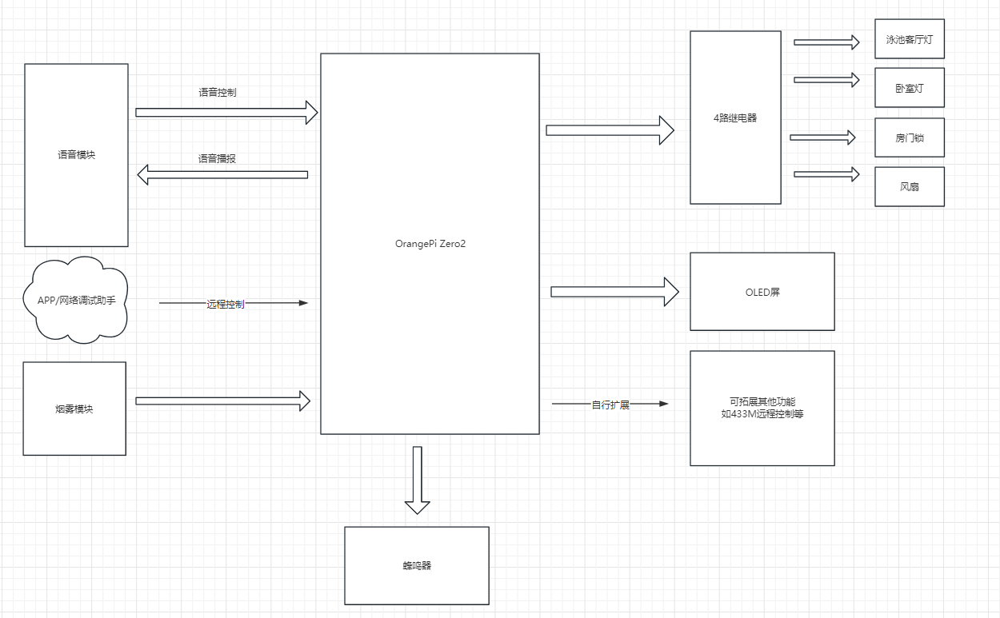
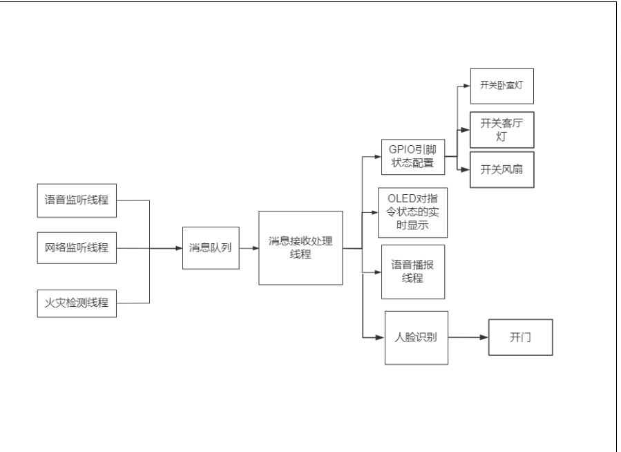

# 第一章

编译工具链:gcc blink.c -lwiringPi -lwiringPiDev -lpthread -lm -lcrypt -lrt -o blink

 sudo nmcli dev wifi connect YXS1017 password yuanxueshe1017

# 第二章

## Linux定时器

### settimer

在 Linux 系统中，`setitimer` 函数用于设置定时器，它可以在未来的某个时间点或者在一定的间隔后触发信号。这个函数提供了比 `alarm` 和 `sleep` 函数更精确和灵活的定时功能。
`setitimer` 可以设置三种类型的定时器：

1. 实时定时器（`ITIMER_REAL`）：减少实际时间，当时间到达时发送 `SIGALRM` 信号。
2. 虚拟定时器（`ITIMER_VIRTUAL`）：减少进程消耗的 CPU 时间，当时间到达时发送 `SIGVTALRM` 信号。
3. 概要定时器（`ITIMER_PROF`）：减少进程消耗的 CPU 时间和系统调用花费的时间，当时间到达时发送 `SIGPROF` 信号。
函数原型如下：
```c
int setitimer(int which, const struct itimerval *new_value, struct itimerval *old_value);
```
参数说明：
- `which`：指定要设置的定时器类型，可以是 `ITIMER_REAL`、`ITIMER_VIRTUAL` 或 `ITIMER_PROF`。
- `new_value`：指向 `itimerval` 结构的指针，用于指定定时器的初始值和间隔值。
- `old_value`：指向 `itimerval` 结构的指针，用于返回定时器的前一个值。如果不需要前一个值，可以设置为 `NULL`。
`itimerval` 结构定义如下：
```c
struct itimerval {
    struct timeval it_interval; // 定时器间隔
    struct timeval it_value;    // 定时器初始值
};
struct timeval {
    time_t      tv_sec;         // 秒
    suseconds_t tv_usec;        // 微秒
};
```
示例：
```c
#include <stdio.h>
#include <sys/time.h>
#include <signal.h>
void alarm_handler(int sig) {
    printf("定时器触发!\n");
}
int main() {
    struct itimerval timer;
    signal(SIGALRM, alarm_handler); // 设置信号处理函数
    // 设置定时器初始值
    timer.it_value.tv_sec = 5; // 5秒后触发
    timer.it_value.tv_usec = 0;
    // 设置定时器间隔
    timer.it_interval.tv_sec = 1; // 每隔1秒触发一次
    timer.it_interval.tv_usec = 0;
    // 设置实时定时器
    if (setitimer(ITIMER_REAL, &timer, NULL) == -1) {
        perror("setitimer");
        return 1;
    }
    // 循环以防止程序退出
    while (1) {
        pause(); // 挂起进程，等待信号
    }
    return 0;
}
```
在上面的示例中，触发时，都会调用 `alarm_handler` 函数打印一条消息。程序使用 `pause` 函数挂起，等待信号到来。

## pwm调控SG90

# 智能垃圾桶

```c
#include <stdio.h>
#include <string.h>
#include <stdlib.h>
#include <wiringPi.h>
#include <pthread.h>
#include <unistd.h>
#include <sys/socket.h>
#include <unistd.h>
#include <netinet/in.h>
#include <arpa/inet.h>

#include "uartTool.h"
#include "garbage.h"
#include "pwm.h"
#include "ole.h"

#define WGET_CMD "sudo wget http://127.0.0.1:8080/?action=snapshot -O /tmp/garbage.jpg"

void* function1(void* arg);
void* function2(void* arg);
void* function3(void* arg);
void* function4(void* arg);
void* function5(void* arg);
//互斥锁
pthread_mutex_t mutex;
//条件变量
pthread_cond_t cond;
//用于存放信号
unsigned char flag[6] = { 0xAA, 0X55, 0x00, 0x00, 0x55, 0xAA };
//存放管道标识符
int fd;
//能使用吗

int isProcessRunning(char *processName) {
    //运行正常将1返回,运行不正常将0返回,并将打印内容存放在buffer中
    char command[256];
    sprintf(command, "ps -ef | grep %s | grep -v grep", processName);

    ​    FILE *fp = popen(command, "r");
    ​    if (fp == NULL) 
        ​    {
        ​        perror("popen failed");
        ​        return 1;
        ​    }
    ​    char buffer[256];
    ​    fgets(buffer, sizeof(buffer), fp);
    ​    //能读取到信息,而且是乱码,所以只能通过正确的信息,来判断是否执行成功
        ​    if(buffer[0] != 'o')
            ​    {
            ​        pclose(fp);
            ​        return 1;
            ​    }
    ​    else
        ​    {
        ​        pclose(fp);
        ​        return 0;
        ​    }
}

int main(void)
{   
    //2.串口初始化
    fd = myserialOpen("/dev/ttyS5", 115200);
    //初始化orangepi
    wiringPiSetup();
    //1.Python接口初始化
    garbage_init();
    //互斥锁初始化
    if(pthread_mutex_init(&mutex, NULL))
    {
        printf("pthread_mutex_init failed");
        return 1;
    }
    //三个线程
    int repthread1, repthread2, repthread3;
    pthread_t thread1;
    pthread_t thread2;
    pthread_t thread3;
    repthread1 = pthread_create(&thread1, NULL, function1, NULL);
    if(0 != repthread1)
    {
        printf("pthread_create1 failed");
        exit(-1);
    }
    repthread2 = pthread_create(&thread2, NULL, function2, NULL);
    if (0 != repthread2)
    {
        printf("pthread_create2 failed");
        exit(-1);
    }
    repthread3 = pthread_create(&thread3, NULL, function3, NULL);
    if(0 != repthread3)
    {
        printf("pthread_create3 failed");
        exit(-1);
    }
    //初始化条件变量
    int repthread_cond_init =  pthread_cond_init(&cond, NULL);
    if(0 != repthread_cond_init)
    {
        puts("repthread_cond_init failed");
        exit(-1);
    }
    printf("主线程跑起来了\n");
    pthread_join(thread1, NULL);
    pthread_join(thread2, NULL);
    pthread_join(thread3, NULL);

    ​    //解锁互斥锁,为了销毁互斥锁做准备
        ​    
        ​    pthread_mutex_unlock(&mutex);
    ​    //销毁互斥锁
        ​    if(pthread_mutex_destroy(&mutex))
            ​    {
            ​        puts("pthread_mutex_destroy failed");
            ​        exit(-1);
            ​    }
    ​    //销毁条件变量
        ​    if(pthread_cond_destroy(&cond))
            ​    {
            ​        puts("pthread_cond_destroy failed");
            ​        exit(-1);
            ​    }
}
//线程1要执行的函数,语音模块数据线程
void* function1(void* arg)
{
    //在这里接收外部信号,如果接收到语音模块启动信号,则发送signal,让主线程操作
    while (1)
    {
        serialGetstring (fd, flag);
        if (0x46 == flag[2])
        {
            //发送信号
            if(pthread_cond_signal(&cond))
            {
                puts("pthread_cond_signal failed");
                exit(-1);
            }
            //解锁互斥锁,让主线程跑起来
            flag[2] = 0x00;
        }
    }
    //终结当前进程
    pthread_exit(NULL);
}
//线程2要执行的函数,为后续网络线程做准备
void* function2(void* arg)
{
    //创建一个套接字 返回一个整数，表示新的套接字描述符
    int sock = socket(AF_INET, SOCK_STREAM, 0);
    if (-1 == sock)
    {
        puts("socket failed");
        exit(-1);
    }

    //将套接字（socket）与一个本地地址（IP 地址和端口）绑定的系统调用
    struct sockaddr_in addrsock;    //指向 `struct sockaddr` 结构的指针，该结构包含了要绑定的地址。
    //清空变量内容
    memset(&addrsock,0,sizeof(addrsock));
    addrsock.sin_family = AF_INET;
    //套接字所绑定的ip 端口
    addrsock.sin_port = htons(9999);
    inet_aton("192.168.31.58",&addrsock.sin_addr);
    socklen_t addrlen = sizeof(addrsock);  //`addr` 指向的结构的长度，以字节为单位。
    int rebind = bind(sock, (const struct sockaddr*)&addrsock, addrlen);
    if (-1 == rebind)
    {
        puts("bind failed");
        exit(-1);
    }

    //在服务器端告知内核准备好接受来自客户端的连接请求。
    int relisten = listen(sock, 10);
    if (-1 == relisten)
    {
        puts("listen failed");
        exit(-1);
    }

    //`accept` 函数会阻塞等待直到有客户端的连接请求到达。
    //当有新的连接请求时，`accept` 函数将创建一个新的套接字用于与客户端通信，
    //而原始的监听套接字仍然保持开放，继续接受其他客户端的连接请求。
    struct sockaddr_in Caddr;
    socklen_t Caddrlen = (socklen_t)sizeof(Caddr);
    int ac_sockfd = accept(sock, (struct sockaddr*)&Caddr, &Caddrlen);
    if (-1 == ac_sockfd)
    {
        puts("accept failed");
        exit(-1);
    }

    //
    char buff[128] = {'\0'};
    while(1)
    {
        //接收信息 返回收到的字节数
        ssize_t received = recv(ac_sockfd, &buff, sizeof(buff), 0);
        printf("%s", buff);
        //如果在这里得到的字符是open,就给xx发送信号 发一个字符收一个字符操了
        ​        if(strstr(buff,"open"))
            ​        {
            ​            if(pthread_cond_signal(&cond))
                ​            {
                ​                puts("pthread_cond_signal failed");
                ​                exit(-1);
                ​            }
            ​            //解锁互斥锁,让主线程跑起来
                ​            flag[2] = 0x00;
            ​        }
        ​        memset(buff, 0, sizeof(buff));
        ​        //发送信息
            ​        //send(ac_sockfd, const void *buf, size_t len, int flags);
            ​        
            ​    }
    ​    close(ac_sockfd);
    ​    // 关闭监听套接字
        ​    close(sock); 
    ​    pthread_exit(NULL);
}

//用来跑原来主程序的内容
void* function3(void* arg)
{
    //存放语音调用返回值
    char* category = NULL;
    //锁住主线程,为了使用wait的前置条件
    while(1)
    {
        pthread_mutex_lock(&mutex);
        //解锁了主线程,但是阻塞在这里等待条件变量
        pthread_cond_wait(&cond, &mutex);
        pthread_mutex_unlock(&mutex);
        //gcc -o test main.c garbage.c uartTool.c pwm.c garbage.h uartTool.h pwm.h -I /usr/include/python3.10/ -lpython3.10 -lwiringPi      
        //1.检测mjpg有没有运行 ps -ef | grep mjpg.sh | grep -v grep
        if(isProcessRunning("mjpg.sh"))
        {
            printf("mjpg.sh没有成功运行\n");
            exit(-1);        
        }
        else
            puts("mjpg.sh成功运行");

        ​        puts("拍照");
        ​        system(WGET_CMD);
        ​        puts("执行阿里云垃圾识别接口");
        ​        category = garbage_category(category);
        ​        //4.接收识别结果

            ​        //5.发送标识实现语音播报 
            ​        puts("语音播报类别线程");
        ​        printf("%s", category);
        ​        if(strstr(category,"干垃圾"))
            ​        {
            ​            flag[2] = 0x41;
            ​            garbage_flag = 1; 
            ​        }
        ​        else if(strstr(category,"湿垃圾"))
            ​        {
            ​            flag[2] = 0x42;
            ​            garbage_flag = 2; 
            ​        }
        ​        else if(strstr(category,"可回收垃圾"))
            ​        {
            ​            flag[2] = 0x43;
            ​            garbage_flag = 3; 
            ​        }
        ​        else if(strstr(category,"有害垃圾"))
            ​        {
            ​            flag[2] = 0x44;
            ​            garbage_flag = 4; 
            ​        }
        ​        else
            ​        {
            ​            flag[2] = 0x45;
            ​            garbage_flag = 5; 
            ​        }
        ​        serialSendstring(fd, flag, 6);
        ​        flag[2] = 0x00;
        ​        remove("/tmp/garbage.jpg");
        ​        category = NULL;
        ​        int repthread4, repthread5;
        ​        pthread_t thread4;
        ​        pthread_t thread5;
        ​        repthread4 = pthread_create(&thread4, NULL, function4, NULL);
        ​        if(0 != repthread4)
            ​        {
            ​            printf("pthread_create4 failed");
            ​            exit(-1);
            ​        }
        ​        repthread5 = pthread_create(&thread5, NULL, function5, NULL);
        ​        if(0 != repthread5)
            ​        {
            ​            printf("pthread_create5 failed");
            ​            exit(-1);
            ​        }
        ​       // pthread_join(thread4, NULL);
            ​        //pthread_join(thread5, NULL);
            ​    }
}
//舵机
void* function4(void* arg)
{
    ​    pthread_detach(pthread_self());
    ​    puts("舵机函数");
    ​    pwm_wirte(5);
    ​    pwm_stop(5);
    ​    //pthread_exit(NULL);
}
//oled
void* function5(void* arg)
{
    ​    pthread_detach(pthread_self());
    ​    puts("oled函数");
    ​    oled();
    ​    //pthread_exit(NULL);
}
```

# 智能家居

## **需求及项目准备**

- 语音接入控制各类家电，如客厅灯、卧室灯、风扇
- 回顾二阶段的Socket编程，实现Sockect发送指令远程控制各类家电
- 烟雾警报监测， 实时检查是否存在煤气泄漏或者火灾警情，当存在警情时及时触发蜂鸣器报警及语音播报
- 控制人脸识别打开房门功能，并语音播报识别成功或者失败
- 局域网实时视频监控
- OLED屏实话显示当前主板温度、警情信息及控制指令信息
- 

```shell
#!/bin/bash

用来测试各个器件是否可以正常工作

#以下用来测试继电器
gpio mode 2 out #这是继电器1-黄灯
gpio mode 5 out #这是继电器2-白灯
gpio mode 7 out #这是继电器3-锁
gpio mode 8 out #这是继电器4-风扇
gpio mode 9 out #这是蜂鸣器

for i in 2 5 7 8 9
do
    gpio write $i 1
done

for i in 2 5 7 8 9
do
    gpio write $i 0
    sleep 2
    gpio write $i 1
done

#以下用来测试语音模块
# cd /boot/orangeEnv.txt 将串口uart5打开
# cd wiringpi 执行serialTest文件 测试语音模块

#测试iic
# 同样进入example里去执行oled_demo文件测试. 该文件需要参数 /dev/i2c-3
```

- 使用c语言调用python接口 下面介绍各个函数的作用和功能

```c
#if 0
1、包含Python.h头文件，以便使用Python API。
2、使用void Py_Initialize()初始化Python解释器，
3、使用PyObject *PyImport_ImportModule(const char *name)和PyObject
*PyObject_GetAttrString(PyObject *o, const char *attr_name)获取sys.path对象，并利用
int PyList_Append(PyObject *list, PyObject *item)将当前路径.添加到sys.path中，以便加载
当前的Python模块(Python文件即python模块)。
4、使用PyObject *PyImport_ImportModule(const char *name)函数导入Python模块，并检查是否
有错误。
5、使用PyObject *PyObject_GetAttrString(PyObject *o, const char *attr_name)函数获取
Python函数对象，并检查是否可调用。
6、使用PyObject *PyObject_CallObject(PyObject *callable, PyObject *args)函数调用
Python函数，并获取返回值。
7、使用void Py_DECREF(PyObject *o)函数释放所有引用的Python对象。
8、结束时调用void Py_Finalize()函数关闭Python解释器。
相关的函数参数说明参考网站（网站左上角输入函数名即可开始搜索）：
https://docs.python.org/zh-cn/3/c-api/import.html
#endif

```

## Py_Initialize()

`Py_Initialize()` 函数是 Python C API 的一部分，用于初始化 Python 解释器。当你想要在 C 或 C++ 代码中使用 Python 时，首先需要调用这个函数来准备好 Python 运行环境。

### 功能概述
- **初始化解释器**: `Py_Initialize()` 负责初始化 Python 解释器，包括执行一些基本的初始化任务，如分配内存、设置内部数据结构等。
- **启动Python**: 调用 `Py_Initialize()` 后，Python 解释器就可以接受命令并执行 Python 代码了。
### 使用场景
在以下场景中，你可能需要使用 `Py_Initialize()`：
- **嵌入式 Python**: 当你希望在 C 或 C++ 程序中嵌入 Python 解释器时，你需要调用 `Py_Initialize()` 来开始使用 Python。
- **扩展模块**: 如果你正在编写一个 Python 扩展模块（用 C 或 C++ 编写），在模块的初始化函数中，你需要在开始与 Python API 交互之前调用 `Py_Initialize()`。
### 注意事项
- **线程安全**: `Py_Initialize()` **不应该在多线程程序中调用**，因为它是线程不安全的。如果需要在多线程环境中初始化 Python 解释器，应该使用 `Py_InitializeThreads()`。
- **终止解释器**: 当你完成 Python 解释器的使用后，应该调用 `Py_Finalize()` 来清理解释器，释放资源。
### 代码示例
以下是一个简单的示例，展示了如何在 C 程序中初始化 Python 解释器：
```c
#include <Python.h>
int main() {
    // 初始化 Python 解释器
    Py_Initialize();
    // 这里可以执行 Python 代码或与 Python 交互
    // 清理 Python 解释器
    Py_Finalize();
    return 0;
}
```
在使用 `Py_Initialize()` 时，请确保遵循 Python C API 的正确使用方式，以避免潜在的问题。

## PyImport_ImportModule

`PyImport_ImportModule` 是 Python C API 中的一个函数，用于导入 Python 模块。这个函数允许你从 C 或 C++ 代码中导入一个 Python 模块，并返回一个指向该模块的 PyObject 指针。

### 函数原型
```c
PyObject *PyImport_ImportModule(const char *name);
```
### 参数
- `name`: 一个以 null 结尾的字符串，指定要导入的模块的名称。
### 返回值
- 如果成功，返回一个指向已导入模块的 PyObject 指针。
- 如果导入失败，返回 NULL，并设置一个异常。
### 使用场景
`PyImport_ImportModule` 通常用于以下情况：
- **嵌入式 Python**: 当你需要在 C 或 C++ 程序中嵌入 Python 解释器，并需要导入 Python 模块时。
- **扩展模块**: 如果你正在编写一个 Python 扩展模块，你可能需要导入其他 Python 模块来使用它们的函数或类。
### 注意事项
- **异常处理**: 在使用 `PyImport_ImportModule` 时，如果导入失败，应该检查并处理可能发生的异常。
- **内存管理**: 返回的 PyObject 指针在使用完成后应该被适当清理，以避免内存泄漏。
### 代码示例
以下是一个简单的示例，展示了如何在 C 程序中使用 `PyImport_ImportModule` 导入 Python 模块：
```c
#include <Python.h>
int main() {
    // 初始化 Python 解释器
    Py_Initialize();
    // 导入 Python 模块
    PyObject *module = PyImport_ImportModule("math");
    if (module == NULL) {
        PyErr_Print();
        return 1;
    }
    // 使用模块中的函数或变量
    // ...
    // 清理模块引用
    Py_DECREF(module);
    // 清理 Python 解释器
    Py_Finalize();
    return 0;
}
```
在这个示例中，我们尝试导入了 Python 的 `math` 模块。如果导入成功，我们可以通过返回的 `module` 指针来访问 `math` 模块中的函数和变量。如果导入失败，我们打印出异常信息并退出程序。最后，我们清理了对模块的引用，并调用了 `Py_Finalize` 来结束 Python 解释器。

##  PyObject_GetAttrString

`PyObject_GetAttrString` 是 Python C API 中的一个函数，用于获取一个 Python 对象的命名属性。这个函数允许你从 C 或 C++ 代码中获取一个 Python 对象的属性，并返回一个指向该属性的 PyObject 指针。

### 函数原型
```c
PyObject *PyObject_GetAttrString(PyObject *o, const char *attr_name);
```
### 参数
- `o`: 一个 Python 对象的指针，你希望从中获取属性。
- `attr_name`: 一个以 null 结尾的字符串，指定要获取的属性的名称。
### 返回值
- 如果成功，返回一个指向属性对象的 PyObject 指针。
- 如果属性不存在，返回 NULL，并设置一个 `AttributeError` 异常。
- 如果发生其他错误，返回 NULL，并设置相应的异常。
### 使用场景
`PyObject_GetAttrString` 通常用于以下情况：
- **嵌入式 Python**: 当你需要在 C 或 C++ 程序中嵌入 Python 解释器，并需要访问 Python 对象的属性时。
- **扩展模块**: 如果你正在编写一个 Python 扩展模块，你可能需要访问或修改其他 Python 对象的属性。
### 注意事项
- **异常处理**: 在使用 `PyObject_GetAttrString` 时，如果获取属性失败，应该检查并处理可能发生的异常。
- **内存管理**: 返回的 PyObject 指针在使用完成后应该被适当清理，以避免内存泄漏。
### 代码示例
以下是一个简单的示例，展示了如何在 C 程序中使用 `PyObject_GetAttrString` 获取 Python 对象的属性：
```c
#include <Python.h>
int main() {
    // 初始化 Python 解释器
    Py_Initialize();
    // 导入 Python 模块
    PyObject *module = PyImport_ImportModule("math");
    if (module == NULL) {
        PyErr_Print();
        return 1;
    }
    // 获取模块中的属性
    PyObject *pi = PyObject_GetAttrString(module, "pi");
    if (pi == NULL) {
        PyErr_Print();
        return 1;
    }
    // 使用属性
    printf("Value of math.pi: %f\n", PyFloat_AsDouble(pi));
    // 清理属性引用
    Py_DECREF(pi);
    // 清理模块引用
    Py_DECREF(module);
    // 清理 Python 解释器
    Py_Finalize();
    return 0;
}
```
在这个示例中，我们导入了 Python 的 `math` 模块，并使用 `PyObject_GetAttrString` 获取了 `math` 模块中的 `pi` 属性。如果获取成功，我们打印出 `pi` 的值。最后，我们清理了对属性和模块的引用，并调用了 `Py_Finalize` 来结束 Python 解释器。

## PyList_Append

`PyList_Append` 是 Python C API 中的一个函数，用于向 Python 列表对象追加一个元素。这个函数允许你从 C 或 C++ 代码中操作 Python 列表，将一个元素添加到列表的末尾。

### 函数原型
```c
int PyList_Append(PyObject *list, PyObject *item);
```
### 参数
- `list`: 一个 Python 列表对象的指针，你希望向其追加元素。
- `item`: 一个 Python 对象的指针，你希望追加到列表中的元素。
### 返回值
- 如果成功，返回 `0`。
- 如果发生错误，返回 `-1`，并设置一个异常。
### 使用场景
`PyList_Append` 通常用于以下情况：
- **嵌入式 Python**: 当你需要在 C 或 C++ 程序中嵌入 Python 解释器，并需要操作 Python 列表时。
- **扩展模块**: 如果你正在编写一个 Python 扩展模块，你可能需要向 Python 列表中添加元素。
### 注意事项
- **异常处理**: 在使用 `PyList_Append` 时，如果操作失败，应该检查并处理可能发生的异常。
- **内存管理**: 如果 `item` 是一个新建的 Python 对象，它会在列表中自动增加引用计数，因此你不需要额外增加它的引用计数。如果你不再需要 `item` 的引用，可以减少其引用计数。
### 代码示例
以下是一个简单的示例，展示了如何在 C 程序中使用 `PyList_Append` 向 Python 列表追加元素：
```c
#include <Python.h>
int main() {
    // 初始化 Python 解释器
    Py_Initialize();
    // 创建一个空列表
    PyObject *py_list = PyList_New(0);
    if (py_list == NULL) {
        PyErr_Print();
        return 1;
    }
    // 创建要追加的元素
    PyObject *py_item = PyLong_FromLong(42);
    if (py_item == NULL) {
        PyErr_Print();
        return 1;
    }
    // 向列表追加元素
    if (PyList_Append(py_list, py_item) < 0) {
        PyErr_Print();
        return 1;
    }
    // 清理元素引用
    Py_DECREF(py_item);
    // 清理列表引用
    Py_DECREF(py_list);
    // 清理 Python 解释器
    Py_Finalize();
    return 0;
}
```
在这个示例中，我们创建了一个空的 Python 列表，并使用 `PyList_Append` 向其追加了一个整数元素 `42`。如果追加成功，我们清理了对元素和列表的引用，并调用了 `Py_Finalize` 来结束 Python 解释器。

## PyObject_CallObject

`PyObject_CallObject` 是一个 C API 函数，用于在 C 语言中使用 Python 对象和函数。这个函数是在 Python 的 C API 中定义的，用于调用一个 Python 可调用对象（例如函数、方法、类或者实现了 `__call__` 方法的对象）。
函数原型定义如下：

```c
PyObject *PyObject_CallObject(PyObject *callable, PyObject *args);
```
参数说明：
- `callable`: 一个 Python 可调用对象，也就是一个可以被调用的 Python 对象。
- `args`: 一个 Python 元组对象，包含了被调用对象的所有参数。如果不需要传递参数，可以使用 `NULL`。
返回值：
- 调用成功，返回调用结果，这通常是一个 Python 对象。
- 调用失败，返回 `NULL`，并且会设置一个异常。
函数使用示例：
```c
PyObject *func = /* 获取一个可调用对象 */;
PyObject *args = PyTuple_Pack(3, "hello", 123, PyFloat_FromDouble(456.789));
PyObject *result = PyObject_CallObject(func, args);
if (result == NULL) {
    PyErr_Print();  // 打印错误信息
}
// 使用结果...
Py_DECREF(result);  // 减少引用计数
Py_DECREF(args);    // 减少引用计数
```
注意事项：
- 使用 `PyObject_CallObject` 时，需要确保 `args` 是一个正确的 Python 元组，且其中的所有元素都是正确的 Python 对象。
- 调用完成后，如果 `result` 和 `args` 不再需要，应该减少它们的引用计数，避免内存泄漏。
- 如果 `PyObject_CallObject` 返回 `NULL`，通常意味着在调用过程中发生了异常。可以使用 `PyErr_Print()` 等函数来处理异常。
- 在多线程环境中，使用这个函数需要确保线程安全。通常来说，需要先获取全局解释器锁（GIL）再进行调用，调用完成后释放 GIL。
这个函数是 Python C API 中与 Python 交互的基础之一，广泛应用于 C 扩展模块的开发中。在使用这个函数时，需要遵循 Python 的内存管理规则，正确处理引用计数，以确保资源的正确分配和释放。

## Py_DECREF()

`Py_DECREF()` 是 Python C API 中的一个函数，用于减少 Python 对象的引用计数。在 Python 中，每个对象都有一个引用计数，用于记录有多少个地方引用了这个对象。当对象的引用计数降到零时，Python 解释器会自动销毁这个对象，释放其占用的内存。
函数原型定义如下：

```c
void Py_DECREF(PyObject *o);
```
参数说明：
- `o`: 一个 Python 对象的指针。
函数作用：
- 将 `o` 指向的 Python 对象的引用计数减一。
- 如果引用计数降到零，Python 解释器会自动调用该对象的析构函数（`__del__` 方法），并释放对象占用的内存。
使用示例：
```c
PyObject *obj = PyLong_FromLong(42);  // 创建一个 Python 整数对象
Py_INCREF(obj);  // 增加引用计数
// ... 使用 obj ...
Py_DECREF(obj);  // 减少 obj 的引用计数
// 如果这是 obj 的最后一个引用，那么 obj 将被销毁
// obj 现在可能已经被销毁，所以不应该再访问它
```
注意事项：
- 在使用 `Py_DECREF()` 时，必须确保对象 `o` 的引用计数大于零，否则可能会导致双重释放（double free）或使用悬空指针（dangling pointer）。
- 如果在减少引用计数后，还需要继续使用该对象，应该确保保留至少一个有效的引用。
- 在多线程环境中，`Py_DECREF()` 的调用应该是线程安全的，因为 Python 的引用计数操作是原子操作。
- `Py_DECREF()` 应该与 `Py_INCREF()` 配对使用。每当你获取一个对象的新的引用时，应该使用 `Py_INCREF()` 来增加引用计数，确保在不再需要该引用时，使用 `Py_DECREF()` 来减少引用计数。
`Py_DECREF()` 是 Python 内存管理的关键部分，正确使用它可以帮助避免内存泄漏和悬挂指针的问题。在编写 C 扩展模块时，管理好对象的引用计数是非常重要的。

## PyArg_Parse()

`PyArg_Parse()` 是 Python C API 中用于解析 Python 函数调用参数的函数。它将 Python 的参数转换为 C 语言中的变量，使得 C 语言编写的扩展模块能够接收 Python 代码传递的参数。
函数原型定义如下：

```c
int PyArg_Parse(PyObject *args, const char *format, ...);
```
参数说明：
- `args`: 一个 Python 元组对象，通常是通过 Python 函数的 `__args__` 属性获得的，包含了所有的参数。
- `format`: 一个字符串，指定了如何解析 `args` 中的参数。格式字符串由一系列格式码组成，每个格式码对应一个 C 语言中的变量。
- `...`: 可变长的参数列表，包含了与 `format` 中格式码对应的 C 语言变量。
返回值：
- 成功时返回 `0`。
- 失败时返回 `-1`，并设置一个 Python 异常。
格式字符串说明：
`PyArg_Parse()` 的格式字符串由一系列格式码组成，每个格式码对应一个参数。格式码后面可以跟着一个额外的字符，用于指定对齐和大小等选项。例如：
- `s`: 将 Python 字符串转换为 C 语言中的 `char*`。
- `i`: 将 Python 整数转换为 C 语言中的 `int`。
- `f`: 将 Python 浮点数转换为 C 语言中的 `float`。
- `O`: 将 Python 对象转换为 `PyObject*`，不进行类型检查。
- `p`: 将 Python 对象转换为 C 指针类型，通常用于 `void*`。
使用示例：
```c
static PyObject *my_module_func(PyObject *self, PyObject *args) {
    int a;
    char *s;
    if (!PyArg_Parse(args, "si", &s, &a)) {
        return NULL;  // 解析失败
    }
    // 使用参数 s 和 a
    // ...
    Py_RETURN_NONE;  // 成功时返回 None
}
```
在这个例子中，`my_module_func` 函数期望接收一个字符串和一个整数作为参数。`PyArg_Parse()` 用于将这些参数从 Python 对象转换为 C 变量 `s` 和 `a`。
注意事项：
- `PyArg_Parse()` 不会检查传递的参数数量，只会根据格式字符串解析参数。如果参数数量不匹配，可能会导致未定义的行为。
- 如果参数解析失败，`PyArg_Parse()` 会设置一个 Python 异常，通常是一个 `TypeError`。
- `PyArg_Parse()` 的使用需要非常小心，以确保类型安全和内存管理。例如，对于字符串参数，`PyArg_Parse()` 会在 C 语言中创建一个临时的字符串副本，因此在使用完毕后不需要手动释放。
- `PyArg_Parse()` 只能用于简单的参数解析情况。对于更复杂的参数类型（如关键字参数、可变参数等），应该使用 `PyArg_ParseTupleAndKeywords()` 或其他相关函数。
`PyArg_Parse()` 是 Python C API 中非常常用的函数，它简化了 C 语言扩展模块中参数的解析工作。正确使用这个函数可以确保 C 语言代码能够安全地接收和处理 Python 代码传递的参数。

## 消息队列posix

### mq_open

在Linux中，`mqd_t mq_open(const char *name, int oflag, mode_t mode, struct mq_attr *attr)` 函数用于创建或打开一个消息队列。这是POSIX消息队列API的一部分，允许进程以类似于文件的方式发送和接收消息。
下面是函数参数的详细说明：

- `name`：指定消息队列的名称。这个名称应该以斜杠`/`开头，表示消息队列在文件系统中的路径。如果名称以`/`开头，那么它将创建一个全局的消息队列，可以在整个系统范围内访问。如果名称不以`/`开头，那么它将创建一个进程特定的消息队列，只能在本进程及其子进程中访问。
- `oflag`：这个参数是一个位掩码，用于指定打开消息队列的模式。它可以包含以下标志：
  - `O_RDONLY`：以只读方式打开消息队列。
  - `O_WRONLY`：以只写方式打开消息队列。
  - `O_RDWR`：以读写方式打开消息队列。
  - `O_CREAT`：如果消息队列不存在，则创建它。
  - `O_EXCL`：与`O_CREAT`一起使用，如果消息队列已经存在，则返回错误。
  - `O_NONBLOCK`：以非阻塞模式打开消息队列。如果消息队列已满（对于写操作）或为空（对于读操作），则操作将立即返回而不是阻塞。
- `mode`：当创建消息队列时，这个参数用于设置消息队列的权限。它使用标准的UNIX文件权限位，例如`0644`。这个参数只在`oflag`中包含`O_CREAT`时才有意义。
- `attr`：指向`struct mq_attr`的指针，用于设置消息队列的属性。如果设置为`NULL`，则使用默认属性。`struct mq_attr`结构体定义了消息队列的各种属性，如最大消息大小、最大消息数量等。
函数返回值：
- 如果成功，返回消息队列的描述符（`mqd_t`类型）。
- 如果失败，返回`-1`，并设置`errno`来表示错误原因。
使用示例：

```c
#include <fcntl.h>
#include <mqueue.h>
#include <sys/stat.h>
int main() {
    struct mq_attr attr;
    attr.mq_flags = 0;
    attr.mq_maxmsg = 10;
    attr.mq_msgsize = 1024;
    attr.mq_curmsgs = 0;
    mqd_t mq = mq_open("/myqueue", O_CREAT | O_RDWR, 0644, &attr);
    if (mq == -1) {
        perror("mq_open");
        return 1;
    }
    // 使用消息队列进行通信...
    if (mq_close(mq) == -1) {
        perror("mq_close");
        return 1;
    }
    return 0;
}

下面有结构体的介绍:
```
在这个示例中，我们创建了一个名为`/myqueue`的消息队列，设置了最大消息数量为10，最大消息大小为1024字节。然后我们打开了这个消息队列，并在之后的使用中可以通过返回的`mqd_t`描述符来进行操作。最后，我们关闭了消息队列。

**struct mq_attr**

在Linux中，`struct mq_attr` 是一个用于定义消息队列属性结构的类型。这个结构体用于在调用 `mq_open()` 函数时传递消息队列的属性，或者在调用 `mq_setattr()` 函数时修改消息队列的属性。
下面是 `struct mq_attr` 结构体的定义和成员详解：

```c
struct mq_attr {
    long mq_flags;         // 消息队列的标志
    long mq_maxmsg;        // 消息队列中允许的最大消息数量
    long mq_msgsize;       // 单个消息的最大大小
    long mq_curmsgs;       // 当前消息队列中的消息数量
};
```
成员详解：
- `mq_flags`：消息队列的标志，可以包含以下值：
  - `O_NONBLOCK`：设置消息队列以非阻塞模式打开。
  - `O_CREAT`：如果消息队列不存在，则创建它。
  - `O_EXCL`：与 `O_CREAT` 一起使用，如果消息队列已经存在，则返回错误。
  - `O_CLOEXEC`：设置消息队列描述符为关闭时exec。
- `mq_maxmsg`：消息队列中允许的最大消息数量。这个值设置为0时，表示没有限制。
- `mq_msgsize`：单个消息的最大大小。这个值设置为0时，表示单个消息的大小没有限制。
- `mq_curmsgs`：当前消息队列中的消息数量。这个值可以在调用 `mq_getattr()` 函数时获取。
使用示例：
```c
#include <mqueue.h>
#include <stdio.h>
#include <stdlib.h>
int main() {
    struct mq_attr attr;
    attr.mq_flags = 0;
    attr.mq_maxmsg = 10;
    attr.mq_msgsize = 1024;
    attr.mq_curmsgs = 0;
    // 使用 mq_attr 结构体创建消息队列
    mqd_t mq = mq_open("/myqueue", O_CREAT | O_RDWR, 0644, &attr);
    if (mq == -1) {
        perror("mq_open");
        exit(EXIT_FAILURE);
    }
    // 使用消息队列进行通信...
    // 关闭消息队列
    if (mq_close(mq) == -1) {
        perror("mq_close");
        exit(EXIT_FAILURE);
    }
    return 0;
}
```
在这个示例中，我们定义了一个 `struct mq_attr` 结构体，并设置了消息队列的属性，包括最大消息数量和单个消息的大小。然后我们使用这个结构体创建了一个消息队列。在实际应用中，您可能需要根据需求调整这些属性值。

### mq_close

在Linux中，`int mq_close(mqd_t mqdes);` 函数用于关闭一个之前通过 `mq_open()` 打开的POSIX消息队列的描述符。这个函数是POSIX消息队列API的一部分，用于管理和操作消息队列。
下面是函数参数的详细说明：

- `mqdes`：这是一个消息队列描述符，它是通过之前的 `mq_open()` 调用返回的，用于标识一个打开的消息队列。
函数返回值：
- 如果成功，返回 `0`。
- 如果失败，返回 `-1`，并设置 `errno` 来表示错误原因。
使用示例：
```c
#include <mqueue.h>
#include <stdio.h>
#include <stdlib.h>
int main() {
    struct mq_attr attr;
    attr.mq_flags = 0;
    attr.mq_maxmsg = 10;
    attr.mq_msgsize = 1024;
    attr.mq_curmsgs = 0;
    mqd_t mq = mq_open("/myqueue", O_CREAT | O_RDWR, 0644, &attr);
    if (mq == -1) {
        perror("mq_open");
        exit(EXIT_FAILURE);
    }
    // 使用消息队列进行通信...
    if (mq_close(mq) == -1) {
        perror("mq_close");
        exit(EXIT_FAILURE);
    }
    printf("消息队列已成功关闭。\n");
    return 0;
}
```
在这个示例中，我们首先创建了一个名为 `/myqueue` 的消息队列，并设置了相关的属性。然后我们打开了这个消息队列，并在完成通信后使用 `mq_close()` 来关闭它。如果关闭成功，我们打印一条消息表示消息队列已成功关闭。
注意事项：
- `mq_close()` 只是将消息队列描述符的引用计数减一，如果引用计数降到零，消息队列才会被真正删除。如果还有其他进程或线程持有该消息队列的描述符，那么消息队列仍然可以使用。
- 如果消息队列是在 `O_CREAT` 模式下创建的，并且在创建时设置了 `O_EXCL` 标志，那么在关闭最后一个描述符时，消息队列将被删除。
- 在进程终止时，所有打开的消息队列描述符都会被自动关闭，但这可能不是优雅的关闭方式，因为它不会等待所有消息被处理完毕。因此，建议在进程结束前显式地关闭所有打开的消息队列。

### mq_unlink

在Linux中，`int mq_unlink(const char *name)` 函数用于删除一个消息队列。这个函数是POSIX消息队列API的一部分，用于管理和操作消息队列。
下面是函数参数的详细说明：

- `name`：这是一个字符串，指定要删除的消息队列的名称。这个名称应该以斜杠`/`开头，表示消息队列在文件系统中的路径。
函数返回值：
- 如果成功，返回 `0`。
- 如果失败，返回 `-1`，并设置 `errno` 来表示错误原因。
使用示例：
```c
#include <mqueue.h>
#include <stdio.h>
#include <stdlib.h>
int main() {
    // 打开消息队列
    mqd_t mq = mq_open("/myqueue", O_CREAT | O_RDWR, 0644, NULL);
    if (mq == -1) {
        perror("mq_open");
        exit(EXIT_FAILURE);
    }
    // 使用消息队列进行通信...
    // 删除消息队列
    if (mq_unlink("/myqueue") == -1) {
        perror("mq_unlink");
        exit(EXIT_FAILURE);
    }
    printf("消息队列已成功删除。\n");
    // 关闭消息队列
    if (mq_close(mq) == -1) {
        perror("mq_close");
        exit(EXIT_FAILURE);
    }
    return 0;
}
```
在这个示例中，我们首先创建了一个名为 `/myqueue` 的消息队列，并设置了相关的属性。然后我们打开了这个消息队列，并在完成通信后使用 `mq_unlink()` 来删除它。如果删除成功，我们打印一条消息表示消息队列已成功删除。
注意事项：
- 调用 `mq_unlink()` 函数时，消息队列必须已经不再被任何进程使用。如果消息队列仍然有打开的描述符，或者有消息在队列中，删除操作将失败。
- 如果消息队列是通过 `O_CREAT` 标志创建的，并且创建时没有设置 `O_EXCL` 标志，那么在最后一个描述符关闭后，消息队列会自动删除。因此，通常不需要显式地调用 `mq_unlink()`。

### mq_getattr

在Linux操作系统中，`mq_getattr` 函数用于获取与消息队列描述符关联的属性。这个函数是POSIX消息队列API的一部分，允许进程以一种统一的方式来处理消息队列。
以下是 `mq_getattr` 函数的详细信息：
**函数原型**

```c
int mq_getattr(mqd_t mqdes, struct mq_attr *attr);
```
**参数说明**

- `mqdes`：消息队列描述符，用于指定要获取属性的消息队列。
- `attr`：指向 `struct mq_attr` 结构的指针，该结构用于接收消息队列的属性信息。

**返回值**

成功时返回0，失败时返回-1，并设置errno以指示错误。

`struct mq_attr` **结构**

`struct mq_attr` 结构用于保存消息队列的属性信息，定义如下：
```c
struct mq_attr {
    long mq_flags;    /* 消息队列的标志 */
    long mq_maxmsg;   /* 消息队列中允许的最大消息数 */
    long mq_msgsize;  /* 单个消息的最大大小 */
    long mq_curmsgs;  /* 消息队列中当前的消息数 */
};
```
- `mq_flags`：消息队列的标志，可以设置为0或`O_NONBLOCK`，表示消息队列是以非阻塞模式打开的。
- `mq_maxmsg`：消息队列中允许的最大消息数。
- `mq_msgsize`：单个消息的最大大小（以字节为单位）。
- `mq_curmsgs`：消息队列中当前的消息数。

**使用示例**

```c
#include <fcntl.h>       /* For O_* constants */
#include <mqueue.h>
#include <sys/stat.h>    /* For mode constants */
#include <stdio.h>
int main() {
    mqd_t mqdes;
    struct mq_attr attr;
    /* 打开消息队列 */
    mqdes = mq_open("/myqueue", O_RDWR | O_CREAT, 0644, NULL);
    /* 获取消息队列属性 */
    mq_getattr(mqdes, &attr);
    /* 打印消息队列属性 */
    printf("Flags: %ld\n", attr.mq_flags);
    printf("Max Messages: %ld\n", attr.mq_maxmsg);
    printf("Message Size: %ld\n", attr.mq_msgsize);
    printf("Current Messages: %ld\n", attr.mq_curmsgs);
    /* 关闭消息队列 */
    mq_close(mqdes);
    return 0;
}
```
这个函数允许程序获取关于消息队列的详细信息，如队列中当前的消息数量、消息的最大数量和大小等，从而能够根据这些信息进行相应的处理。

###  mq_setattr

linux中int mq_setattr(mqd_t mqdes, struct mq_attr *attr, struct mq_attr *oattr);函数详解

### mq_send

在 Linux 系统中，`mq_send` 函数用于向消息队列发送一条消息。消息队列（Message Queue）是进程间通信（IPC）的一种机制，允许一个或多个进程发送和接收消息。
函数原型如下：
```c
int mq_send(mqd_t mqdes, const char *ptr, size_t len, unsigned int prio);
```
参数说明：
- `mqdes`：消息队列描述符，通过 `mq_open` 函数创建或打开消息队列时返回。
- `ptr`：指向要发送的消息的指针。
- `len`：要发送的消息的长度（以字节为单位）。消息的最大长度在创建消息队列时指定，不能超过这个最大值。
- `prio`：消息的优先级。这个值越大，消息的优先级越高。如果消息队列的实现不支持优先级，这个参数可能会被忽略。
返回值：
- 成功时返回 0。
- 出错时返回 -1，并设置 `errno` 来指示错误。
在使用 `mq_send` 之前，需要包含 `<mqueue.h>` 头文件，并且确保系统支持 POSIX 消息队列。
示例代码：
```c
#include <fcntl.h>
#include <mqueue.h>
#include <stdio.h>
#include <stdlib.h>
#include <string.h>
int main() {
    mqd_t mqdes;
    struct mq_attr attr;
    char buffer[256];
    // 设置消息队列的属性
    attr.mq_flags = 0;
    attr.mq_maxmsg = 10;
    attr.mq_msgsize = 256;
    attr.mq_curmsgs = 0;
    // 创建或打开消息队列
    mqdes = mq_open("/myqueue", O_CREAT | O_RDWR, 0644, &attr);
    if (mqdes == (mqd_t)-1) {
        perror("mq_open");
        exit(EXIT_FAILURE);
    }
    // 准备要发送的消息
    strcpy(buffer, "Hello, World!");
    // 发送消息
    if (mq_send(mqdes, buffer, strlen(buffer) + 1, 0) == -1) {
        perror("mq_send");
        exit(EXIT_FAILURE);
    }
    // 关闭消息队列
    if (mq_close(mqdes) == -1) {
        perror("mq_close");
        exit(EXIT_FAILURE);
    }
    // 删除消息队列
    if (mq_unlink("/myqueue") == -1) {
        perror("mq_unlink");
        exit(EXIT_FAILURE);
    }
    return EXIT_SUCCESS;
}
```
在这个例子中，我们创建了一个消息队列，然后发送了一条消息。消息的内容是 "Hello, World!"，长度为 13 个字节（包括结束符 '\0'）。消息的优先级设置为 0。发送消息后，我们关闭了消息队列，并最终删除了它。

### mq_receive

在 Linux 系统中，`mq_receive` 函数用于从消息队列中接收一条消息。消息队列（Message Queue）是进程间通信（IPC）的一种机制，允许一个或多个进程发送和接收消息。
函数原型如下：
```c
ssize_t mq_receive(mqd_t mqdes, char *ptr, size_t len, unsigned int *prio);
```
参数说明：
- `mqdes`：消息队列描述符，通过 `mq_open` 函数创建或打开消息队列时返回。
- `ptr`：指向缓冲区的指针，用于接收消息内容。
- `len`：缓冲区的长度（以字节为单位）。这个值应该至少与消息队列中消息的最大长度相等，以确保能够接收完整的消息。
- `prio`：指向一个 `unsigned int` 变量的指针，用于接收消息的优先级。如果消息队列不支持优先级，或者不需要获取消息的优先级，可以将这个参数设置为 `NULL`。
返回值：
- 成功时返回接收到的消息的字节数。
- 如果消息队列为空，且队列为非阻塞模式，返回 -1 并设置 `errno` 为 `EAGAIN`。
- 如果发生其他错误，返回 -1 并设置 `errno` 来指示错误。
在使用 `mq_receive` 之前，需要包含 `<mqueue.h>` 头文件，并且确保系统支持 POSIX 消息队列。
示例代码：
```c
#include <fcntl.h>
#include <mqueue.h>
#include <stdio.h>
#include <stdlib.h>
#include <string.h>
int main() {
    mqd_t mqdes;
    struct mq_attr attr;
    char buffer[256];
    unsigned int prio;
    // 设置消息队列的属性
    attr.mq_flags = 0;
    attr.mq_maxmsg = 10;
    attr.mq_msgsize = 256;
    attr.mq_curmsgs = 0;
    // 创建或打开消息队列
    mqdes = mq_open("/myqueue", O_CREAT | O_RDWR, 0644, &attr);
    if (mqdes == (mqd_t)-1) {
        perror("mq_open");
        exit(EXIT_FAILURE);
    }
    // 接收消息
    ssize_t bytes_read = mq_receive(mqdes, buffer, sizeof(buffer), &prio);
    if (bytes_read == -1) {
        perror("mq_receive");
        exit(EXIT_FAILURE);
    }
    printf("Received message: %s\n", buffer);
    printf("Message priority: %u\n", prio);
    // 关闭消息队列
    if (mq_close(mqdes) == -1) {
        perror("mq_close");
        exit(EXIT_FAILURE);
    }
    // 删除消息队列
    if (mq_unlink("/myqueue") == -1) {
        perror("mq_unlink");
        exit(EXIT_FAILURE);
    }
    return EXIT_SUCCESS;
}
```
在这个例子中，我们打开了一个消息队列，然后使用 `mq_receive` 函数接收了一条消息。接收到的消息存储在 `buffer` 中，消息的优先级存储在 `prio` 变量中。接收消息后，我们关闭了消息队列，并最终删除了它。

###  mq_notify

在 Linux 系统中，`mq_notify` 函数用于注册或注销消息队列的通知。当消息队列中有新消息到达时，可以收到通知，这样应用程序就不需要不断地轮询消息队列是否有新消息。
函数原型如下：

```c
int mq_notify(mqd_t mqdes, const struct sigevent* notification);

//结构体
   union sigval { 
       int     sival_int;
       void   *sival_ptr;
   };

   struct sigevent {
       int          sigev_notify; /* 通知方式 */
       int          sigev_signo;  /* 通知信号 */
       union sigval sigev_value;  /* 伴随通知所传递的数据 */
       void       (*sigev_notify_function) (union sigval);
                        /* 通知方式设置为"线程通知" (SIGEV_THREAD)时新线程的线程函数 */
       void        *sigev_notify_attributes;
                        /* 通知方式设置为"线程通知" (SIGEV_THREAD)时新线程的属性 */
       pid_t        sigev_notify_thread_id;
                        /* 通知方式为SIGEV_THREAD_ID时，接收信号的线程的pid */
   };
```
参数说明：
- `mqdes`：消息队列描述符，通过 `mq_open` 函数创建或打开消息队列时返回。
- `notification`：指向 `sigevent` 结构的指针，用于指定通知的方式。如果 `notification` 为 `NULL`，则注销之前注册的通知。
`sigevent` 结构至少包含以下成员：
- `sigev_notify`：指定通知类型，可以是 `SIGEV_NONE`、`SIGEV_SIGNAL`、`SIGEV_THREAD` 之一。
  - `SIGEV_NONE`：不进行通知。
  - `SIGEV_SIGNAL`：当消息到达时，发送一个信号给进程。
  - `SIGEV_THREAD`：当消息到达时，创建一个线程来处理通知。
- `sigev_signo`：当 `sigev_notify` 设置为 `SIGEV_SIGNAL` 时，指定发送的信号编号。
- `sigev_value`：信号携带的值，可以通过 `siginfo_t` 结构的 `si_value` 成员在信号处理函数中访问。当 `sigev_notify` 设置为 `SIGEV_THREAD` 时，`sigev_value` 用于指定传递给新创建线程的初始化值。这个值会被传递给线程函数的参数。
- `sigev_notify_function`：当 `sigev_notify` 设置为 `SIGEV_THREAD` 时，指定线程函数的地址。
- `sigev_notify_attributes`：当 `sigev_notify` 设置为 `SIGEV_THREAD` 时，指定线程属性结构的地址。如果设置为 `NULL`，则使用默认的线程属性。
返回值：
- 成功时返回 0。
- 出错时返回 -1，并设置 `errno` 来指示错误。
在使用 `mq_notify` 之前，需要包含 `<mqueue.h>` 头文件，并且确保系统支持 POSIX 消息队列。
示例代码（使用 `SIGEV_SIGNAL`）：
```c
#include <fcntl.h>
#include <mqueue.h>
#include <stdio.h>
#include <stdlib.h>
#include <string.h>
#include <unistd.h>
#include <signal.h>
void signal_handler(int signo) {
    printf("Received signal %d\n", signo);
}
int main() {
    mqd_t mqdes;
    struct mq_attr attr;
    struct sigevent sev;
    // 设置消息队列的属性
    attr.mq_flags = 0;
    attr.mq_maxmsg = 10;
    attr.mq_msgsize = 1024;
    attr.mq_curmsgs = 0;
    // 创建或打开消息队列
    mqdes = mq_open("/myqueue", O_CREAT | O_RDWR, 0644, &attr);
    if (mqdes == (mqd_t)-1) {
        perror("mq_open");
        exit(EXIT_FAILURE);
    }
    // 设置信号处理函数
    signal(SIGUSR1, signal_handler);
    // 设置通知
    sev.sigev_notify = SIGEV_SIGNAL;
    sev.sigev_signo = SIGUSR1;
    sev.sigev_value.sival_ptr = &mqdes;
    if (mq_notify(mqdes, &sev) == -1) {
        perror("mq_notify");
        exit(EXIT_FAILURE);
    }
    // ... 其他代码 ...
    // 关闭消息队列
    if (mq_close(mqdes) == -1) {
        perror("mq_close");
        exit(EXIT_FAILURE);
    }
    // 删除消息队列
    if (mq_unlink("/myqueue") == -1) {
        perror("mq_unlink");
        exit(EXIT_FAILURE);
    }
    return EXIT_SUCCESS;
}
```
在这个例子中，我们创建了一个消息队列，并注册了一个通知，当消息到达时，会发送一个 `SIGUSR1` 信号给进程。在信号处理函数中，我们可以处理通知并采取相应的行动。

### 示例

```c
#include <pthread.h>
#include <stdio.h>
#include <mqueue.h>
#include <stdlib.h>
#include <unistd.h>

void* sender (void* arg)
{
    mqd_t mq = *((mqd_t*)arg);
    char message[] = "i am a superman!\n";
    printf("发送的信息是: %s", message);
    //发送消息进入队列
    /*
    1.消息队列描述符
    2.指向要发送的消息的指针。
    3.要发送的消息的长度（以字节为单位）。
    4.消息的优先级。
    */
    sleep(15);
    if(-1 == mq_send(mq, message, sizeof(message), 0))
    {
        perror("mq_send");
        exit(-1);
    } 
    return NULL;
}

void* receiver (void* arg)
{
    char buffer[1024] = {'\0'};
    mqd_t mq = *((mqd_t*)arg);
    unsigned int level;
    sleep(30);
    ssize_t receive_num = mq_receive(mq, buffer, 1024, &level);
    if(-1 == receive_num)
    {
        perror("mq_receive");
        exit(-1);
    }
    printf("收到的信息是: %s", buffer);
    return NULL;
}

int main (void)
{
    //创建消息队列
    /*
    1.指定消息队列的名称。 带/为全局变量
    2.这个参数是一个位掩码，用于指定打开消息队列的模式。
    3.设置消息队列的权限。
    4.结构体指针
    */
    struct mq_attr attr;
    attr.mq_flags = 0;      // 消息队列的标志
    attr.mq_maxmsg = 10;    // 消息队列中允许的最大消息数量
    attr.mq_msgsize = 1024; // 单个消息的最大大小
    attr.mq_curmsgs = 0;    // 当前消息队列中的消息数量
    mqd_t mq = mq_open("/queue", O_CREAT | O_RDWR, 0666, &attr);
    if(mq == -1)
    {
        perror("mq_open");
        return 1;
    }

    pthread_t send, receive;
    pthread_create(&send, NULL, sender, (void*)&mq);
    pthread_create(&receive, NULL, receiver, (void*)&mq);

    pthread_join(send, NULL);
    pthread_join(receive, NULL);

    sleep(15);
    mq_unlink("/queue");
    if(mq_close(mq) == -1)
    {
        perror("mq_close: ");
        exit(-1);
    }
    //
    return 0;
}

```

**这个是使用mq_notify达到通信的效果**

```c
#include <pthread.h>
#include <stdio.h>
#include <mqueue.h>
#include <stdlib.h>
#include <unistd.h>
#include <signal.h>

void* sender (void* arg)
{
    mqd_t mq = *((mqd_t*)arg);
    char message[] = "i am a superman!\n";
    printf("发送的信息是: %s", message);
    //发送消息进入队列
    /*
    1.消息队列描述符
    2.指向要发送的消息的指针。
    3.要发送的消息的长度（以字节为单位）。
    4.消息的优先级。
    */
    while(1)
    {
        if(-1 == mq_send(mq, message, sizeof(message), 0))
        {
            perror("mq_send");
            exit(-1);
        }
        sleep(rand()%10);
    }


    return NULL;
}
//定义函数的时候要这样定义
//因为:notification.sigev_notify_function 应该是一个函数指针，它指向一个函数，该函数的参数是一个 union sigval 类型的值，返回类型是 void。
void notify_thread(union sigval arg)
{
    mqd_t mq = *((mqd_t*)arg.sival_ptr);
    char buffer[1024] = {'\0'};
    ssize_t recv_size = -1;
    recv_size = mq_receive(mq, buffer, 1024, NULL);
    if(-1 == recv_size)
    {
        perror("mq_receive");
        exit(-1);
    }
    printf("接收的信息是: %s", buffer);
    
    struct sigevent notification;
    notification.sigev_notify = SIGEV_THREAD;   //当消息到达时，创建一个线程来处理通知。
    notification.sigev_value.sival_ptr =(void*)&mq;    //信号携带的值，可以通过 `siginfo_t` 结构的 `si_value` 成员在信号处理函数中访问。
    notification.sigev_notify_function = notify_thread;
    notification.sigev_notify_attributes = NULL; //指定线程属性结构的地址。如果设置为 `NULL`，则使用默认的线程属性。
    int remq = mq_notify(mq, &notification);
    if(remq != 0)
    {
        perror("mq_notify");
        exit(-1);
    }

    return;
}

int main (void)
{
    //创建消息队列
    /*
    1.指定消息队列的名称。 带/为全局变量
    2.这个参数是一个位掩码，用于指定打开消息队列的模式。
    3.设置消息队列的权限。
    4.结构体指针
    */
    struct mq_attr attr;
    attr.mq_flags = 0;      // 消息队列的标志
    attr.mq_maxmsg = 10;    // 消息队列中允许的最大消息数量
    attr.mq_msgsize = 1024; // 单个消息的最大大小
    attr.mq_curmsgs = 0;    // 当前消息队列中的消息数量
    mqd_t mq = mq_open("/queue", O_CREAT | O_RDWR, 0666, &attr);
    if(mq == -1)
    {
        perror("mq_open");
        return 1;
    }

    struct sigevent notification;
    notification.sigev_notify = SIGEV_THREAD;   //当消息到达时，创建一个线程来处理通知。
    notification.sigev_value.sival_ptr =(void*)&mq;    //信号携带的值，可以通过 `siginfo_t` 结构的 `si_value` 成员在信号处理函数中访问。
    notification.sigev_notify_function = notify_thread;
    notification.sigev_notify_attributes = NULL; //指定线程属性结构的地址。如果设置为 `NULL`，则使用默认的线程属性。
    int remq = mq_notify(mq, &notification);
    if(remq != 0)
    {
        perror("mq_notify");
        exit(-1);
    }

    pthread_t send, receive;
    pthread_create(&send, NULL, sender, (void*)&mq);
    puts("try");
    pthread_join(send, NULL);
    puts("try1");

    sleep(5);
    mq_unlink("/queue");
    if(mq_close(mq) == -1)
    {
        perror("mq_close: ");
        exit(-1);
    }

    return 0;
}

```

## 整体设计



## 补充

使用语音模块和oled模块,内部含有电容和上拉电阻,可能会影响其他接口的电平

# 第三章 gcc编译器的使用

## gcc编译过程

预处理 —->编译 —->汇编 —->链接 —->反汇编

预处理:把.c里面的头文件找到,把宏展开,编译开关使用起来

xx.c

```
Using built-in specs.
COLLECT_GCC=gcc
COLLECT_LTO_WRAPPER=/usr/lib/gcc/x86_64-linux-gnu/11/lto-wrapper
OFFLOAD_TARGET_NAMES=nvptx-none:amdgcn-amdhsa
OFFLOAD_TARGET_DEFAULT=1
Target: x86_64-linux-gnu

Thread model: posix
Supported LTO compression algorithms: zlib zstd
gcc version 11.4.0 (Ubuntu 11.4.0-1ubuntu1~22.04) 
COLLECT_GCC_OPTIONS='-o' 'test' '-v' '-mtune=generic' '-march=x86-64' '-dumpdir' 'test-'

cc1  test.c -o /tmp/cchapOlw.s
GNU C17 (Ubuntu 11.4.0-1ubuntu1~22.04) version 11.4.0 (x86_64-linux-gnu)
	compiled by GNU C version 11.4.0, GMP version 6.2.1, MPFR version 4.1.0, MPC version 1.2.1, isl version isl-0.24-GMP

GGC heuristics: --param ggc-min-expand=100 --param ggc-min-heapsize=131072
ignoring nonexistent directory "/usr/local/include/x86_64-linux-gnu"
ignoring nonexistent directory "/usr/lib/gcc/x86_64-linux-gnu/11/include-fixed"
ignoring nonexistent directory "/usr/lib/gcc/x86_64-linux-gnu/11/../../../../x86_64-linux-gnu/include"
#include "..." search starts here:
#include <...> search starts here:
 /usr/lib/gcc/x86_64-linux-gnu/11/include
 /usr/local/include
 /usr/include/x86_64-linux-gnu
 /usr/include
End of search list.
GNU C17 (Ubuntu 11.4.0-1ubuntu1~22.04) version 11.4.0 (x86_64-linux-gnu)
	compiled by GNU C version 11.4.0, GMP version 6.2.1, MPFR version 4.1.0, MPC version 1.2.1, isl version isl-0.24-GMP

GGC heuristics: --param ggc-min-expand=100 --param ggc-min-heapsize=131072
Compiler executable checksum: 50eaa2331df977b8016186198deb2d18
COLLECT_GCC_OPTIONS='-o' 'test' '-v' '-mtune=generic' '-march=x86-64' '-dumpdir' 'test-'

 as -v --64 -o /tmp/ccg46Jas.o /tmp/cchapOlw.s
 
GNU assembler version 2.38 (x86_64-linux-gnu) using BFD version (GNU Binutils for Ubuntu) 2.38
COLLECT_GCC_OPTIONS='-o' 'test' '-v' '-mtune=generic' '-march=x86-64' '-dumpdir' 'test-'
 /usr/lib/gcc/x86_64-linux-gnu/11/cc1 -quiet -v -imultiarch x86_64-linux-gnu my.c -quiet -dumpdir test- -dumpbase my.c -dumpbase-ext .c -mtune=generic -march=x86-64 -version -fasynchronous-unwind-tables -fstack-protector-strong -Wformat -Wformat-security -fstack-clash-protection -fcf-protection -o /tmp/cchapOlw.s
GNU C17 (Ubuntu 11.4.0-1ubuntu1~22.04) version 11.4.0 (x86_64-linux-gnu)
	compiled by GNU C version 11.4.0, GMP version 6.2.1, MPFR version 4.1.0, MPC version 1.2.1, isl version isl-0.24-GMP

GGC heuristics: --param ggc-min-expand=100 --param ggc-min-heapsize=131072
ignoring nonexistent directory "/usr/local/include/x86_64-linux-gnu"
ignoring nonexistent directory "/usr/lib/gcc/x86_64-linux-gnu/11/include-fixed"
ignoring nonexistent directory "/usr/lib/gcc/x86_64-linux-gnu/11/../../../../x86_64-linux-gnu/include"
#include "..." search starts here:
#include <...> search starts here:
 /usr/lib/gcc/x86_64-linux-gnu/11/include
 /usr/local/include
 /usr/include/x86_64-linux-gnu
 /usr/include
End of search list.
GNU C17 (Ubuntu 11.4.0-1ubuntu1~22.04) version 11.4.0 (x86_64-linux-gnu)
	compiled by GNU C version 11.4.0, GMP version 6.2.1, MPFR version 4.1.0, MPC version 1.2.1, isl version isl-0.24-GMP

GGC heuristics: --param ggc-min-expand=100 --param ggc-min-heapsize=131072
Compiler executable checksum: 50eaa2331df977b8016186198deb2d18
COLLECT_GCC_OPTIONS='-o' 'test' '-v' '-mtune=generic' '-march=x86-64' '-dumpdir' 'test-'

 as -v --64 -o /tmp/cc4Yiz8y.o /tmp/cchapOlw.s
 
GNU assembler version 2.38 (x86_64-linux-gnu) using BFD version (GNU Binutils for Ubuntu) 2.38
COMPILER_PATH=/usr/lib/gcc/x86_64-linux-gnu/11/:/usr/lib/gcc/x86_64-linux-gnu/11/:/usr/lib/gcc/x86_64-linux-gnu/:/usr/lib/gcc/x86_64-linux-gnu/11/:/usr/lib/gcc/x86_64-linux-gnu/
LIBRARY_PATH=/usr/lib/gcc/x86_64-linux-gnu/11/:/usr/lib/gcc/x86_64-linux-gnu/11/../../../x86_64-linux-gnu/:/usr/lib/gcc/x86_64-linux-gnu/11/../../../../lib/:/lib/x86_64-linux-gnu/:/lib/../lib/:/usr/lib/x86_64-linux-gnu/:/usr/lib/../lib/:/usr/lib/gcc/x86_64-linux-gnu/11/../../../:/lib/:/usr/lib/
COLLECT_GCC_OPTIONS='-o' 'test' '-v' '-mtune=generic' '-march=x86-64' '-dumpdir' 'test.'
 /usr/lib/gcc/x86_64-linux-gnu/11/collect2 -plugin /usr/lib/gcc/x86_64-linux-gnu/11/liblto_plugin.so -plugin-opt=/usr/lib/gcc/x86_64-linux-gnu/11/lto-wrapper -plugin-opt=-fresolution=/tmp/ccjqRnFt.res -plugin-opt=-pass-through=-lgcc -plugin-opt=-pass-through=-lgcc_s -plugin-opt=-pass-through=-lc -plugin-opt=-pass-through=-lgcc -plugin-opt=-pass-through=-lgcc_s --build-id --eh-frame-hdr -m elf_x86_64 --hash-style=gnu --as-needed -dynamic-linker /lib64/ld-linux-x86-64.so.2 -pie -z now -z relro -o test /usr/lib/gcc/x86_64-linux-gnu/11/../../../x86_64-linux-gnu/Scrt1.o /usr/lib/gcc/x86_64-linux-gnu/11/../../../x86_64-linux-gnu/crti.o /usr/lib/gcc/x86_64-linux-gnu/11/crtbeginS.o -L/usr/lib/gcc/x86_64-linux-gnu/11 -L/usr/lib/gcc/x86_64-linux-gnu/11/../../../x86_64-linux-gnu -L/usr/lib/gcc/x86_64-linux-gnu/11/../../../../lib -L/lib/x86_64-linux-gnu -L/lib/../lib -L/usr/lib/x86_64-linux-gnu -L/usr/lib/../lib -L/usr/lib/gcc/x86_64-linux-gnu/11/../../.. /tmp/ccg46Jas.o /tmp/cc4Yiz8y.o -lgcc --push-state --as-needed -lgcc_s --pop-state -lc -lgcc --push-state --as-needed -lgcc_s --pop-state /usr/lib/gcc/x86_64-linux-gnu/11/crtendS.o /usr/lib/gcc/x86_64-linux-gnu/11/../../../x86_64-linux-gnu/crtn.o
COLLECT_GCC_OPTIONS='-o' 'test' '-v' '-mtune=generic' '-march=x86-64' '-dumpdir' 'test.'
```

问题:

1.预处理会不会直接把.h文件内容插入进去

2.通过.c生成.i .i文件就是预处理的文件
