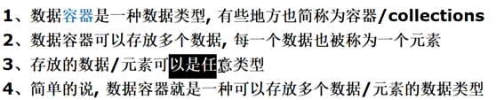

# python

nmcli dev wifi connect YXS1017 password yuanxueshe1017

# 第一章 

## 环境变量


环境变量（Environment Variables）是在操作系统中用来存储有关系统环境信息的变量，它们可以影响到系统中运行的应用程序的行为。环境变量通常用于配置用户的工作环境，提供程序运行时所需的信息，如路径、文件位置、系统配置等。
在大多数操作系统中，环境变量分为系统环境变量和用户环境变量：
- **系统环境变量**：对计算机上的所有用户和进程都有效。它们通常用于定义所有用户都需要访问的全局设置。
- **用户环境变量**：只对特定用户有效。它们用于定义特定用户的个人设置。
环境变量的常见用途包括：
1. **路径变量（PATH）**：告诉操作系统在哪里查找可执行文件。当你在命令行中输入一个命令时，系统会按照PATH变量中列出的目录顺序去查找该命令的可执行文件。
2. **临时文件目录（TMP、TEMP）**：指定程序创建临时文件的目录。
3. **语言和区域设置（LANG、LC_*）**：指定用户的语言、字符编码和货币格式等本地化设置。
4. **用户主目录（HOME）**：指定当前用户的主目录路径。
5. **终端或命令行提示符（PS1、PS2等）**：自定义命令行界面的外观和提示符。
在Windows中，你可以通过“系统属性”中的“高级”选项卡来查看和编辑环境变量。在Linux和macOS中，你可以通过在终端中输入 `printenv` 命令来查看所有环境变量，或者使用 `export` 命令来设置或修改环境变量。
例如，在Linux中设置一个新的环境变量：
```bash
export MY_VARIABLE="Hello, World!"
```
在Windows PowerShell中设置一个新的环境变量：
```powershell
$env:MY_VARIABLE = "Hello, World!"
```
环境变量的作用域通常限于当前会话或进程。如果想要永久性地设置环境变量，你需要将其添加到相应的配置文件中，如在Linux中的 `.bashrc` 或 `.profile` 文件，或者在Windows中的系统环境变量设置中。

# 第二章-python快速入门

老韩分享:
如何快速的掌握技术和知识点,心得分享
先学会,在学精

## PyCharm基本使用

1. 新建工程-点击new project

## PyCharm常用快捷键

PyCharm 是一款强大的 Python 集成开发环境（IDE），提供了许多快捷键来帮助开发者提高工作效率。以下是一些 PyCharm 常用的快捷键：

1. 查找和替换

- `Ctrl+F`：查找
- `Ctrl+R`：替换
- `Ctrl+Shift+F`：全局查找
- `Ctrl+Shift+R`：全局替换

2. 代码导航

- `Ctrl+E`：最近打开的文件
- `Ctrl+Shift+E`：最近编辑的文件
- `Ctrl+N`：新建文件
- `Ctrl+Shift+N`：根据名称查找文件
- `Alt+Right`：查看下一个编辑器选项卡
- `Alt+Left`：查看上一个编辑器选项卡
- `Ctrl+G`：跳转到指定行
- `Ctrl+Alt+Left`：后退
- `Ctrl+Alt+Right`：前进
- `Ctrl+B` 或 `Ctrl+Click`：跳转到声明

3. 代码编辑

- `Ctrl+D`：复制当前行或选定的块
- `Ctrl+Y`：删除当前行
- `Ctrl+X`：剪切当前行
- `Ctrl+C`：复制当前行
- `Ctrl+V`：粘贴
- `Ctrl+Z`：撤销
- `Ctrl+Shift+Z`：重做
- `Ctrl+/`：注释/取消注释
- `Ctrl+Alt+L`：格式化代码
- `Tab` / `Shift+Tab`：缩进/取消缩进
- `Alt+Enter`：自动修复

4. 运行和调试

- `Shift+F10`：运行
- `Shift+F9`：调试
- `F8`：单步执行
- `F7`：进入内部方法
- `Shift+F8`：跳出方法
- `Ctrl+F2`：停止

5. 版本控制

- `Ctrl+K`：提交
- `Ctrl+T`：更新项目
- `Alt+` `：VCS 快速弹出
这些快捷键可能会根据你的操作系统和 PyCharm 版本有所不同。你可以在 PyCharm 的设置中查看和自定义快捷键。
希望这些信息能帮助你更高效地使用 PyCharm！\

# 第三章 变量

## 为什么需要变量

在 Python 编程中，变量是存储信息的一种方式，它们是程序执行过程中的基本构建块。以下是为什么在 Python 编程中需要使用变量的几个原因：
1. **存储数据**：变量用于存储数据值，这样可以在程序中的多个位置重复使用这些值，而不必每次都重新写出来。
2. **可读性和维护性**：使用变量可以使代码更具有可读性，因为变量名可以提供关于数据含义的线索。例如，使用变量名 `total_sales` 比使用数字 `4321.99` 更能清楚地表达数据的含义。
3. **灵活性**：变量使得程序更灵活，因为它们可以被重新赋值。这意味着可以在程序运行时修改数据，而不必手动更改代码的每个实例。
4. **代码重用**：通过将数据存储在变量中，可以在程序的不同部分重用这些数据，减少代码冗余，提高代码的可重用性。
5. **功能参数和返回值**：函数通过变量（参数）接收输入，并通过变量（返回值）提供输出。这使得函数可以处理各种输入，并允许其结果被进一步使用。
6. **动态类型**：Python 是动态类型的语言，这意味着在使用变量时不需要预先声明数据类型。Python 解释器在运行时自动推断变量的类型，这使得编写和修改代码更加快捷。
7. **内存管理**：变量帮助管理内存。当变量被创建时，Python 为其分配内存空间。当变量不再被使用时，Python 的垃圾收集器会自动清理这些内存。
8. **算法表达**：在实现算法时，变量用于表示算法中的状态和中间结果，是表达逻辑和计算过程的基础。
    总之，变量是 Python 编程中不可或缺的组成部分，它们提供了一种高效、灵活和可读的方式来处理数据。
  - 变量三要素:	类型	名称	值

## 变量的介绍


## 变量快速入门


## 格式化输出

```python
name = "tom"
age = 20
score = 90.4
gender = "男"
# %操作符输出
print("个人信息: %s %d %s %.2f" % (name, age, gender, score))
# .2f保留小数点俩位

# format函数
print("个人信息: {} {} {}" .format(name, age, gender))

# f-strings     推荐
print(f"个人信息: {name} {age} {score} {gender}")
```

## 程序中+号的使用

```python
# +号的使用案列

name = "king"
score = 20.8

print(score + 90)
print(name + " hi")
print("100" + "86")
print(34.2 + 100)

#print(23 + "1") 会报错
```

## 数据类型

### type的使用


**例子**

```python
name = "tom"

# 查看变量的类型,本质是查看变量指向的数据的类型
print(type(name))
```

### 整数类型

### 浮点类型

```python
n1 = 5.12
n2 = .9

print(f"n1 = {n1} \nn2 = {n2}")

# 科学计数法形式:    如:5.12e2,   5.12E-2
n3 = 5.12e2
n4 = 5.12E-2

print(f"n3 = {n3} \nn4 = {n4}")
# 浮点数类型计算后,存在精度损失的问题,可以使用Decimal类进行精确计算
# 如果使用Decimal类,需要导入Decimal类
b = 8.1 / 3
print("%f", b)

from decimal import Decimal
b = Decimal("8.1") / Decimal("3")
print(f"{b}")
```

### 布尔类型

特性:0为假 非零即真

```python
number1 = 100
number2 = 200

if number1 < number2:
    print("number1 > number2")

# 表示把number1>number2的结果赋值给result变量
result = number1 > number2
print(f"{result}")
print(type(result))
```

### 字符串

字符串的驻留机制

**函数sys.intern()**

在Python中，`sys.intern()` 是一个函数，用于将字符串对象放入内部字符串缓存中。这个缓存可以确保在程序的不同部分中，当多个字符串字面量或字符串对象具有相同的值时，它们实际上是同一个对象。这可以节省内存，并使得字符串比较更加快速，因为可以使用指针比较而不是逐字符比较。


### 数据类型转换


# 第四章 运算符

## 算数运算符

1. +
2. -
3. *
4. /      对于除号,返回的是小数
5. %   对应的公式: a % b  =   a - a  //  b * b
6. //      并且向下取整)
7. **

## 比较运算符

is	– 	判断俩个变量引用对象是否为同一个(地址是否一样)

## 逻辑/布尔 运算符

1. and 与: a and b	如果a为真返回b的值,如果a为假返回a的值
2. or 或: a or b	如果a为真返回a的值,如果a为假返回b的值
3. not 非: not a	如果a为真返回假,反之亦然

## 赋值运算符


## 三元运算符

```python
max = a if  a > b else b
如果a>b返回a,否则返回b
```

## 位运算符


## 运算符优先级

算数运算>位运算>比较运算>逻辑运算>赋值运算

## 标识符

- **命名规范:**
	1. 变量要小写,若有多个单词,使用下划线分开.常量全部大写
	2. 函数名一律小写,如果有多个单词,用下划线隔开,另外,私有函数以双下划线开头
	3. 类名使用大驼峰命名,单词和首字母大写

## 关键字

**定义:**被python语言赋予了特殊含义,用做专门用途的字符串(单词)

## 键盘输入语句

```python
name = input("请输入姓名: ")
age = input("请输入年龄: ")
score = input("请输入成绩: ")

print(f"\n输入的信息如下: \n{name}\n{age}\n{score}")
print(type(age))
```


# 第五章 程序控制结构

## 顺序控制

从上往下呗

## 分支控制

### 单分支

### 双分支

### 多分支

```python
high = int(input("请输入男方的身高:"))
money = int(input("请输入男方的资产:"))
beauty = input("请输入男方的颜值:")

if (high > 180 and money > 1000) and beauty == "handsome":
    print("我一定要嫁给他")
elif (high > 180 or money > 1000) or beauty == "handsome":
    print("比上不足,比下有余")
else:
    print("嫁毛线")
```

### 嵌套分支

尽量不要超过三层(可读性不好)

## 循环控制

### for循环

每次循环的时候,依次将nums中的值取出赋给i

```python
nums = [1, 2, 3, 4, 5, 6, 7, 8, 9, 10]
print(type(nums))

for i in nums:
    print("hello", i)
```

如果正常遍历,会执行else语句,如果被打断,不执行else

```python
for i in range(10):
    print("hello", i + 1)
    if i == 2:
        break
else:
    print("nihao")
```

### while循环

如果正常遍历,会执行else语句,如果被打断,不执行else

```python
i = 1
while i <= 10:
    print("hello", i)
    i += 1
    if i == 3:
        break
else:
    print("haoba")
```


### 多重循环控制

直接上案例:打印金字塔 

老师的编程思想: 化繁为简 先死后活

我自己写的

```python
# i控制层数
for i in range(length):
    # j控制列数
    for j in range(1, length * 2):
        # if i == length - 1:
        #     print("*", end="")
        if (length-i) == j or j == (length+i):
            print("*", end="")
        else:
            print(" ", end="")
    print("")

for i in range(1, length):
    for j in range(1, length * 2):
        if i+1 == j or j == 2*length - i - 1:
            print("*", end="")
        else:
            print(" ", end="")
    print("")
```

### break语句

随机生成数字,知道生成97,看运行了多少次

```python
import random
j = 0
while 1:
    i = random.randint(1, 100)
    j += 1
    if i == 97:
        break
print(j)
```

### continue语句

### return语句


# 第六章 函数

## 为什么需要函数


## 解决方案-函数

内置函数

自定义函数

## 函数的定义


## 函数-调用机制

和c差不多

## 函数注意事项和使用细节


## 函数的传参机制


## 递归调用

```python
#实例:n的阶乘
def factorial(n):
    if n != 1:
        return n*(factorial(n-1))
    else:
        return 1
 
c = factorial(3)
print(c)
```

```python
def recursion(n):
    """
    :param n: 接收一个整数n >=1 
    :return: 返回n对应的斐波那契数
    """
    if n <= 2:
        return 1
    else:
        return recursion(n - 2) + recursion(n - 1)


i = recursion(7)
print(i)
```

```python
#猴子吃桃 每天吃一半-1 10天后还剩1桃子 问第一天有几个桃子
def peach(day):
    """
    :param day:第几天
    :return:第一天的桃子数
    """
    if day == 10:
        return 1
    else:
        return (peach(day + 1) + 1) * 2


print(peach(1))
```

```python
def hanoi(num, a, b, c):
    """
    :param num:指定盘子数量
    :param a:柱子A
    :param b:柱子B
    :param c:柱子C
    :return:
    """
    if num == 1:
        print(f"把第1个柱子从{a}->{c}")
    else:
        hanoi(num - 1, a, c, b)
        print(f"把第{num}个柱子从{a}->{c}")
        hanoi(num - 1, b, a, c)


hanoi(3, "A", "B", "C")
```

## 函数作为参数传递

1. 传入的不是数据,而是业务处理能力
2. 一个函数可以接收多个函数作为参数传入

```python
def fun(num1, num2):
    val_max = num1 if num1 > num2 else num2
    return val_max

def f1(fun1, num1, num2):
    return fun1(num1, num2)

print(f1(fun, 5, 7))
```

## lambda匿名函数


```python
def f1(fun, num1, num2):
    print(type(fun))
    return fun(num1, num2)
#f1是我调用的函数,a,b是我传入的参数,12,18是我传入参数的值,冒号后面是我需要的功能
max_val = f1(lambda a, b: a if a > b else b, 12, 18)

print("max_val = ", max_val)
```

## 全局变量和局部变量

global可以在函数体内使用与改变全局变量

## 知识点梳理和回顾

# 第七章 数据容器

## 为什么需要数据容器


## 什么是数据容器



## 列表-list


## 元组(tuple)

没看了

## 字符串(str)


## 集合


## 字典

```python
garbage_dict = {
    'Data':
        {
            'Elements':
                [
                    {
                        'Category': '干垃圾',
                        'CategoryScore': 0.8855999999999999,
                        'Rubbish': '',
                        'RubbishScore': 0.0
                    }
                ],
            'Sensitive': False
        },
    'RequestId': '1AB9E813-3781-5CA2-95A0-1EA334E80663'
}

print(garbage_dict['Data']['Elements'][0]['Category'])
print(garbage_dict['RequestId'])
print(garbage_dict['Data']['Sensitive'])
```

# 第八章 排序和查找

# 第九章 断点调试

## 基本介绍

可以一步一步的查看源码执行过程

## 断点调试应用案例


## 断点调试课后练习


## 知识点梳理和回顾

# c语言执行python

## C语言中执行Python函数

在C语言中执行Python函数通常需要使用Python的C API。这个过程涉及到嵌入Python解释器到C程序中，并使用API调用来执行Python代码。以下是一个简单的例子，展示了如何在C程序中执行Python函数：
1. 首先，确保你的系统上安装了Python开发包，这样你才能使用Python的C API。
2. 编写你的Python代码。比如，你有一个名为`my_module.py`的Python模块，其中有一个函数`my_function`：
```python
# my_module.py
def my_function():
    print("Hello from Python!")
```
3. 编写C代码，使用Python C API来调用上面的Python函数：
```c
#include <Python.h>
int main() {
    // 初始化Python解释器
    Py_Initialize();
    // 导入my_module模块
    PyObject *pName = PyUnicode_DecodeFSDefault("my_module");
    PyObject *pModule = PyImport_Import(pName);
    Py_DECREF(pName);
    if (pModule != NULL) {
        // 获取my_function函数
        PyObject *pFunc = PyObject_GetAttrString(pModule, "my_function");
        if (pFunc && PyCallable_Check(pFunc)) {
            // 调用函数
            PyObject_CallObject(pFunc, NULL);
        } else {
            PyErr_Print();
        }
        Py_XDECREF(pFunc);
        Py_DECREF(pModule);
    } else {
        PyErr_Print();
    }
    // 清理Python解释器
    Py_Finalize();
    return 0;
}
```
4. 编译C代码。由于我们使用了Python的C API，因此在编译时需要链接Python库。如果你使用的是gcc，编译命令可能如下：
```bash
gcc -o my_program my_program.c $(python3-config --cflags --ldflags)
```
5. 运行编译后的程序。如果一切正常，你应该会在控制台上看到来自Python函数的打印输出。
请注意，这个过程涉及到与Python解释器的交互，因此需要确保Python环境正确设置，并且C代码正确处理了与Python对象的引用计数。在实际应用中，可能还需要处理更复杂的情况，比如Python函数返回值、传递参数给Python函数等。

```python
#if 0
1、包含Python.h头文件，以便使用Python API。
2、使用void Py_Initialize()初始化Python解释器，
3、使用PyObject *PyImport_ImportModule(const char *name)和PyObject
*PyObject_GetAttrString(PyObject *o, const char *attr_name)获取sys.path对象，并利用
int PyList_Append(PyObject *list, PyObject *item)将当前路径.添加到sys.path中，以便加载
当前的Python模块(Python文件即python模块)。
4、使用PyObject *PyImport_ImportModule(const char *name)函数导入Python模块，并检查是否
有错误。
5、使用PyObject *PyObject_GetAttrString(PyObject *o, const char *attr_name)函数获取
Python函数对象，并检查是否可调用。
6、使用PyObject *PyObject_CallObject(PyObject *callable, PyObject *args)函数调用
Python函数，并获取返回值。
7、使用void Py_DECREF(PyObject *o)函数释放所有引用的Python对象。
8、结束时调用void Py_Finalize()函数关闭Python解释器。
相关的函数参数说明参考网站（网站左上角输入函数名即可开始搜索）：
https://docs.python.org/zh-cn/3/c-api/import.html
#endif

#include "Python.h"
//编译此程序需要指定头文件的目录 gcc c_python.c -o c_python -I /usr/include/python3.10 -l python3.10
int main (void)
{
    // 初始化Python解释器 让c语言可以执行python代码
    Py_Initialize();

    //先让我知道要导入哪个模块
    PyObject* sys = PyImport_ImportModule("sys");
    //然后获得要导入模块的路径
    PyObject* path = PyObject_GetAttrString(sys, "path");
    //再给当前路径加入到导入模块路径下面
    PyList_Append(path, PyUnicode_FromString("."));
    //把nopara导入进来执行
    PyObject *pModule = PyImport_ImportModule("para");
    if(!pModule)
    {
        PyErr_Print();
        printf("Error: failed to load nopara.py\n");        
    }

    PyObject *pFunc = PyObject_GetAttrString(pModule, "say_funny");
    if(!pFunc)
    {
        PyErr_Print();
        printf("Error: failed to load say_funny\n");
    }

    char* category = "nihao";
    PyObject* pArgs = Py_BuildValue("(s)", category);

    PyObject* pValue = PyObject_CallObject(pFunc, pArgs);
    if(!pValue)
    {
        PyErr_Print();
        printf("Error: function call failed\n");
    }

    char* result = NULL;
    if(!PyArg_Parse(pValue, "s", &result))
    {
        PyErr_Print();
        printf("Error: function return failed\n");   
    }

    printf("%s\n",result);

    Py_DECREF(pArgs);
    Py_DECREF(pModule);
    Py_DECREF(pFunc);
    Py_DECREF(pValue);
    Py_Finalize();
    return 0;
}
```

