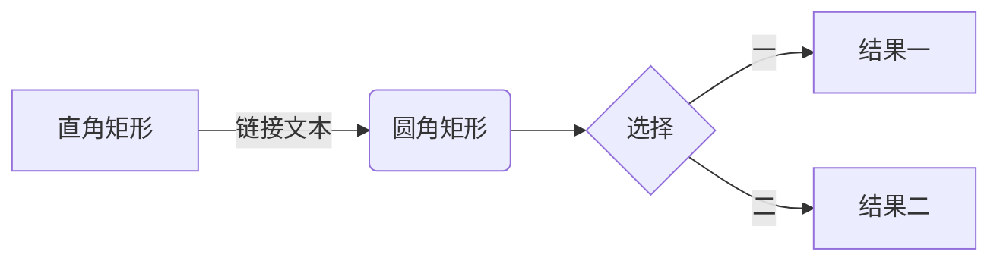
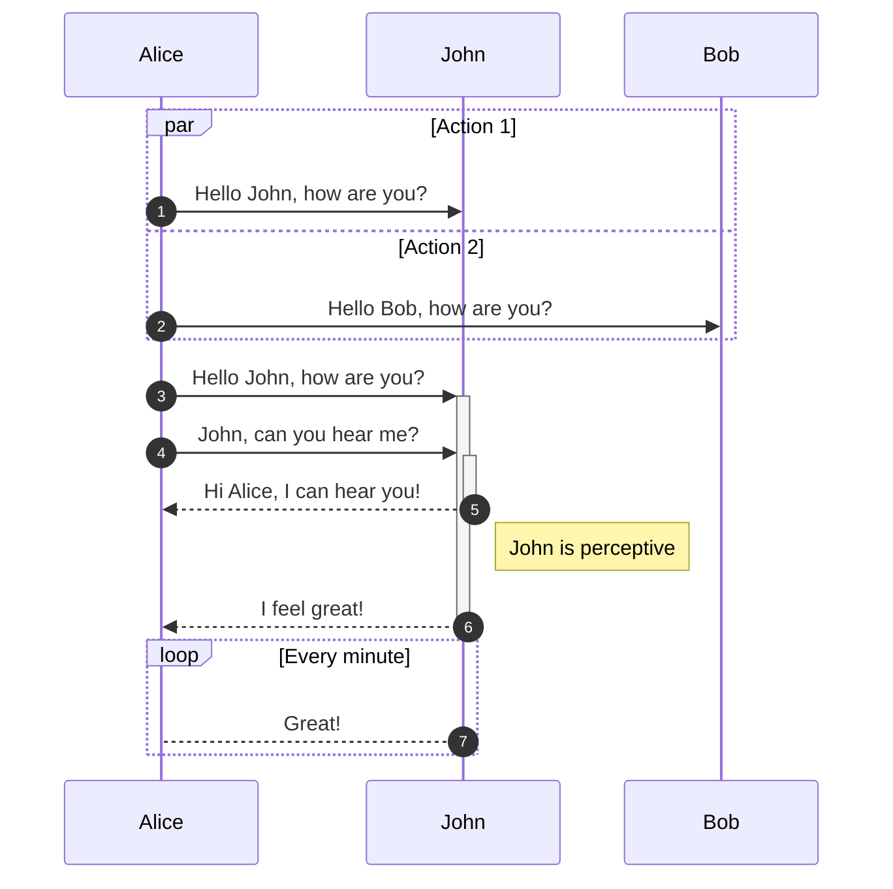
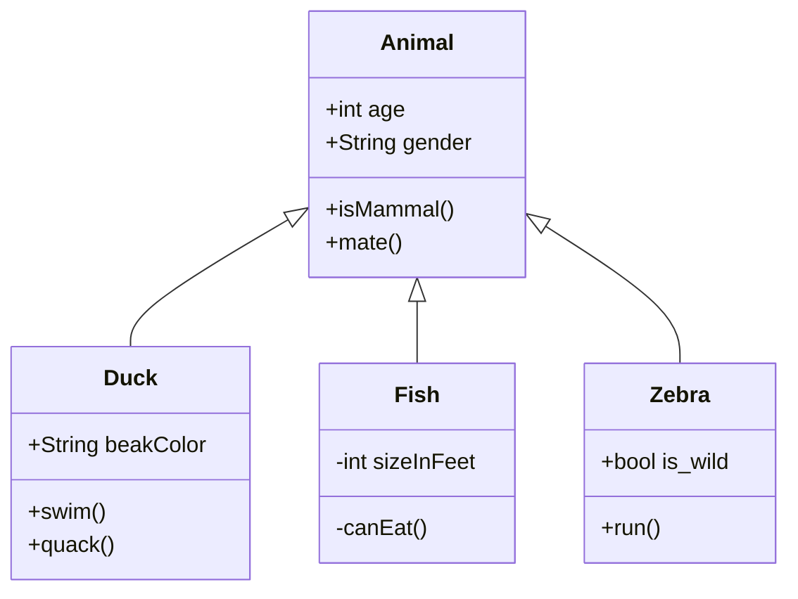
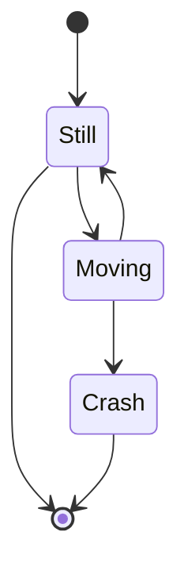
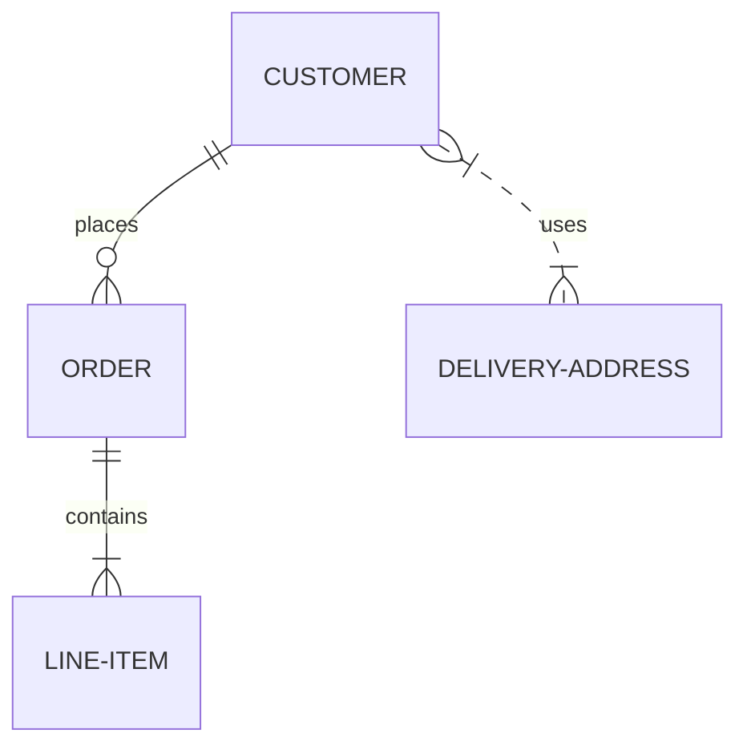
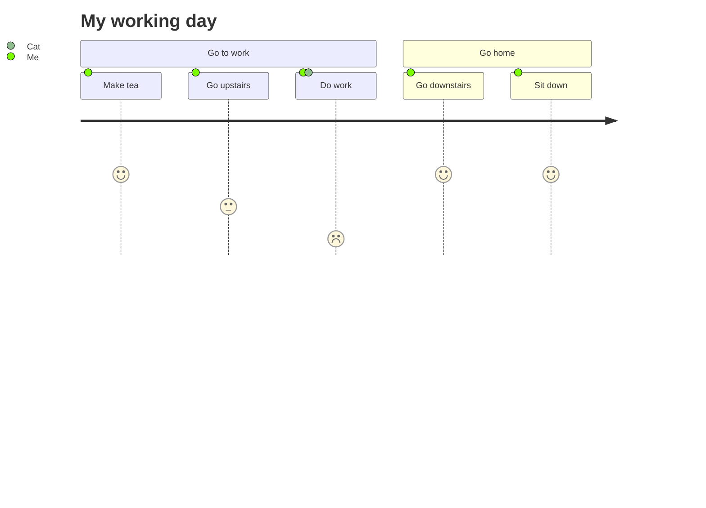
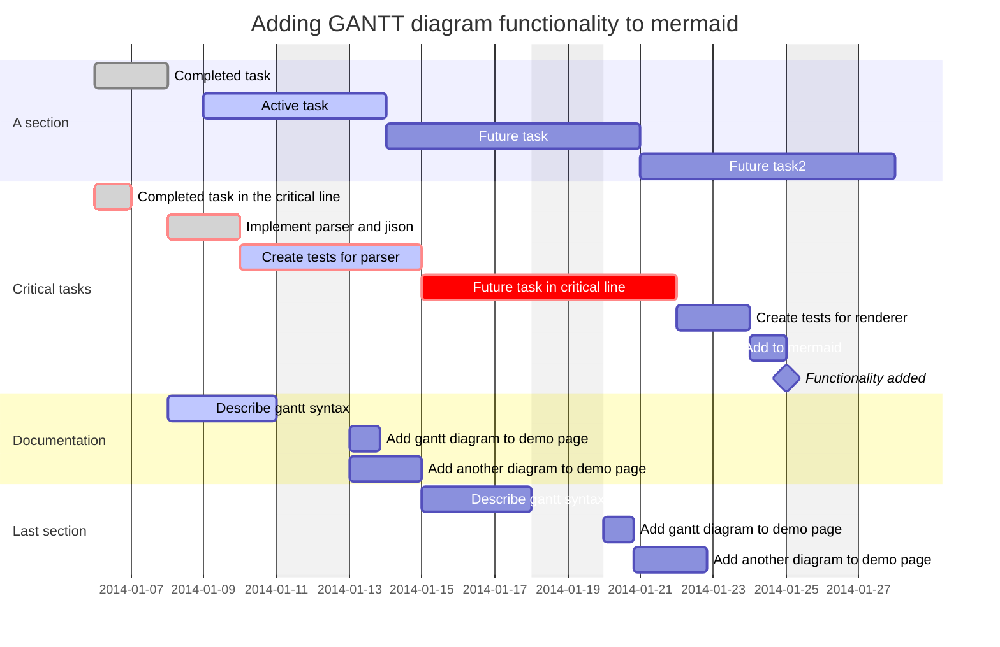
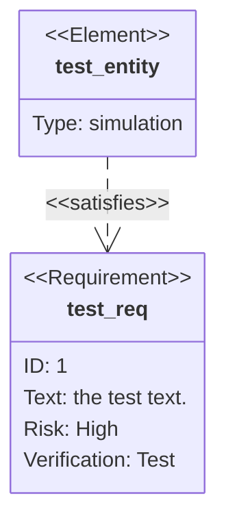
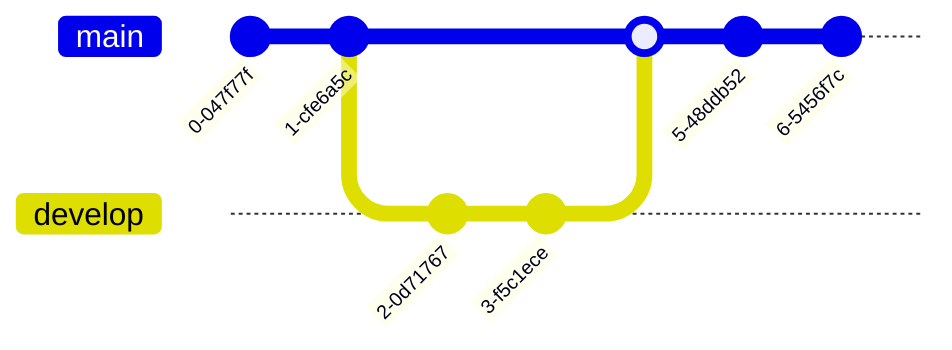
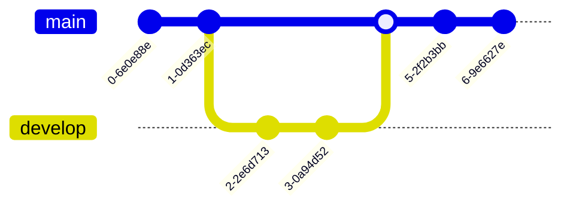

# Markdown 胎教级保姆教程

## 一、关于 Markdown

### 1. 什么是 Markdown？

>   **Markdown **是一种[轻量级标记语言](https://zh.m.wikipedia.org/wiki/轻量级标记语言)，创始人为[约翰·格鲁伯](https://zh.m.wikipedia.org/wiki/約翰·格魯伯)。它允许人们使用易读易写的纯文本格式编写文档，然后转换成有效的[XHTML](https://zh.m.wikipedia.org/wiki/XHTML)（或者[HTML](https://zh.m.wikipedia.org/wiki/HTML)）文档。[[4\]](https://zh.m.wikipedia.org/wiki/Markdown#cite_note-md-4)这种语言吸收了很多在[电子邮件](https://zh.m.wikipedia.org/wiki/电子邮件)中已有的纯文本标记的特性。
>
>   由于 Markdown 的轻量化、易读易写特性，并且对于图片，图表、数学式都有支持，目前许多网站都广泛使用 Markdown 来撰写帮助文档或是用于[论坛](https://zh.m.wikipedia.org/wiki/网络论坛)上发表消息。如 [GitHub](https://zh.m.wikipedia.org/wiki/GitHub)、[Reddit](https://zh.m.wikipedia.org/wiki/Reddit)、[Discord](https://zh.m.wikipedia.org/wiki/Discord)、[Diaspora](https://zh.m.wikipedia.org/wiki/Diaspora_(社交网络))、[Stack Exchange](https://zh.m.wikipedia.org/wiki/Stack_Exchange)、[OpenStreetMap](https://zh.m.wikipedia.org/wiki/OpenStreetMap) 、[SourceForge](https://zh.m.wikipedia.org/wiki/SourceForge)、[简书](https://zh.m.wikipedia.org/wiki/简书)等，甚至还能被用来撰写[电子书](https://zh.m.wikipedia.org/wiki/電子書)。

Markdown 如今已成为世界上最受欢迎的标记语言之一。

1.  专注于文字内容；
2.  纯文本，易读易写，可以方便地纳入版本控制；
3.  语法简单，没有什么学习成本，能轻松在码字的同时做出美观大方的排版。

Markdown 与 Word 不同，如果需要把一段文本加粗，在 Word 中，点击工具栏的加粗图标，内容就会被加粗。而在 Markdown 中我们可以使用在文本前后添加两个星号（`**粗体**`，**粗体**）来达到同样的目的。

和 Word 需要使用 Microsoft Office、WPS 等工具不同，Markdown 可以使用任何在线或本机的文本编辑器（例如 CSDN 等）。

### 2. 为什么要用 Markdown？

当你可以通过按下界面中的按钮来设置文本格式时，为什么还要使用 Markdown 来书写呢？使用 Markdown 而不是 word 类编辑器的原因有：

1.  **Markdown 无处不在**。StackOverflow、CSDN、掘金、简书、GitBook、有道云笔记、V2EX、光谷社区等。主流的代码托管平台，如 GitHub、GitLab、BitBucket、Coding、Gitee 等等，都支持 Markdown 语法，很多开源项目的 README、开发文档、帮助文档、Wiki 等都用 Markdown 写作。
2.  **Markdown 是纯文本可移植的**。几乎可以使用任何应用程序打开包含 Markdown 格式的文本文件。如果你不喜欢当前使用的 Markdown 应用程序了，则可以将 Markdown 文件导入另一个 Markdown 应用程序中。这与 Microsoft Word 等文字处理应用程序形成了鲜明的对比，Microsoft Word 将你的内容锁定在专有文件格式中。
3.  **Markdown 是独立于平台的**。你可以在运行任何操作系统的任何设备上使用任何文本工具创建 Markdown 格式的文本。
4.  **Markdown 能适应未来的变化**。即使你正在使用的应用程序将来会在某个时候不能使用了，你仍然可以使用文本编辑器读取 Markdown 格式的文本。当涉及需要无限期保存的书籍、大学论文和其他里程碑式的文件时，这是一个重要的考虑因素。

### 3. 怎么用 Markdown？（编辑软件）

上面我们说**可以在运行任何操作系统的任何设备上使用任何文本工具创建 Markdown 格式的文本**，我们确实可以使用**任何**文本工具创建 Markdown 文件，如果你想用 `echo "内容" >> file.md` 都可以。但使用一些具备代码高亮和实时预览功能的编辑器，可以让我们更加优雅和快速的编写 Markdown。

用 Markdown 最多的应该是程序员了（哪个程序员还没有写过文档🐶），一般程序员用的 IDE，诸如 VS Code、IDEA、Android Studio 等都内置了 Markdown 高亮和预览功能，下面是一些好用的 Markdown 工具。

1.  编程/文本工具
    1.  [Visual Studio Code](https://code.visualstudio.com/)
    2.  [IntelliJ IDEA](https://www.jetbrains.com/zh-cn/idea/)（包括 [Android Studio](https://developer.android.com/studio/)、WebStorm 等）
    3.  [Sublime Text](https://www.sublimetext.com/)
    4.  [Nodepad++](https://notepad-plus-plus.org/)
    5.  [Atom](https://atom.io/)
2.  在线编辑器
    1.  [何方的个人小站](https://iamhefang.cn/tools/markdown/)
    2.  [Markdown 中文网站](https://markdown.com.cn/editor/)
    3.  [Editor.md](https://pandao.github.io/editor.md/index.html)
    4.  [小书匠](http://markdown.xiaoshujiang.com/)
    5.  [菜鸟工具](https://c.runoob.com/front-end/712/)
    6.  [MaHua](https://mahua.jser.me/)
3.  其他软件
    1.  MarkdownPad
    2.  BookPad
    3.  [Typora](https://www.typora.io/)

##  二、标题

### 1. 常用标题写法

Markdown 的标题和 HTML 的标题一致，分为 6 级。分别在一行的开头放 1 到 6 个 `#` 加空格再加标题内容。

| Markdown        | HTML              |
| --------------- | ----------------- |
| `# 标题 1`      | `<h1>标题 1</h1>` |
| `## 标题 2`     | `<h2>标题 2</h2>` |
| `### 标题 3`    | `<h3>标题 3</h3>` |
| `#### 标题 4`   | `<h4>标题 4</h4>` |
| `##### 标题 5`  | `<h5>标题 5</h5>` |
| `###### 标题 6` | `<h6>标题 6</h6>` |

### 2. 可选标题写法

标题内容的后面如果也存在空格和 #，也可以构成标题，且标题的级别以前面 # 的数量为准。

| Markdown               | HTML              |
| ---------------------- | ----------------- |
| `# 标题 1 ##`          | `<h1>标题 1</h1>` |
| `## 标题 2 ##`         | `<h2>标题 2</h2>` |
| `### 标题 3 ###`       | `<h3>标题 3</h3>` |
| `#### 标题 4 ####`     | `<h4>标题 4</h4>` |
| `##### 标题 5 #####`   | `<h5>标题 5</h5>` |
| `###### 标题 6 ######` | `<h6>标题 6</h6>` |

除了前面加 # 外，标题 1 和标题 2 也可以用下面加横线的形式。标题下面加等号 `=` 会生成标题 1，加减号 `-` 会生成标题 2。等号和减号的数量一般不限制，可以有一个或多个。

| Markdown       | HTML              |
| -------------- | ----------------- |
| `标题 1` `===` | `<h1>标题 1</h1>` |
| `标题 2` `---` | `<h2>标题 2</h2>` |

### 3. 自定义标题 ID

| Markdown                 | HTML                         |
| ------------------------ | ---------------------------- |
| `# 标题 1 {#head1}`      | `<h1 id="head1">标题 1</h1>` |
| `## 标题 2 {#head2}`     | `<h2 id="head2">标题 2</h2>` |
| `### 标题 3 {#head3}`    | `<h3 id="head3">标题 3</h3>` |
| `#### 标题 4 {#head4}`   | `<h4 id="head4">标题 4</h4>` |
| `##### 标题 5 {#head5}`  | `<h5 id="head5">标题 5</h5>` |
| `###### 标题 6 {#head6}` | `<h6 id="head6">标题 6</h6>` |

### 4. 注意事项

在有些 Markdown 解析器里面，`#` 和内容之间不加空格也可以识别为标题，但大部分解析器都是需要加空格的，为了兼容性更强我们一般在写标题时都加空格。

## 三、段落

| Markdown                          | HTML                                   |
| --------------------------------- | -------------------------------------- |
| `这是一段文本 1`                  | `<p>这是一段文本 1</p>`                |
| `这是一段文本 1` `这是一段文本 2` | `<p>这是一段文本 1 这是一段文本 2</p>` |

Markdown 里面的段落前面不能有超过一个空白字符（空格、制表符等）。 前面如果有超过一个空格或制表符，该行文本会被生成[代码块](https://iamhefang.cn/tutorials/markdown/代码块)（`<pre><code>...</code></pre>`）而不是段落(`<p>...</p>`)

段落后面也不能有超过一个空白字符（空格、换行符等）。 如果有超过一个换行符，会生成两个段落。如果有超过一个空格，会生成[换行标签](https://iamhefang.cn/tutorials/markdown/换行) `<br/>`。

## 四、换行

在一行文本后面添加两个以上空格，引擎会生成换行符 `<br/>`，下表中 `这是一段文本 1` 后面有两个空格。

| Markdown                                | HTML                                       |
| --------------------------------------- | ------------------------------------------ |
| `这是一段文本 1 ` <br/>`这是一段文本 2` | `<p>这是一段文本 1<br/>这是一段文本 2</p>` |

几乎每个 Markdown 应用程序都支持两个或多个空格进行换行，称为 `结尾空格（trailing whitespace)` 的方式，但这是有争议的，因为很难在编辑器中直接看到空格，并且很多人在每个句子后面都会有意或无意地添加两个空格。由于这个原因，你可能要使用除结尾空格以外的其它方式来换行。幸运的是，几乎每个 Markdown 应用程序都支持另一种换行方式：HTML 的 `<br/>` 标签。

为了兼容性，请在行尾添加“结尾空格”或 HTML 的 `<br/>` 标签来实现换行。

还有两种其他方式我并不推荐使用。CommonMark 和其它几种轻量级标记语言支持在行尾添加反斜杠 (\) 的方式实现换行，但是并非所有 Markdown 应用程序都支持此种方式，因此从兼容性的角度来看，不推荐使用。并且至少有两种轻量级标记语言支持无须在行尾添加任何内容，只须键入回车键（return）即可实现换行。

## 五、字体选项

### 1. 粗体

在需要加粗的文本前后添加两个星号(`*`)或下划线(`_`)可以对文本加粗。

| Markdown       | HTML                        | 预览         |
| -------------- | --------------------------- | ------------ |
| `**这是粗体**` | `<strong>这是粗体</strong>` | **这是粗体** |
| `__这是粗体__` | `<strong>这是粗体</strong>` | __这是粗体__ |

### 2. 斜体

在需要加粗的文本前后添加两个星号(`*`)或下划线(`_`)可以倾斜文本。

| Markdown     | HTML                | 预览       |
| ------------ | ------------------- | ---------- |
| `*这是斜体*` | `<em>这是斜体</em>` | *这是斜体* |
| `_这是斜体_` | `<em>这是斜体</em>` | _这是斜体_ |

### 3. 粗斜体

在需要加粗的文本前后添加三个星号(`*`)或下划线(`_`)可以倾斜并加粗文本。

| Markdown         | HTML                                   | 预览              |
| ---------------- | -------------------------------------- | ----------------- |
| `___这是粗斜体___` | `<strong><em>这是粗斜体</em></strong>` | ___这是粗斜体___ |
| `***这是粗斜体***` | `<strong><em>这是粗斜体</em></strong>` | ***这是粗斜体*** |
| `**_这是粗斜体_**` | `<strong><em>这是粗斜体</em></strong>` | _**这是粗斜体**_ |
| `__*这是粗斜体*__` | `<strong><em>这是粗斜体</em></strong>` | __*这是粗斜体*__ |

### 4. 删除线

| Markdown           | HTML                  | 预览             |
| ------------------ | --------------------- | ---------------- |
| `~~带删除线的字~~` | `<s>带删除线的字</s>` | ~~带删除线的字~~ |

## 六、列表

### 1.有序列表

在文本前面添加数字加点加空格可以构成有序列表。如下表，最终生成的列表前面的编号和前面的数字没有绝对关系，总是从第一个数字开始依次增加。

>   也有很多 Markdown 解析器完全忽略前导数字，总是从 1 开始。

| Markdown                                 | HTML                                                         |
| ---------------------------------------- | ------------------------------------------------------------ |
| `1. 有序列表项 1` <br/>`2. 有序列表项 2` | `<ol>` `<li>有序列表项 1</li>` `<li>有序列表项 2</li>` `</ol>` |
| `1. 有序列表项 1` <br/>`1. 有序列表项 2` | `<ol>` `<li>有序列表项 1</li>` `<li>有序列表项 2</li>` `</ol>` |
| `5. 有序列表项 1` <br/>`6. 有序列表项 2` | `<ol start="5">` `<li>有序列表项 1</li>` `<li>有序列表项 2</li>` `</ol>` |

### 2. 无序列表

无序列表可以在文本前面加减号(`-`)、星号(`*`)、加号(`+`)实现。

| Markdown                               | HTML                                                         |
| -------------------------------------- | ------------------------------------------------------------ |
| `- 无序列表项 1` <br/>`- 无序列表项 2` | `<ul>` `<li>无序列表项 1</li>` `<li>无序列表项 2</li>` `</ul>` |
| `* 无序列表项 1` <br/>`* 无序列表项 2` | `<ul>` `<li>无序列表项 1</li>` `<li>无序列表项 2</li>` `</ul>` |
| `+ 无序列表项 1`<br/>`+ 无序列表项 2`  | `<ul>` `<li>无序列表项 1</li>` `<li>无序列表项 2</li>` `</ul>` |

### 3. 列表嵌套

有序列表、无序列表都是可以嵌套的。在列表项前面添加两个以上空格或制表符可以把该行变成子列表。

| Markdown                                  | HTML                                                         |
| ----------------------------------------- | ------------------------------------------------------------ |
| `1. 有序列表项 1`<br/> ` 1. 有序列表项 2` | `<ol>` `<li>` 有序列表项 1 `<ul>` `<li>` 无序列表项 2 `</li>` `</ul>` `</li>` `</ol>` |
| `- 无序列表项 1`<br/> ` - 无序列表项 2`   | `<ul>` `<li>` 无序列表项 1 `<ul>` `<li>` 无序列表项 2 `</li>` `</ul>` `</li>` `</ul>` |

### 4. 任务列表

有序列表和无序列表都可以做为任务列表使用，任务列表会在每项前面添加一个复选框

下面的 Markdown 代码

```markdown
**有序任务列表**

1. [x] 已选中的项目
1. [ ] 未选中的项目

**无序任务列表**

- [x] 已选中的项目
- [ ] 未选中的项目
```

会生成下面的效果

**有序任务列表**

1. [x] 已选中的项目
1. [  ] 未选中的项目

**无序任务列表**

- [x] 已选中的项目
- [ ] 未选中的项目

PS：我也觉得很奇怪，为什么 typora 用不了有序任务列表。理想情况应该是下面这样。


### 5. 定义列表

下面的 Markdown 代码

```markdown
列表头 1
: 列表项 11
: 列表项 12

列表头 2
: 列表项 21
: 列表项 22
```

会生成下面的 HTML 代码

```html
<dl>
  <dt>列表头1</dt>
  <dd>列表项11</dd>
  <dd>列表项12</dd>
  <dt>列表头2</dt>
  <dd>列表项21</dd>
  <dd>列表项22</dd>
</dl>
```

渲染效果类似下面这样

-   列表头1

    列表项11

    列表项12

-   列表头2

    列表项21

    列表项22

## 七、引用

### 1. 引用写法

Markdown 可以使用大于号 `>` 和空格生成引用（`<blockquote>...</blockquote>`）

下面的代码

```markdown
> 这是一个引用段落
```

会生成下面效果

>   这是一个引用段落

### 2. 引用多个段落

引用可以包含多个段落，引用内段落和普通段落一样，不过在空行前面也要加上小于号。

下面的代码

```markdown
> 这是一个引用段落
>
> 这是另一个引用段落
```

会生成下面效果

>   这是一个引用段落
>
>   这是另一个引用段落

### 3. 引用嵌套

在一个引用块里面还可以再引用其他段落。在段落的前面加多个小于事情可以大致多重嵌套的目的。

下面的代码

```markdown
> 这是一个引用段落
>
> > 这是另一个引用段落
```

会生成下面效果

>   这是一个引用段落
>
>   >   这是另一个引用段落

### 4. 引用其他元素

引用不只可以有段落，还可以存在列表、粗斜体等。

下面的代码

```markdown
> 这是一个*引用* **段落**
>
> 1. 有序列表项 1
> 1. 有序列表项 2
> 1. 有序列表项 3
>
> - 无序列表项 1
> - 无序列表项 2
> - 无序列表项 3
```

会生成下面效果

>   这是一个*引用* **段落**
>
>   1.  有序列表项 1
>   2.  有序列表项 2
>   3.  有序列表项 3
>
>   -   无序列表项 1
>   -   无序列表项 2
>   -   无序列表项 3

## 八、代码块

### 1. 行内代码

使用一对反引号(```)来创建行内代码。如果在行内代码中需要包含反引号本身，可以使用两个反引号对加前后空格来创建。

| Markdown         | HTML                               |
| ---------------- | ---------------------------------- |
| 这是行内`代码` |<p>这是行内<code>代码</code></p>|
| `` ` ``        | `<code>`</code>`                   |

### 2. 代码块

将文本的每一行缩进至少四个空格或一个制表符。这样这些文本会变成代码块。

下面的代码

```markdown
    <html>
        <head></head>
    </html>
```

会生成下面的效果

​    <html>

​        <head></head>

​    </html>

### 3. 围栏式代码

在很多 Markdown 解析器里都支持使用三个反引号(```)或三个波浪号(`~`)来定义围栏式代码块。同时这种代码块配合插件还可以做到代码高亮、行号等高级功能。

>   如果在代码块中也存在三个反引号或波浪号，可以在外层使用 4 个。

注意

下面的代码有高亮显示效果，这并不是 Markdown 本身的功能，而是通过第三方插件 `Prism.js` 做到的。一般在开始的三个反引号或波浪号的后面加代码语言可以指定代码的语言从而可以使用第三方插件做到高亮效果。

下面的代码

~~~markdown
```javascript
const a = 1;
const b = 2;
function add(num1, num2) {
  return num1 + num2;
}
console.log(add(a, b));
```
~~~

会生成下面的效果

```javascript
const a = 1;
const b = 2;
function add(num1, num2) {
  return num1 + num2;
}
console.log(add(a, b));
```

## 九、分隔线

一行只存在连续三个或以上星号(`*`)、减号(`-`)或下划线(`_`)会被生成分隔线(`<hr/>`)

以下代码

```markdown
___

---

***
```

会生成以下效果

____

---

***

1.  在使用分隔线时一行在分隔线的上下各留一行空白行。
2.  虽然星号、减号和下划线都能构成分隔符，但一般使用减号，输入更方便。

## 十、超链接

### 1. 使用超链接

#### 1-1. 网页跳转

```markdown
[Grayson_Zheng-CSDN博客](https://blog.csdn.net/qq_42417071?spm=1000.2115.3001.5343)
```

[Grayson_Zheng-CSDN博客](https://blog.csdn.net/qq_42417071?spm=1000.2115.3001.5343)

#### 1-2. 跳转至文档其他位置

```markdown
[Markdown胎教级教程 标题](##二、标题)
```

[Markdown胎教级教程 标题](##二、标题)

#### 1-3. 无标签链接

```markdown
<https://blog.csdn.net/qq_42417071?spm=1000.2115.3001.5343>
```

<https://blog.csdn.net/qq_42417071?spm=1000.2115.3001.5343>

#### 1-4. 无标签邮箱链接

```markdown
<zhengxinyu13@gmail.com>
```

<zhengxinyu13@gmail.com>

### 2. 自动超链接

有些 Markdown 解析器还可以自动解析代码中的链接，并生成无标签链接。

比如 https://www.zhihu.com/people/XinYu-Zheng-6-16 ，并没有添加任何的超链接语法，但是被自动转换成了 a 标签。

如果不希望自动转换，可以把链接写成行内代码，这样就不会自动转换了。比如:` https://www.zhihu.com/people/XinYu-Zheng-6-16`

### 3. 和其他元素配合

超链接还可以和粗体、斜体、代码等其他元素一块使用

```markdown
1. 这是一个[**粗体链接**](https://www.zhihu.com/people/XinYu-Zheng-6-16)
1. 这是一个[_斜体链接_](https://www.zhihu.com/people/XinYu-Zheng-6-16)
1. 这是一个[**_粗斜体链接_**](https://www.zhihu.com/people/XinYu-Zheng-6-16)
1. 这是一个[`在代码里面的链接`](https://www.zhihu.com/people/XinYu-Zheng-6-16)
```

1.  这是一个[**粗体链接**](https://www.zhihu.com/people/XinYu-Zheng-6-16)
1. 这是一个[_斜体链接_](https://www.zhihu.com/people/XinYu-Zheng-6-16)
1. 这是一个[**_粗斜体链接_**](https://www.zhihu.com/people/XinYu-Zheng-6-16)
1. 这是一个[`在代码里面的链接`](https://www.zhihu.com/people/XinYu-Zheng-6-16)

>   上面 4 个都是在列表里面的链接，这个是在[引用里面的链接](https://www.zhihu.com/people/XinYu-Zheng-6-16)

## 十一、图片

### 1. 添加图片


### 2. 带链接的图片

[](https://blog.csdn.net/qq_42417071?spm=1000.2115.3001.5343)

看起来好像没什么区别，你把鼠标放在图片上，按住`Ctrl`键再单击鼠标左键，就知道是什么效果了。

### 3. 带 Title 的图片


（typora 同样没有效果。。。）

## 十二、内嵌 HTML

在 Markdown 里面是可以直接内嵌 HTML 语法的。扩展的 MarkdownX 语法中，甚至可以使用 React 的 JSX 语法。

下面的代码是在 Markdown 里面使用 html 添加了一个有用户名和密码输入框的表单

```markdown
**请在下面表单中输入您的用户名和密码**

<form>
  <div>
      <label>用户名：</label><input type="text" placeholder="请输入用户名"/>
  </div>
  <div>
      <label>密码： </label><input type="password" placeholder="请输入密码"/>
  </div>
</form>
```

会生成下面效果：

**请在下面表单中输入您的用户名和密码**

<form>
  <div>
      <label>用户名：</label><input type="text" placeholder="请输入用户名"/>
  </div>
  <div>
      <label>密码：</label><input type="password" placeholder="请输入密码"/>
  </div>
</form>

## 十三、表格

### 1. 使用表格

表格使用竖线(`|`)区分每一列，在表格头和表格体之间第列使用至少三个减号(`-`)来做为分隔。

下面的代码

```markdown
|第一列|第二列|第三列|
|---|---|---|
|第一行第一列|第一行第二列|第一行第三列|
|第二行第一列|第二行第二列|第二行第三列|
```

会生成下面效果：

| 第一列       | 第二列       | 第三列       |
| ------------ | ------------ | ------------ |
| 第一行第一列 | 第一行第二列 | 第一行第三列 |
| 第二行第一列 | 第二行第二列 | 第二行第三列 |

### 2. 设置表格对齐方式

下列代码，在第二行的每一列都添加了冒号(`:`)，左侧添加一个冒号表示该列左对齐，右侧添加一个冒号表示该列右对齐，左右各添加一个冒号表示该列居中对齐。

```markdown
|第一列|第二列|第三列|
|:---|:---:|---:|
|这一列是左对齐的|这一列是居中对齐的|这一列是右对齐的|
```

会生成下面效果：

| 第一列           |       第二列       |           第三列 |
| :--------------- | :----------------: | ---------------: |
| 这一列是左对齐的 | 这一列是居中对齐的 | 这一列是右对齐的 |

### 3. 在表格中使用其他元素

在表格中可以使用斜体单行元素，比如粗体斜体、行内代码、超链接、图片、Emoji表情、HTML等。

```markdown
|第一列|第二列|
|:---:|:---:|
|**粗体**|_斜体_|
|`行内代码`|[超链接](./超链接)|
|:cat:|<span style={{color:"red"}}>带颜色的字</span>|
```

会生成下面效果：

|   第一列   |                    第二列                     |
| :--------: | :-------------------------------------------: |
|  **粗体**  |                    _斜体_                     |
| `行内代码` |              [超链接](./超链接)               |
|   :cat:    | <span style={{color:"red"}}>带颜色的字</span> |

在 typora 中的 markdown 解释器没办法在表格中解析 HTML 语法。

## 十四、脚注

脚注类似于参考文献或补充说明，统一出现的文档的最后，可在文中任意位置引用。

脚注的定义语法为： `[^名称]: 内容`[注]()

脚注的引用语法为：`[^名称]`。比如上面的`注`就是引用的脚注，点击可以跳转到下面的脚注内容。

## 十五、公式

Markdown 本身并不支持公式，但 Markdown 在技术文章、文档、博客领域使用较多，所以非常多的 Markdown 解析器是支持公式扩展的。在支持公式扩展的 Markdown 解析器中，我们可以使用 [Katex](https://katex.org/) 语法在 Markdown 中使用公式。

不同的公式渲染器的语法定义也不同，一般分两种，**行内公式**和**块公式**。行内公式一般前后各使用一个 `$` 包裹，块公式一般前后各使用两个 `$` 包裹。

### 1. 行内公式

行内公式前后各使用一个 `$` 包裹，渲染结果和行内代码类似，在行内显示，不换行。

```markdown
这是一个行内公式: $a^2 = b^2 + c^2$
```

这是一个行内公式: $a^2 = b^2 + c^2$

（typora看不到效果，vs code可以。）

### 2. 块公式

块公式前后各使用两个 `$` 包裹，渲染结果和代码块一样，独占一行。

```markdown
$$
f(x) = \int_{-\infty}^\infty
    \hat{f}(\xi)\,e^{2 \pi i \xi x}\,d\xi
$$
```

$$
f(x) = \int_{-\infty}^\infty
    \hat{f}(\xi)\,e^{2 \pi i \xi x}\,d\xi
$$

## 十六、图表

Markdown 本身并不支持图表，但 Markdown 在技术文章、文档、博客领域使用较多，所以非常多的 Markdown 解析器是支持图表扩展的。在支持图表扩展的 Markdown 解析器中，我们可以使用解析支持的图表语法来渲染图表。

由于图表不是 Markdown 标准，不同的 Markdown 编辑器支持的图表类型也不同。图表的使用方法和围栏式代码块一样，但代码语言固定为 `mermaid`，Markdown 解析器会把代码为 `mermaid` 的代码块解析并渲染为图表。

### 1. 流程图

~~~markdown

~~~


### 2. 时序图

~~~markdown

~~~


### 3. 类图

~~~markdown

~~~


### 4. 状态图

~~~markdown

~~~


### 5. 实体关系图

~~~markdown

~~~


### 6. 用户旅行图

~~~markdown

~~~


### 7. 甘特图

~~~markdown

~~~


### 8. 需求图

~~~markdown

~~~

```mermaid
requirementDiagram
    requirement test_req {
        id: 1
        text: the test text.
        risk: high
        verifymethod: test
    }

    element test_entity {
        type: simulation
    }

    test_entity --|> test_req

```

### 9. Git 记录图

~~~markdown

~~~



### 10. C4 模型图

~~~markdown
```mermaid
C4Context
      title System Context diagram for Internet Banking System
      Enterprise_Boundary(b0, "BankBoundary0") {
        Person(customerA, "Banking Customer A", "A customer of the bank, with personal bank accounts.")
        Person(customerB, "Banking Customer B")      
        Person_Ext(customerC, "Banking Customer C", "desc")            

        Person(customerD, "Banking Customer D", "A customer of the bank, <br/> with personal bank accounts.")

        System(SystemAA, "Internet Banking System", "Allows customers to view information about their bank accounts, and make payments.")  

        Enterprise_Boundary(b1, "BankBoundary") {
         
          SystemDb_Ext(SystemE, "Mainframe Banking System", "Stores all of the core banking information about customers, accounts, transactions, etc.")      

          System_Boundary(b2, "BankBoundary2") {  
            System(SystemA, "Banking System A")  
            System(SystemB, "Banking System B", "A system of the bank, with personal bank accounts. next line.")        
          } 

          System_Ext(SystemC, "E-mail system", "The internal Microsoft Exchange e-mail system.") 
          SystemDb(SystemD, "Banking System D Database", "A system of the bank, with personal bank accounts.") 

          Boundary(b3, "BankBoundary3", "boundary") {  
            SystemQueue(SystemF, "Banking System F Queue", "A system of the bank.")        
            SystemQueue_Ext(SystemG, "Banking System G Queue", "A system of the bank, with personal bank accounts.") 
          }
        }
      }
      
      BiRel(customerA, SystemAA, "Uses")
      BiRel(SystemAA, SystemE, "Uses")
      Rel(SystemAA, SystemC, "Sends e-mails", "SMTP")
      Rel(SystemC, customerA, "Sends e-mails to")

      UpdateElementStyle(customerA, $fontColor="red", $bgColor="grey", $borderColor="red")
      UpdateRelStyle(customerA, SystemAA, $textColor="blue", $lineColor="blue", $offsetX="5")
      UpdateRelStyle(SystemAA, SystemE, $textColor="blue", $lineColor="blue", $offsetY="-10")
      UpdateRelStyle(SystemAA, SystemC, $textColor="blue", $lineColor="blue", $offsetY="-40", $offsetX="-50")
      UpdateRelStyle(SystemC, customerA, $textColor="red", $lineColor="red", $offsetX="-50", $offsetY="20")
      
      UpdateLayoutConfig($c4ShapeInRow="3", $c4BoundaryInRow="1")
 ```
~~~

```mermaid
C4Context
      title System Context diagram for Internet Banking System
      Enterprise_Boundary(b0, "BankBoundary0") {
        Person(customerA, "Banking Customer A", "A customer of the bank, with personal bank accounts.")
        Person(customerB, "Banking Customer B")      
        Person_Ext(customerC, "Banking Customer C", "desc")            

        Person(customerD, "Banking Customer D", "A customer of the bank, <br/> with personal bank accounts.")

        System(SystemAA, "Internet Banking System", "Allows customers to view information about their bank accounts, and make payments.")  

        Enterprise_Boundary(b1, "BankBoundary") {
         
          SystemDb_Ext(SystemE, "Mainframe Banking System", "Stores all of the core banking information about customers, accounts, transactions, etc.")      

          System_Boundary(b2, "BankBoundary2") {  
            System(SystemA, "Banking System A")  
            System(SystemB, "Banking System B", "A system of the bank, with personal bank accounts. next line.")        
          } 

          System_Ext(SystemC, "E-mail system", "The internal Microsoft Exchange e-mail system.") 
          SystemDb(SystemD, "Banking System D Database", "A system of the bank, with personal bank accounts.") 

          Boundary(b3, "BankBoundary3", "boundary") {  
            SystemQueue(SystemF, "Banking System F Queue", "A system of the bank.")        
            SystemQueue_Ext(SystemG, "Banking System G Queue", "A system of the bank, with personal bank accounts.") 
          }
        }
      }
      
      BiRel(customerA, SystemAA, "Uses")
      BiRel(SystemAA, SystemE, "Uses")
      Rel(SystemAA, SystemC, "Sends e-mails", "SMTP")
      Rel(SystemC, customerA, "Sends e-mails to")

      UpdateElementStyle(customerA, $fontColor="red", $bgColor="grey", $borderColor="red")
      UpdateRelStyle(customerA, SystemAA, $textColor="blue", $lineColor="blue", $offsetX="5")
      UpdateRelStyle(SystemAA, SystemE, $textColor="blue", $lineColor="blue", $offsetY="-10")
      UpdateRelStyle(SystemAA, SystemC, $textColor="blue", $lineColor="blue", $offsetY="-40", $offsetX="-50")
      UpdateRelStyle(SystemC, customerA, $textColor="red", $lineColor="red", $offsetX="-50", $offsetY="20")
      
      UpdateLayoutConfig($c4ShapeInRow="3", $c4BoundaryInRow="1")
```

## 十七、注释

Markdown 本身是不支持注释的，但大部分的 Markdown 编辑器或解析器是支持 HTML 的，我们可以使用 HTML 的注释来做到 Markdown 注释的效果。

```html
<!-- 注释内容 -->
<?注释内容>
```

## 十八、Emoji 表情

### 1. 人物

| :bowtie: `:bowtie:`                | 😄 `:smile:`                        | 😆 `:laughing:`            |
| ---------------------------------- | ---------------------------------- | ------------------------- |
| 😊 `:blush:`                        | 😃 `:smiley:`                       | ☺️ `:relaxed:`             |
| 😏 `:smirk:`                        | 😍 `:heart_eyes:`                   | 😘 `:kissing_heart:`       |
| 😚 `:kissing_closed_eyes:`          | 😳 `:flushed:`                      | 😌 `:relieved:`            |
| 😆 `:satisfied:`                    | 😁 `:grin:`                         | 😉 `:wink:`                |
| 😜 `:stuck_out_tongue_winking_eye:` | 😝 `:stuck_out_tongue_closed_eyes:` | 😀 `:grinning:`            |
| 😗 `:kissing:`                      | 😙 `:kissing_smiling_eyes:`         | 😛 `:stuck_out_tongue:`    |
| 😴 `:sleeping:`                     | 😟 `:worried:`                      | 😦 `:frowning:`            |
| 😧 `:anguished:`                    | 😮 `:open_mouth:`                   | 😬 `:grimacing:`           |
| 😕 `:confused:`                     | 😯 `:hushed:`                       | 😑 `:expressionless:`      |
| 😒 `:unamused:`                     | 😅 `:sweat_smile:`                  | 😓 `:sweat:`               |
| 😥 `:disappointed_relieved:`        | 😩 `:weary:`                        | 😔 `:pensive:`             |
| 😞 `:disappointed:`                 | 😖 `:confounded:`                   | 😨 `:fearful:`             |
| 😰 `:cold_sweat:`                   | 😣 `:persevere:`                    | 😢 `:cry:`                 |
| 😭 `:sob:`                          | 😂 `:joy:`                          | 😲 `:astonished:`          |
| 😱 `:scream:`                       | :neckbeard: `:neckbeard:`          | 😫 `:tired_face:`          |
| 😠 `:angry:`                        | 😡 `:rage:`                         | 😤 `:triumph:`             |
| 😪 `:sleepy:`                       | 😋 `:yum:`                          | 😷 `:mask:`                |
| 😎 `:sunglasses:`                   | 😵 `:dizzy_face:`                   | 👿 `:imp:`                 |
| 😈 `:smiling_imp:`                  | 😐 `:neutral_face:`                 | 😶 `:no_mouth:`            |
| 😇 `:innocent:`                     | 👽 `:alien:`                        | 💛 `:yellow_heart:`        |
| 💙 `:blue_heart:`                   | 💜 `:purple_heart:`                 | ❤️ `:heart:`               |
| 💚 `:green_heart:`                  | 💔 `:broken_heart:`                 | 💓 `:heartbeat:`           |
| 💗 `:heartpulse:`                   | 💕 `:two_hearts:`                   | 💞 `:revolving_hearts:`    |
| 💘 `:cupid:`                        | 💖 `:sparkling_heart:`              | ✨ `:sparkles:`            |
| ⭐ `:star:`                         | 🌟 `:star2:`                        | 💫 `:dizzy:`               |
| 💥 `:boom:`                         | 💥 `:collision:`                    | 💢 `:anger:`               |
| ❗ `:exclamation:`                  | ❓ `:question:`                     | ❕ `:grey_exclamation:`    |
| ❔ `:grey_question:`                | 💤 `:zzz:`                          | 💨 `:dash:`                |
| 💦 `:sweat_drops:`                  | 🎶 `:notes:`                        | 🎵 `:musical_note:`        |
| 🔥 `:fire:`                         | 💩 `:hankey:`                       | 💩 `:poop:`                |
| 💩 `:shit:`                         | 👍 `:+1:`                           | 👍 `:thumbsup:`            |
| 👎 `:-1:`                           | 👎 `:thumbsdown:`                   | 👌 `:ok_hand:`             |
| 👊 `:punch:`                        | 👊 `:facepunch:`                    | ✊ `:fist:`                |
| ✌️ `:v:`                            | 👋 `:wave:`                         | ✋ `:hand:`                |
| ✋ `:raised_hand:`                  | 👐 `:open_hands:`                   | ☝️ `:point_up:`            |
| 👇 `:point_down:`                   | 👈 `:point_left:`                   | 👉 `:point_right:`         |
| 🙌 `:raised_hands:`                 | 🙏 `:pray:`                         | 👆 `:point_up_2:`          |
| 👏 `:clap:`                         | 💪 `:muscle:`                       | :metal: `:metal:`         |
| :fu: `:fu:`                        | 🚶‍♂️ `:walking:`                     | 🏃‍♂️ `:runner:`             |
| 🏃‍♂️ `:running:`                     | 👫 `:couple:`                       | 👨‍👩‍👦 `:family:`            |
| 👬 `:two_men_holding_hands:`        | 👭 `:two_women_holding_hands:`      | 💃 `:dancer:`              |
| 👯‍♀️ `:dancers:`                     | 🙆‍♀️ `:ok_woman:`                    | 🙅‍♀️ `:no_good:`            |
| 💁‍♀️ `:information_desk_person:`     | 🙋‍♀️ `:raising_hand:`                | 👰 `:bride_with_veil:`     |
| 🙎‍♀️ `:person_with_pouting_face:`    | 🙍‍♀️ `:person_frowning:`             | 🙇‍♂️ `:bow:`                |
| 💏 `:couplekiss:`                   | 💑 `:couple_with_heart:`            | 💆‍♀️ `:massage:`            |
| 💇‍♀️ `:haircut:`                     | 💅 `:nail_care:`                    | 👦 `:boy:`                 |
| 👧 `:girl:`                         | 👩 `:woman:`                        | 👨 `:man:`                 |
| 👶 `:baby:`                         | 👵 `:older_woman:`                  | 👴 `:older_man:`           |
| 👱‍♂️ `:person_with_blond_hair:`      | 👲 `:man_with_gua_pi_mao:`          | 👳‍♂️ `:man_with_turban:`    |
| 👷‍♂️ `:construction_worker:`         | 👮‍♂️ `:cop:`                         | 👼 `:angel:`               |
| 👸 `:princess:`                     | 😺 `:smiley_cat:`                   | 😸 `:smile_cat:`           |
| 😻 `:heart_eyes_cat:`               | 😽 `:kissing_cat:`                  | 😼 `:smirk_cat:`           |
| 🙀 `:scream_cat:`                   | 😿 `:crying_cat_face:`              | 😹 `:joy_cat:`             |
| 😾 `:pouting_cat:`                  | 👹 `:japanese_ogre:`                | 👺 `:japanese_goblin:`     |
| 🙈 `:see_no_evil:`                  | 🙉 `:hear_no_evil:`                 | 🙊 `:speak_no_evil:`       |
| 💂‍♂️ `:guardsman:`                   | 💀 `:skull:`                        | 🐾 `:feet:`                |
| 👄 `:lips:`                         | 💋 `:kiss:`                         | 💧 `:droplet:`             |
| 👂 `:ear:`                          | 👀 `:eyes:`                         | 👃 `:nose:`                |
| 👅 `:tongue:`                       | 💌 `:love_letter:`                  | 👤 `:bust_in_silhouette:`  |
| 👥 `:busts_in_silhouette:`          | 💬 `:speech_balloon:`               | 💭 `:thought_balloon:`     |
| :feelsgood: `:feelsgood:`          | :finnadie: `:finnadie:`            | :goberserk: `:goberserk:` |
| :godmode: `:godmode:`              | :hurtrealbad: `:hurtrealbad:`      | :rage1: `:rage1:`         |
| :rage2: `:rage2:`                  | :rage3: `:rage3:`                  | :rage4: `:rage4:`         |
| :suspect: `:suspect:`              | :trollface: `:trollface:`          |                           |

### 2. 自然

| ☀️ `:sunny:`                        | ☂️ `:umbrella:`             | ☁️ `:cloud:`                       |
| ---------------------------------- | -------------------------- | --------------------------------- |
| ❄️ `:snowflake:`                    | ☃️ `:snowman:`              | ⚡ `:zap:`                         |
| 🌀 `:cyclone:`                      | 🌁 `:foggy:`                | 🌊 `:ocean:`                       |
| 🐱 `:cat:`                          | 🐶 `:dog:`                  | 🐭 `:mouse:`                       |
| 🐹 `:hamster:`                      | 🐰 `:rabbit:`               | 🐺 `:wolf:`                        |
| 🐸 `:frog:`                         | 🐯 `:tiger:`                | 🐨 `:koala:`                       |
| 🐻 `:bear:`                         | 🐷 `:pig:`                  | 🐽 `:pig_nose:`                    |
| 🐮 `:cow:`                          | 🐗 `:boar:`                 | 🐵 `:monkey_face:`                 |
| 🐒 `:monkey:`                       | 🐴 `:horse:`                | 🐎 `:racehorse:`                   |
| 🐫 `:camel:`                        | 🐑 `:sheep:`                | 🐘 `:elephant:`                    |
| 🐼 `:panda_face:`                   | 🐍 `:snake:`                | 🐦 `:bird:`                        |
| 🐤 `:baby_chick:`                   | 🐥 `:hatched_chick:`        | 🐣 `:hatching_chick:`              |
| 🐔 `:chicken:`                      | 🐧 `:penguin:`              | 🐢 `:turtle:`                      |
| 🐛 `:bug:`                          | 🐝 `:honeybee:`             | 🐜 `:ant:`                         |
| 🪲 `:beetle:`                       | 🐌 `:snail:`                | 🐙 `:octopus:`                     |
| 🐠 `:tropical_fish:`                | 🐟 `:fish:`                 | 🐳 `:whale:`                       |
| 🐋 `:whale2:`                       | 🐬 `:dolphin:`              | 🐄 `:cow2:`                        |
| 🐏 `:ram:`                          | 🐀 `:rat:`                  | 🐃 `:water_buffalo:`               |
| 🐅 `:tiger2:`                       | 🐇 `:rabbit2:`              | 🐉 `:dragon:`                      |
| 🐐 `:goat:`                         | 🐓 `:rooster:`              | 🐕 `:dog2:`                        |
| 🐖 `:pig2:`                         | 🐁 `:mouse2:`               | 🐂 `:ox:`                          |
| 🐲 `:dragon_face:`                  | 🐡 `:blowfish:`             | 🐊 `:crocodile:`                   |
| 🐪 `:dromedary_camel:`              | 🐆 `:leopard:`              | 🐈 `:cat2:`                        |
| 🐩 `:poodle:`                       | 🐾 `:paw_prints:`           | 💐 `:bouquet:`                     |
| 🌸 `:cherry_blossom:`               | 🌷 `:tulip:`                | 🍀 `:four_leaf_clover:`            |
| 🌹 `:rose:`                         | 🌻 `:sunflower:`            | 🌺 `:hibiscus:`                    |
| 🍁 `:maple_leaf:`                   | 🍃 `:leaves:`               | 🍂 `:fallen_leaf:`                 |
| 🌿 `:herb:`                         | 🍄 `:mushroom:`             | 🌵 `:cactus:`                      |
| 🌴 `:palm_tree:`                    | 🌲 `:evergreen_tree:`       | 🌳 `:deciduous_tree:`              |
| 🌰 `:chestnut:`                     | 🌱 `:seedling:`             | 🌼 `:blossom:`                     |
| 🌾 `:ear_of_rice:`                  | 🐚 `:shell:`                | 🌐 `:globe_with_meridians:`        |
| 🌞 `:sun_with_face:`                | 🌝 `:full_moon_with_face:`  | 🌚 `:new_moon_with_face:`          |
| 🌑 `:new_moon:`                     | 🌒 `:waxing_crescent_moon:` | 🌓 `:first_quarter_moon:`          |
| 🌔 `:waxing_gibbous_moon:`          | 🌕 `:full_moon:`            | 🌖 `:waning_gibbous_moon:`         |
| 🌗 `:last_quarter_moon:`            | 🌘 `:waning_crescent_moon:` | 🌜 `:last_quarter_moon_with_face:` |
| 🌛 `:first_quarter_moon_with_face:` | 🌔 `:moon:`                 | 🌍 `:earth_africa:`                |
| 🌎 `:earth_americas:`               | 🌏 `:earth_asia:`           | 🌋 `:volcano:`                     |
| 🌌 `:milky_way:`                    | ⛅ `:partly_sunny:`         | :octocat: `:octocat:`             |
| :squirrel: `:squirrel:`            |                            |                                   |

### 3. 物体

| 🎍 `:bamboo:`                         | 💝 `:gift_heart:`                 | 🎎 `:dolls:`                  |
| ------------------------------------ | -------------------------------- | ---------------------------- |
| 🎒 `:school_satchel:`                 | 🎓 `:mortar_board:`               | 🎏 `:flags:`                  |
| 🎆 `:fireworks:`                      | 🎇 `:sparkler:`                   | 🎐 `:wind_chime:`             |
| 🎑 `:rice_scene:`                     | 🎃 `:jack_o_lantern:`             | 👻 `:ghost:`                  |
| 🎅 `:santa:`                          | 🎄 `:christmas_tree:`             | 🎁 `:gift:`                   |
| 🔔 `:bell:`                           | 🔕 `:no_bell:`                    | 🎋 `:tanabata_tree:`          |
| 🎉 `:tada:`                           | 🎊 `:confetti_ball:`              | 🎈 `:balloon:`                |
| 🔮 `:crystal_ball:`                   | 💿 `:cd:`                         | 📀 `:dvd:`                    |
| 💾 `:floppy_disk:`                    | 📷 `:camera:`                     | 📹 `:video_camera:`           |
| 🎥 `:movie_camera:`                   | 💻 `:computer:`                   | 📺 `:tv:`                     |
| 📱 `:iphone:`                         | ☎️ `:phone:`                      | ☎️ `:telephone:`              |
| 📞 `:telephone_receiver:`             | 📟 `:pager:`                      | 📠 `:fax:`                    |
| 💽 `:minidisc:`                       | 📼 `:vhs:`                        | 🔉 `:sound:`                  |
| 🔈 `:speaker:`                        | 🔇 `:mute:`                       | 📢 `:loudspeaker:`            |
| 📣 `:mega:`                           | ⌛ `:hourglass:`                  | ⏳ `:hourglass_flowing_sand:` |
| ⏰ `:alarm_clock:`                    | ⌚ `:watch:`                      | 📻 `:radio:`                  |
| 🛰️ `:satellite:`                      | ➿ `:loop:`                       | 🔍 `:mag:`                    |
| 🔎 `:mag_right:`                      | 🔓 `:unlock:`                     | 🔒 `:lock:`                   |
| 🔏 `:lock_with_ink_pen:`              | 🔐 `:closed_lock_with_key:`       | 🔑 `:key:`                    |
| 💡 `:bulb:`                           | 🔦 `:flashlight:`                 | 🔆 `:high_brightness:`        |
| 🔅 `:low_brightness:`                 | 🔌 `:electric_plug:`              | 🔋 `:battery:`                |
| 📲 `:calling:`                        | ✉️ `:email:`                      | 📫 `:mailbox:`                |
| 📮 `:postbox:`                        | 🛀 `:bath:`                       | 🛁 `:bathtub:`                |
| 🚿 `:shower:`                         | 🚽 `:toilet:`                     | 🔧 `:wrench:`                 |
| 🔩 `:nut_and_bolt:`                   | 🔨 `:hammer:`                     | 💺 `:seat:`                   |
| 💰 `:moneybag:`                       | 💴 `:yen:`                        | 💵 `:dollar:`                 |
| 💷 `:pound:`                          | 💶 `:euro:`                       | 💳 `:credit_card:`            |
| 💸 `:money_with_wings:`               | 📧 `:e-mail:`                     | 📥 `:inbox_tray:`             |
| 📤 `:outbox_tray:`                    | ✉️ `:envelope:`                   | 📨 `:incoming_envelope:`      |
| 📯 `:postal_horn:`                    | 📪 `:mailbox_closed:`             | 📬 `:mailbox_with_mail:`      |
| 📭 `:mailbox_with_no_mail:`           | 🚪 `:door:`                       | 🚬 `:smoking:`                |
| 💣 `:bomb:`                           | 🔫 `:gun:`                        | 🔪 `:hocho:`                  |
| 💊 `:pill:`                           | 💉 `:syringe:`                    | 📄 `:page_facing_up:`         |
| 📃 `:page_with_curl:`                 | 📑 `:bookmark_tabs:`              | 📊 `:bar_chart:`              |
| 📈 `:chart_with_upwards_trend:`       | 📉 `:chart_with_downwards_trend:` | 📜 `:scroll:`                 |
| 📋 `:clipboard:`                      | 📆 `:calendar:`                   | 📅 `:date:`                   |
| 📇 `:card_index:`                     | 📁 `:file_folder:`                | 📂 `:open_file_folder:`       |
| ✂️ `:scissors:`                       | 📌 `:pushpin:`                    | 📎 `:paperclip:`              |
| ✒️ `:black_nib:`                      | ✏️ `:pencil2:`                    | 📏 `:straight_ruler:`         |
| 📐 `:triangular_ruler:`               | 📕 `:closed_book:`                | 📗 `:green_book:`             |
| 📘 `:blue_book:`                      | 📙 `:orange_book:`                | 📓 `:notebook:`               |
| 📔 `:notebook_with_decorative_cover:` | 📒 `:ledger:`                     | 📚 `:books:`                  |
| 🔖 `:bookmark:`                       | 📛 `:name_badge:`                 | 🔬 `:microscope:`             |
| 🔭 `:telescope:`                      | 📰 `:newspaper:`                  | 🏈 `:football:`               |
| 🏀 `:basketball:`                     | ⚽ `:soccer:`                     | ⚾ `:baseball:`               |
| 🎾 `:tennis:`                         | 🎱 `:8ball:`                      | 🏉 `:rugby_football:`         |
| 🎳 `:bowling:`                        | ⛳ `:golf:`                       | 🚵‍♂️ `:mountain_bicyclist:`    |
| 🚴‍♂️ `:bicyclist:`                     | 🏇 `:horse_racing:`               | 🏂 `:snowboarder:`            |
| 🏊‍♂️ `:swimmer:`                       | 🏄‍♂️ `:surfer:`                    | 🎿 `:ski:`                    |
| ♠️ `:spades:`                         | ♥️ `:hearts:`                     | ♣️ `:clubs:`                  |
| ♦️ `:diamonds:`                       | 💎 `:gem:`                        | 💍 `:ring:`                   |
| 🏆 `:trophy:`                         | 🎼 `:musical_score:`              | 🎹 `:musical_keyboard:`       |
| 🎻 `:violin:`                         | 👾 `:space_invader:`              | 🎮 `:video_game:`             |
| 🃏 `:black_joker:`                    | 🎴 `:flower_playing_cards:`       | 🎲 `:game_die:`               |
| 🎯 `:dart:`                           | 🀄 `:mahjong:`                    | 🎬 `:clapper:`                |
| 📝 `:memo:`                           | 📝 `:pencil:`                     | 📖 `:book:`                   |
| 🎨 `:art:`                            | 🎤 `:microphone:`                 | 🎧 `:headphones:`             |
| 🎺 `:trumpet:`                        | 🎷 `:saxophone:`                  | 🎸 `:guitar:`                 |
| 👞 `:shoe:`                           | 👡 `:sandal:`                     | 👠 `:high_heel:`              |
| 💄 `:lipstick:`                       | 👢 `:boot:`                       | 👕 `:shirt:`                  |
| 👕 `:tshirt:`                         | 👔 `:necktie:`                    | 👚 `:womans_clothes:`         |
| 👗 `:dress:`                          | 🎽 `:running_shirt_with_sash:`    | 👖 `:jeans:`                  |
| 👘 `:kimono:`                         | 👙 `:bikini:`                     | 🎀 `:ribbon:`                 |
| 🎩 `:tophat:`                         | 👑 `:crown:`                      | 👒 `:womans_hat:`             |
| 👞 `:mans_shoe:`                      | 🌂 `:closed_umbrella:`            | 💼 `:briefcase:`              |
| 👜 `:handbag:`                        | 👝 `:pouch:`                      | 👛 `:purse:`                  |
| 👓 `:eyeglasses:`                     | 🎣 `:fishing_pole_and_fish:`      | ☕ `:coffee:`                 |
| 🍵 `:tea:`                            | 🍶 `:sake:`                       | 🍼 `:baby_bottle:`            |
| 🍺 `:beer:`                           | 🍻 `:beers:`                      | 🍸 `:cocktail:`               |
| 🍹 `:tropical_drink:`                 | 🍷 `:wine_glass:`                 | 🍴 `:fork_and_knife:`         |
| 🍕 `:pizza:`                          | 🍔 `:hamburger:`                  | 🍟 `:fries:`                  |
| 🍗 `:poultry_leg:`                    | 🍖 `:meat_on_bone:`               | 🍝 `:spaghetti:`              |
| 🍛 `:curry:`                          | 🍤 `:fried_shrimp:`               | 🍱 `:bento:`                  |
| 🍣 `:sushi:`                          | 🍥 `:fish_cake:`                  | 🍙 `:rice_ball:`              |
| 🍘 `:rice_cracker:`                   | 🍚 `:rice:`                       | 🍜 `:ramen:`                  |
| 🍲 `:stew:`                           | 🍢 `:oden:`                       | 🍡 `:dango:`                  |
| 🥚 `:egg:`                            | 🍞 `:bread:`                      | 🍩 `:doughnut:`               |
| 🍮 `:custard:`                        | 🍦 `:icecream:`                   | 🍨 `:ice_cream:`              |
| 🍧 `:shaved_ice:`                     | 🎂 `:birthday:`                   | 🍰 `:cake:`                   |
| 🍪 `:cookie:`                         | 🍫 `:chocolate_bar:`              | 🍬 `:candy:`                  |
| 🍭 `:lollipop:`                       | 🍯 `:honey_pot:`                  | 🍎 `:apple:`                  |
| 🍏 `:green_apple:`                    | 🍊 `:tangerine:`                  | 🍋 `:lemon:`                  |
| 🍒 `:cherries:`                       | 🍇 `:grapes:`                     | 🍉 `:watermelon:`             |
| 🍓 `:strawberry:`                     | 🍑 `:peach:`                      | 🍈 `:melon:`                  |
| 🍌 `:banana:`                         | 🍐 `:pear:`                       | 🍍 `:pineapple:`              |
| 🍠 `:sweet_potato:`                   | 🍆 `:eggplant:`                   | 🍅 `:tomato:`                 |
| 🌽 `:corn:`                           |                                  |                              |

### 4. 地点

| 🏠 `:house:`               | 🏡 `:house_with_garden:`       | 🏫 `:school:`                 |
| ------------------------- | ----------------------------- | ---------------------------- |
| 🏢 `:office:`              | 🏣 `:post_office:`             | 🏥 `:hospital:`               |
| 🏦 `:bank:`                | 🏪 `:convenience_store:`       | 🏩 `:love_hotel:`             |
| 🏨 `:hotel:`               | 💒 `:wedding:`                 | ⛪ `:church:`                 |
| 🏬 `:department_store:`    | 🏤 `:european_post_office:`    | 🌇 `:city_sunrise:`           |
| 🌆 `:city_sunset:`         | 🏯 `:japanese_castle:`         | 🏰 `:european_castle:`        |
| ⛺ `:tent:`                | 🏭 `:factory:`                 | 🗼 `:tokyo_tower:`            |
| 🗾 `:japan:`               | 🗻 `:mount_fuji:`              | 🌄 `:sunrise_over_mountains:` |
| 🌅 `:sunrise:`             | 🌠 `:stars:`                   | 🗽 `:statue_of_liberty:`      |
| 🌉 `:bridge_at_night:`     | 🎠 `:carousel_horse:`          | 🌈 `:rainbow:`                |
| 🎡 `:ferris_wheel:`        | ⛲ `:fountain:`                | 🎢 `:roller_coaster:`         |
| 🚢 `:ship:`                | 🚤 `:speedboat:`               | ⛵ `:boat:`                   |
| ⛵ `:sailboat:`            | 🚣‍♂️ `:rowboat:`                | ⚓ `:anchor:`                 |
| 🚀 `:rocket:`              | ✈️ `:airplane:`                | 🚁 `:helicopter:`             |
| 🚂 `:steam_locomotive:`    | 🚊 `:tram:`                    | 🚞 `:mountain_railway:`       |
| 🚲 `:bike:`                | 🚡 `:aerial_tramway:`          | 🚟 `:suspension_railway:`     |
| 🚠 `:mountain_cableway:`   | 🚜 `:tractor:`                 | 🚙 `:blue_car:`               |
| 🚘 `:oncoming_automobile:` | 🚗 `:car:`                     | 🚗 `:red_car:`                |
| 🚕 `:taxi:`                | 🚖 `:oncoming_taxi:`           | 🚛 `:articulated_lorry:`      |
| 🚌 `:bus:`                 | 🚍 `:oncoming_bus:`            | 🚨 `:rotating_light:`         |
| 🚓 `:police_car:`          | 🚔 `:oncoming_police_car:`     | 🚒 `:fire_engine:`            |
| 🚑 `:ambulance:`           | 🚐 `:minibus:`                 | 🚚 `:truck:`                  |
| 🚋 `:train:`               | 🚉 `:station:`                 | 🚆 `:train2:`                 |
| 🚅 `:bullettrain_front:`   | 🚄 `:bullettrain_side:`        | 🚈 `:light_rail:`             |
| 🚝 `:monorail:`            | 🚃 `:railway_car:`             | 🚎 `:trolleybus:`             |
| 🎫 `:ticket:`              | ⛽ `:fuelpump:`                | 🚦 `:vertical_traffic_light:` |
| 🚥 `:traffic_light:`       | ⚠️ `:warning:`                 | 🚧 `:construction:`           |
| 🔰 `:beginner:`            | 🏧 `:atm:`                     | 🎰 `:slot_machine:`           |
| 🚏 `:busstop:`             | 💈 `:barber:`                  | ♨️ `:hotsprings:`             |
| 🏁 `:checkered_flag:`      | 🎌 `:crossed_flags:`           | 🏮 `:izakaya_lantern:`        |
| 🗿 `:moyai:`               | 🎪 `:circus_tent:`             | 🎭 `:performing_arts:`        |
| 📍 `:round_pushpin:`       | 🚩 `:triangular_flag_on_post:` | 🇯🇵 `:jp:`                    |
| 🇰🇷 `:kr:`                 | 🇨🇳 `:cn:`                     | 🇺🇸 `:us:`                    |
| 🇫🇷 `:fr:`                 | 🇪🇸 `:es:`                     | 🇮🇹 `:it:`                    |
| 🇷🇺 `:ru:`                 | 🇬🇧 `:gb:`                     | 🇬🇧 `:uk:`                    |
| 🇩🇪 `:de:`                 |                               |                              |

### 5. 符号

| 1️⃣ `:one:`                             | 2️⃣ `:two:`                         | 3️⃣ `:three:`                     |
| ------------------------------------- | --------------------------------- | ------------------------------- |
| 4️⃣ `:four:`                            | 5️⃣ `:five:`                        | 6️⃣ `:six:`                       |
| 7️⃣ `:seven:`                           | 8️⃣ `:eight:`                       | 9️⃣ `:nine:`                      |
| 🔟 `:keycap_ten:`                      | 🔢 `:1234:`                        | 0️⃣ `:zero:`                      |
| #️⃣ `:hash:`                            | 🔣 `:symbols:`                     | ◀️ `:arrow_backward:`            |
| ⬇️ `:arrow_down:`                      | ▶️ `:arrow_forward:`               | ⬅️ `:arrow_left:`                |
| 🔠 `:capital_abcd:`                    | 🔡 `:abcd:`                        | 🔤 `:abc:`                       |
| ↙️ `:arrow_lower_left:`                | ↘️ `:arrow_lower_right:`           | ➡️ `:arrow_right:`               |
| ⬆️ `:arrow_up:`                        | ↖️ `:arrow_upper_left:`            | ↗️ `:arrow_upper_right:`         |
| ⏬ `:arrow_double_down:`               | ⏫ `:arrow_double_up:`             | 🔽 `:arrow_down_small:`          |
| ⤵️ `:arrow_heading_down:`              | ⤴️ `:arrow_heading_up:`            | ↩️ `:leftwards_arrow_with_hook:` |
| ↪️ `:arrow_right_hook:`                | ↔️ `:left_right_arrow:`            | ↕️ `:arrow_up_down:`             |
| 🔼 `:arrow_up_small:`                  | 🔃 `:arrows_clockwise:`            | 🔄 `:arrows_counterclockwise:`   |
| ⏪ `:rewind:`                          | ⏩ `:fast_forward:`                | ℹ️ `:information_source:`        |
| 🆗 `:ok:`                              | 🔀 `:twisted_rightwards_arrows:`   | 🔁 `:repeat:`                    |
| 🔂 `:repeat_one:`                      | 🆕 `:new:`                         | 🔝 `:top:`                       |
| 🆙 `:up:`                              | 🆒 `:cool:`                        | 🆓 `:free:`                      |
| 🆖 `:ng:`                              | 🎦 `:cinema:`                      | 🈁 `:koko:`                      |
| 📶 `:signal_strength:`                 | 🈹 `:u5272:`                       | 🈴 `:u5408:`                     |
| 🈺 `:u55b6:`                           | 🈯 `:u6307:`                       | 🈷️ `:u6708:`                     |
| 🈶 `:u6709:`                           | 🈵 `:u6e80:`                       | 🈚 `:u7121:`                     |
| 🈸 `:u7533:`                           | 🈳 `:u7a7a:`                       | 🈲 `:u7981:`                     |
| 🈂️ `:sa:`                              | 🚻 `:restroom:`                    | 🚹 `:mens:`                      |
| 🚺 `:womens:`                          | 🚼 `:baby_symbol:`                 | 🚭 `:no_smoking:`                |
| 🅿️ `:parking:`                         | ♿ `:wheelchair:`                  | 🚇 `:metro:`                     |
| 🛄 `:baggage_claim:`                   | 🉑 `:accept:`                      | 🚾 `:wc:`                        |
| 🚰 `:potable_water:`                   | 🚮 `:put_litter_in_its_place:`     | ㊙️ `:secret:`                   |
| ㊗️ `:congratulations:`                | Ⓜ️ `:m:`                           | 🛂 `:passport_control:`          |
| 🛅 `:left_luggage:`                    | 🛃 `:customs:`                     | 🉐 `:ideograph_advantage:`       |
| 🆑 `:cl:`                              | 🆘 `:sos:`                         | 🆔 `:id:`                        |
| 🚫 `:no_entry_sign:`                   | 🔞 `:underage:`                    | 📵 `:no_mobile_phones:`          |
| 🚯 `:do_not_litter:`                   | 🚱 `:non-potable_water:`           | 🚳 `:no_bicycles:`               |
| 🚷 `:no_pedestrians:`                  | 🚸 `:children_crossing:`           | ⛔ `:no_entry:`                  |
| ✳️ `:eight_spoked_asterisk:`           | ✴️ `:eight_pointed_black_star:`    | 💟 `:heart_decoration:`          |
| 🆚 `:vs:`                              | 📳 `:vibration_mode:`              | 📴 `:mobile_phone_off:`          |
| 💹 `:chart:`                           | 💱 `:currency_exchange:`           | ♈ `:aries:`                     |
| ♉ `:taurus:`                          | ♊ `:gemini:`                      | ♋ `:cancer:`                    |
| ♌ `:leo:`                             | ♍ `:virgo:`                       | ♎ `:libra:`                     |
| ♏ `:scorpius:`                        | ♐ `:sagittarius:`                 | ♑ `:capricorn:`                 |
| ♒ `:aquarius:`                        | ♓ `:pisces:`                      | ⛎ `:ophiuchus:`                 |
| 🔯 `:six_pointed_star:`                | ❎ `:negative_squared_cross_mark:` | 🅰️ `:a:`                         |
| 🅱️ `:b:`                               | 🆎 `:ab:`                          | 🅾️ `:o2:`                        |
| 💠 `:diamond_shape_with_a_dot_inside:` | ♻️ `:recycle:`                     | 🔚 `:end:`                       |
| 🔛 `:on:`                              | 🔜 `:soon:`                        | 🕐 `:clock1:`                    |
| 🕜 `:clock130:`                        | 🕙 `:clock10:`                     | 🕥 `:clock1030:`                 |
| 🕚 `:clock11:`                         | 🕦 `:clock1130:`                   | 🕛 `:clock12:`                   |
| 🕧 `:clock1230:`                       | 🕑 `:clock2:`                      | 🕝 `:clock230:`                  |
| 🕒 `:clock3:`                          | 🕞 `:clock330:`                    | 🕓 `:clock4:`                    |
| 🕟 `:clock430:`                        | 🕔 `:clock5:`                      | 🕠 `:clock530:`                  |
| 🕕 `:clock6:`                          | 🕡 `:clock630:`                    | 🕖 `:clock7:`                    |
| 🕢 `:clock730:`                        | 🕗 `:clock8:`                      | 🕣 `:clock830:`                  |
| 🕘 `:clock9:`                          | 🕤 `:clock930:`                    | 💲 `:heavy_dollar_sign:`         |
| ©️ `:copyright:`                       | ®️ `:registered:`                  | ™️ `:tm:`                        |
| ❌ `:x:`                               | ❗ `:heavy_exclamation_mark:`      | ‼️ `:bangbang:`                  |
| ⁉️ `:interrobang:`                     | ⭕ `:o:`                           | ✖️ `:heavy_multiplication_x:`    |
| ➕ `:heavy_plus_sign:`                 | ➖ `:heavy_minus_sign:`            | ➗ `:heavy_division_sign:`       |
| 💮 `:white_flower:`                    | 💯 `:100:`                         | ✔️ `:heavy_check_mark:`          |
| ☑️ `:ballot_box_with_check:`           | 🔘 `:radio_button:`                | 🔗 `:link:`                      |
| ➰ `:curly_loop:`                      | 〰️ `:wavy_dash:`                  | 〽️ `:part_alternation_mark:`    |
| 🔱 `:trident:`                         | :black_square: `:black_square:`   | :white_square: `:white_square:` |
| ✅ `:white_check_mark:`                | 🔲 `:black_square_button:`         | 🔳 `:white_square_button:`       |
| ⚫ `:black_circle:`                    | ⚪ `:white_circle:`                | 🔴 `:red_circle:`                |
| 🔵 `:large_blue_circle:`               | 🔷 `:large_blue_diamond:`          | 🔶 `:large_orange_diamond:`      |
| 🔹 `:small_blue_diamond:`              | 🔸 `:small_orange_diamond:`        | 🔺 `:small_red_triangle:`        |
| 🔻 `:small_red_triangle_down:`         | :shipit: `:shipit:`               |                                 |
